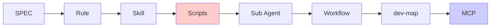

# 6 零件详细对照表

> 来自 Harness 6 零件分类法的扩展对照。用于设计架构、判断引入时机、识别误用。

---

## 完整对照表

| 维度         | Rule                   | Skill      | Sub Agent       | Workflow        | Scripts      | MCP        |
| ------------ | ---------------------- | ---------- | --------------- | --------------- | ------------ | ---------- |
| **回答问题** | 不能乱来               | 怎么做     | 谁分工          | 接力顺序        | 做对没       | 接外部     |
| **比喻**     | 制度                   | 操作手册   | 专业岗位        | 接力规则        | 闸机         | 标准插座   |
| **约束硬度** | 软                     | 半软       | 角色            | 流程            | **硬**       | 接口       |
| **存储形式** | always 加载            | 按需加载   | YAML/Code       | YAML            | 可执行脚本   | Protocol   |
| **失效模式** | AI 会"解释性执行"      | 加载不及时 | 角色边界漂      | 路径不稳        | 检查不严     | 兼容性问题 |
| **触发时机** | 编码时                 | 特定场景   | 任务阶段        | 流程节点        | 提交前 / CI  | 跨系统调用 |
| **维护成本** | 低（写一次）           | 中         | 中              | 高              | 中           | 高         |
| **典型数量** | ≤ 20 条                | 5-20 个    | 1-7 个          | 1 套            | 5-20 个脚本  | 0-5 个     |
| **引入时机** | 早期                   | 早-中期    | 单 Agent 失稳后 | 多 Agent 复杂后 | 早期         | 想外推时   |
| **谁维护**   | Chief Arch / Tech Lead | 各专业组   | 流程 owner      | 流程 owner      | Tooling 团队 | 平台       |

---

## 详细说明

### Rule（规则）

**核心定义**：基础规矩、红线、底线。

**适用场景**：

- ✅ 命名规范（"函数 camelCase"）
- ✅ 禁用 API（"不能直接用 MessageBox.Show"）
- ✅ 安全红线（"不能存密码明文"）
- ✅ 简单一致性（"必须有 lint 通过的代码"）

**不适合的场景**：

- ❌ 复杂流程（"处理 SVN 冲突的 5 步" → 应该是 Skill）
- ❌ 业务规则（"用户登录失败 3 次锁定" → 应该是代码）
- ❌ 跨步骤判断（"如果 X 则 Y 否则 Z" → 应该是 Skill 或 Workflow）

**反模式**：

- 写 100 条 Rule（AI 会忘）
- Rule 写得抽象（无法验证）
- Rule 当流程用（用 Skill）

### Skill（技能）

**核心定义**：固定动作的标准操作手册。

**适用场景**：

- ✅ 高频固定流程（"编译 + 测试 + lint 的标准命令"）
- ✅ 复杂决策树（"处理 X 类问题的步骤"）
- ✅ 工具使用指南（"如何用 Cypress 写 E2E 测试"）

**Skill 三层加载**（参考 skill-creator）：
| 层 | 何时加载 | 大小 |
|----|---------|------|
| Metadata (name+description) | 总在上下文 | ~100 词 |
| SKILL.md 主体 | skill 触发时 | <500 行 |
| 打包资源 (references/, scripts/, assets/) | 按需 | 无限 |

**反模式**：

- Skill 主体 > 500 行（应拆 references）
- description 太弱（AI 不触发）
- 堆砌 MUST/NEVER（不解释 WHY）

### Sub Agent（子代理）

**核心定义**：不同阶段的专业角色。

**七角色标准配置**：

1. PM（路由）
2. 需求分析
3. 方案设计
4. 闸门总控
5. 开发实现
6. 代码审查
7. 测试验证

**引入决策树**：

```
项目规模？
├─ 早期 ─→ 1 个 Agent
├─ 中期 ─→ 2-3 个 (设计/实现/测试)
└─ 大型 ─→ 4-7 个 (含 PM/闸门)
```

**反模式**：

- 一开始就 7 个（维护成本爆炸）
- 一个 Agent 干到底
- 去中心化协商
- 动态招聘

### Workflow（流程）

**核心定义**：Agent 间按什么顺序接力。

**三层资产**：
| 层 | 写给谁 | 内容 |
|----|--------|------|
| 流程定义 | 系统 | 状态机 |
| 角色契约 | 各 Agent | 读写规则 |
| 校验脚本 | Scripts | 一致性检查 |

**反模式**：

- 流程靠 PM 长文记忆
- 没有回退边
- 跨边界改文档

### Scripts（脚本）

**核心定义**：统一门禁和事后验证。**最硬的约束。**

**三类检查**：

- A 类：静态规范（编码风格、禁用 API）
- B 类：基础交付（编译、测试、**测试数不减少**）
- C 类：工程一致性（跨文件同步）

**关键机制**：

- **基线对比**（防 AI 说"本来就有"）
- **阻塞合并**（不通过不能 merge）

### MCP（Model Context Protocol）

**核心定义**：AI 安全接外部系统的标准接口。

**当前阶段**：不是主干，但越来越关键。

**何时引入**：

- 想自动构建 / 签名 / 发布
- 想接 CI/CD、监控、告警
- 想做完整的"代码→发布"闭环

---

## 引入顺序（标准路径）



**关键观察**：

- Scripts 引入很早（第 1-2 周就要有）
- Sub Agent 引入很晚（单 Agent 失稳后）
- MCP 最晚（基础设施稳定后）

---

## 误用速查

| 把什么错用为 Rule？ | 应该用什么？      |
| ------------------- | ----------------- |
| 复杂流程            | Skill             |
| 业务逻辑            | 代码              |
| 多步判断            | Skill 或 Workflow |

| 把什么错用为 Skill？ | 应该用什么？ |
| -------------------- | ------------ |
| 跨 Agent 的协调      | Workflow     |
| 简单一致性检查       | Rule         |
| 业务计算             | 代码         |

| 把什么错用为 Sub Agent？ | 应该用什么？ |
| ------------------------ | ------------ |
| 简单的单步任务           | 单 Agent     |
| 状态机式流程             | Workflow     |
| 一次性脚本               | Scripts      |

---

## 关键引言

> "Rule 不是没用，而是 Rule 只能做'原则约束'，不能做'流程执行'。" —— 腾讯/白家杰

> "Scripts 是 Harness 里最硬的东西。" —— 腾讯/白家杰

> "你说你做完了没用，得跑过我这关才算。" —— Scripts 定位
