# 集中收录的 Mermaid 流程图

> 所有重要的可视化资产集中在此，便于查阅 / 复用 / 教学。每个图都标注了来源章节。

---

## 1. Harness 核心架构

### 1.1 REPL 容器（核心抽象）

来源：`references/02-architecture.md` § 1

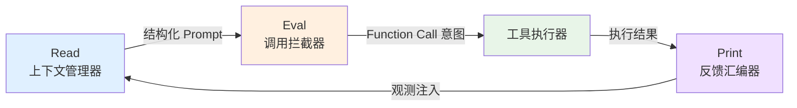

### 1.2 控制平面 vs 数据平面

来源：`references/02-architecture.md` § 4

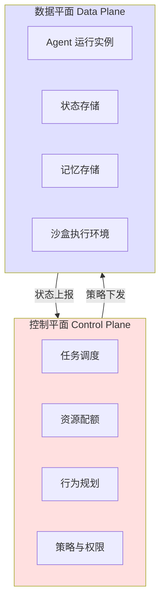

### 1.3 四块拼图模型

来源：`references/02-architecture.md` § 3

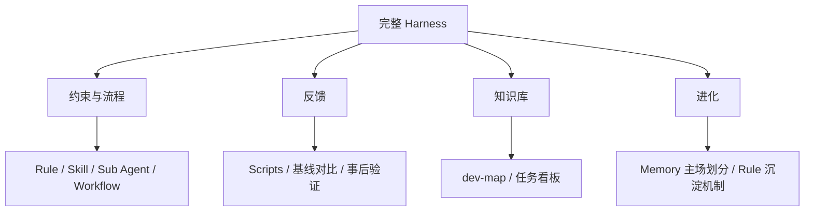

### 1.4 系统级 Memory 三层架构

来源：`references/02-architecture.md` § 7

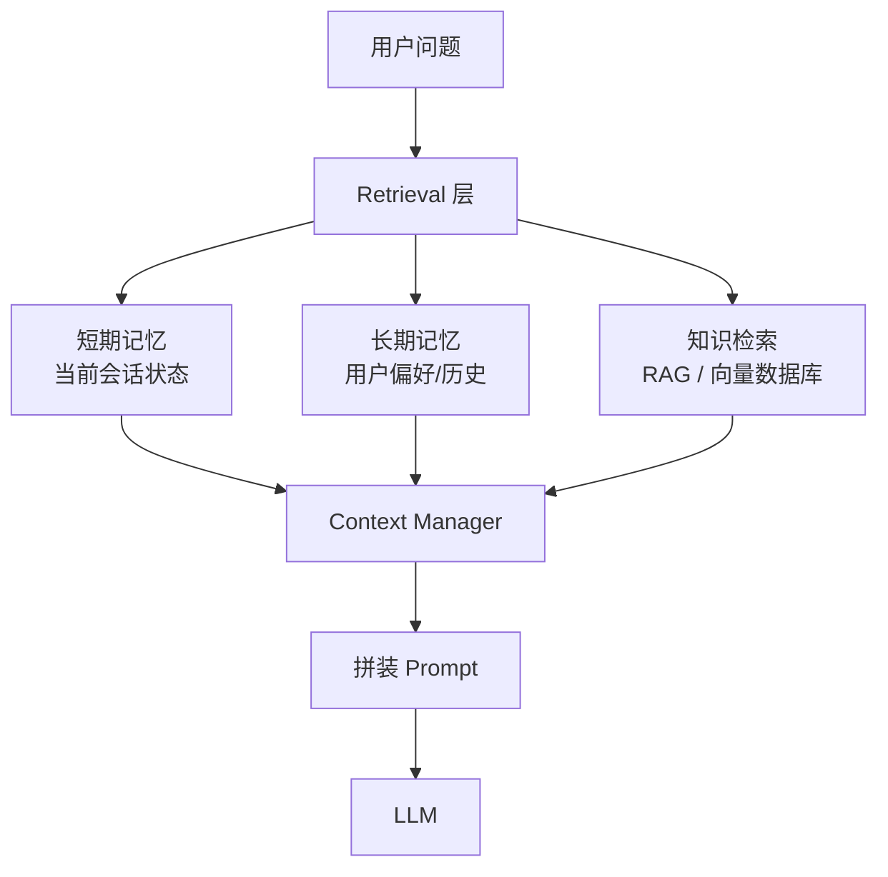

---

## 2. 工作流程

### 2.1 PPAF 闭环

来源：`references/03-workflow.md` § 1

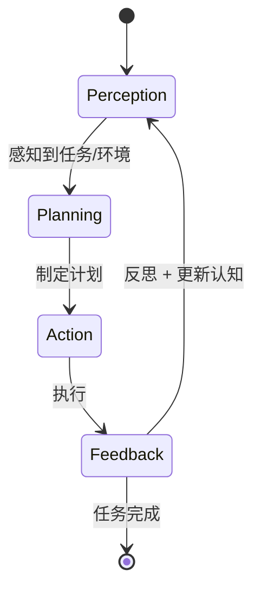

### 2.2 Token 转化流水线

来源：`references/03-workflow.md` § 2

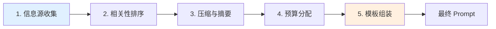

### 2.3 Function Calling 生命周期

来源：`references/03-workflow.md` § 3

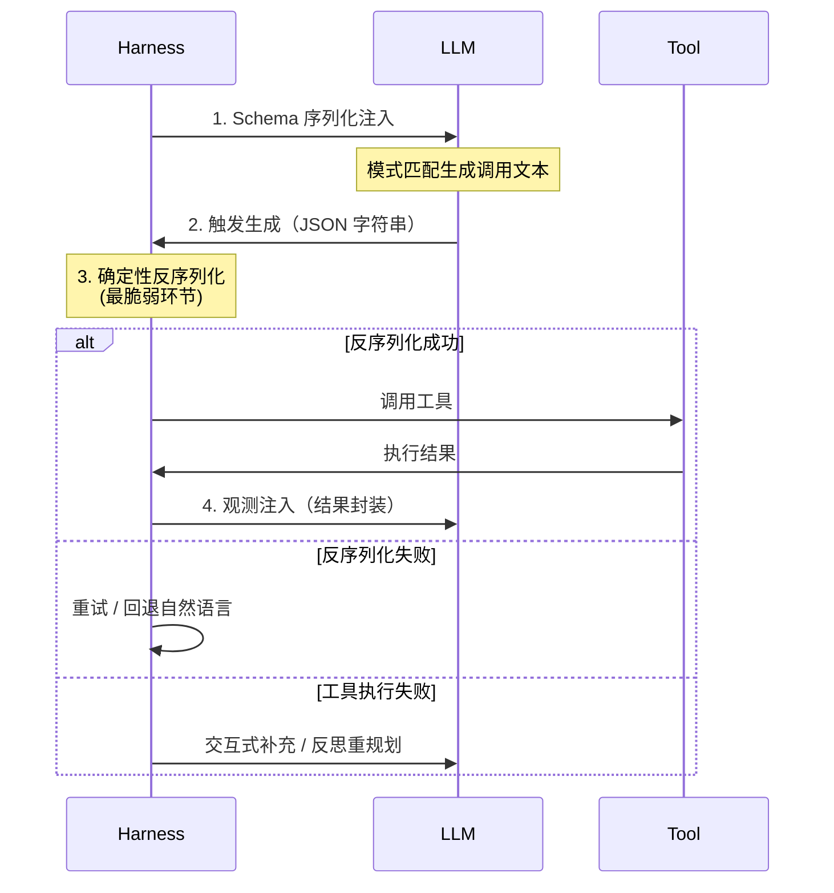

### 2.4 七 Agent 结构化调度

来源：`references/03-workflow.md` § 4

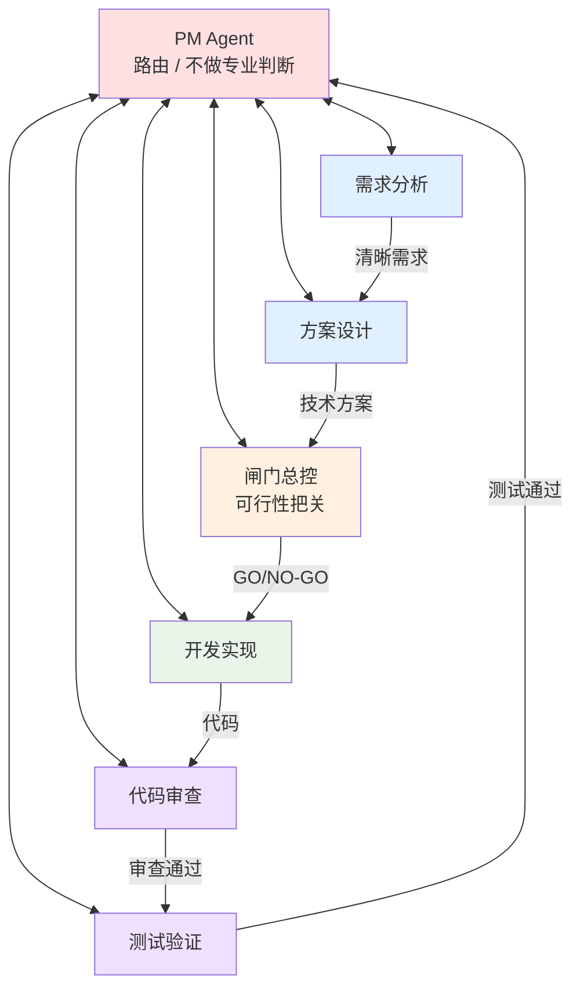

### 2.5 AI 全链条参与

来源：`references/03-workflow.md` § 7

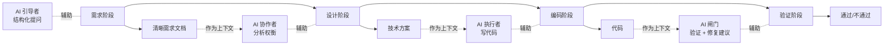

---

## 3. 质量门禁

### 3.1 Scripts 三大类检查

来源：`references/04-quality-gates.md` § 2

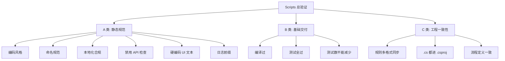

### 3.2 基线对比机制

来源：`references/04-quality-gates.md` § 3

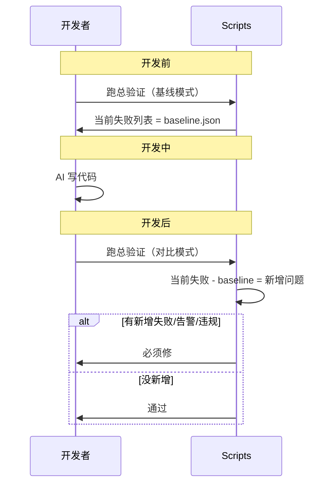

### 3.3 Pre-PR 机制

来源：`references/04-quality-gates.md` § 4

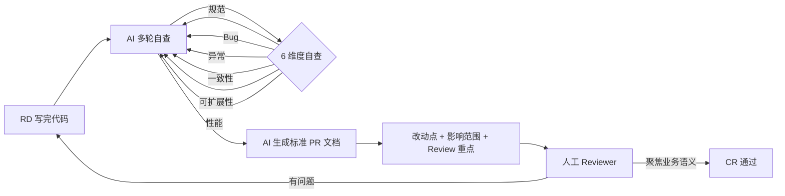

### 3.4 Human-in-the-loop 测试 5 步 SOP

来源：`references/04-quality-gates.md` § 5

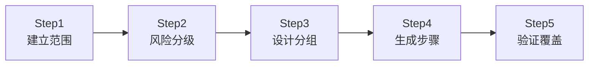

---

## 4. 演进与团队治理

### 4.1 渐进引入顺序

来源：`references/02-architecture.md` § 8

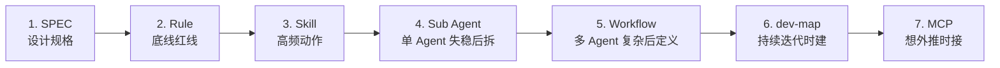

### 4.2 主 R 打样 → SOP 分发

来源：`references/06-team-governance.md` § 3

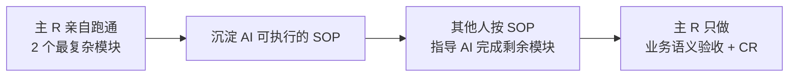

### 4.3 见缝插针式重构

来源：`references/06-team-governance.md` § 4

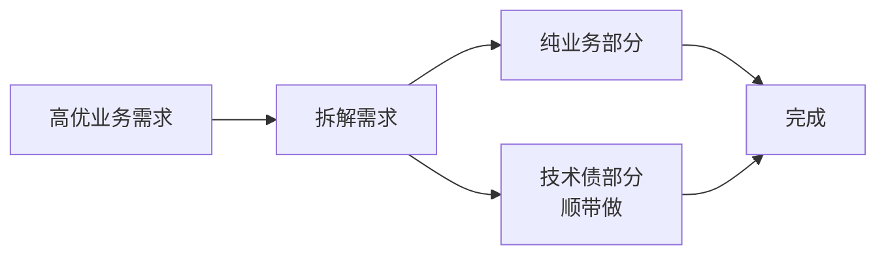

### 4.4 美团 31 万行重构三阶段

来源：`references/06-team-governance.md` § 7

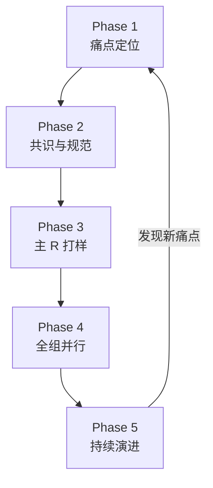

---

## 5. 实践模型

### 5.1 6 条实践协同关系

来源：`references/07-six-practices.md` § 8

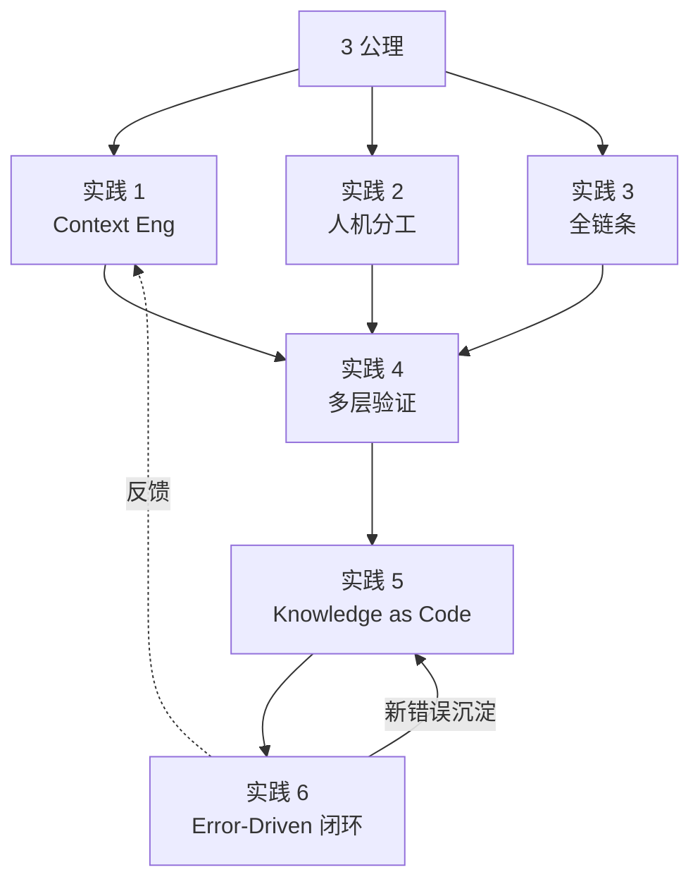

### 5.2 Error-Driven 反馈闭环

来源：`references/04-quality-gates.md` § 6 + `references/07-six-practices.md` § 7

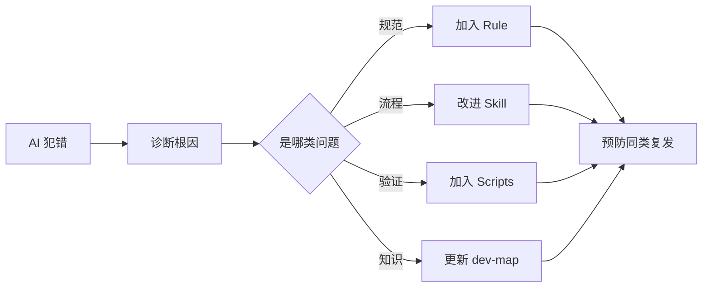

### 5.3 角色跃迁路径

来源：`references/01-theory.md` § 4

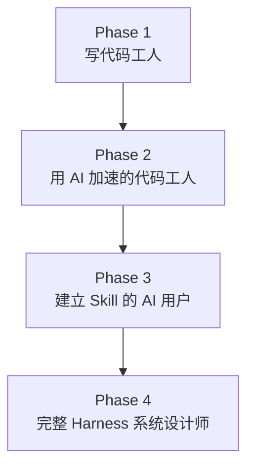

---

## 6. 场景流程图

### 6.1 决策树（高层）

来源：`SKILL.md`

```mermaid
flowchart TB
    Start[接到 AI Coding 任务]
    Start --> Q1{项目状态?}
    Q1 -->|新项目| NP[playbooks/new-project.md]
    Q1 -->|在做项目| OP[playbooks/ongoing-project.md]
    Q1 -->|大规模重构| RP[playbooks/refactoring.md]
    Q1 -->|个人/小项目| SP[playbooks/small-project.md]
    Q1 -->|多团队/遗留| MT[playbooks/multi-team.md<br/>+ legacy-migration.md]
```

### 6.2 遗留系统迁移 Strangler Fig

来源：`playbooks/legacy-migration.md`

```mermaid
flowchart LR
    subgraph Old[旧系统]
        O1[模块 A]
        O2[模块 B]
        O3[模块 C]
    end
    subgraph New[新系统]
        N1[新模块 A]
    end
    User --> Router{路由层}
    Router -->|模块 A 流量| N1
    Router -->|其他| Old
    style N1 fill:#90EE90
    style O1 fill:#FFB6B6
```

### 6.3 影子流量校验

来源：`playbooks/legacy-migration.md` § Step 6

```mermaid
flowchart LR
    User --> Router
    Router --> Old
    Router -.影子.-> New
    Old --> Response[返回给用户]
    Old --> Compare[对比器]
    New --> Compare
    Compare --> Diff[行为差异报警]
```

---

## 用法

- **教学**：用图给团队解释 Harness 核心概念
- **设计**：作为模板对照你的项目架构
- **检查**：定期看看你的项目"画得出来吗"

每个图都有源 reference 链接，深入了解去看源文档。
