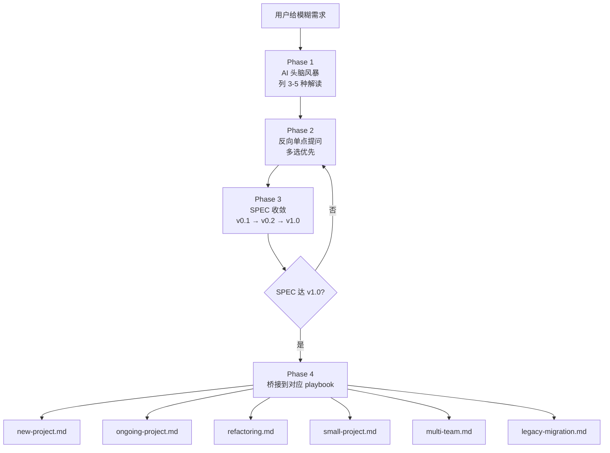

# Playbook: 0-Discovery / 零到一发现（用户也不知道做啥时）

> 场景：用户给的需求模糊到无法直接写 SPEC——"做个 AI 工具吧"、"我也不确定"、"看你建议"、"反正就是个 X 类的东西"。
>
> 本 playbook **必须**在其他 playbook（new-project / ongoing-project / refactoring...）之前完成。

---

## 何时用这个 Playbook

### 触发信号（用户输入特征）

强信号（**必须**用本 playbook）：

- "我想做个项目但不知道做啥"
- "你看着办"、"看你建议"
- "反正就是个 X 类的东西"
- "做个 AI 工具吧"
- "我也不确定要什么"

弱信号（**应该**走一遍，至少 Phase 1）：

- 需求一句话说不清
- 提到 2+ 种可能方向（"A 或 B 都行"）
- 没说技术栈、范围、用户群
- "你觉得呢？"

反向信号（**不**用本 playbook）：

- 用户已有清晰 SPEC → 直接进 new-project.md
- 用户只是查询/解释代码 → 不触发 harness skill
- 用户明确说"不要废话，直接做" → 尊重用户，跳过

---

## 核心原则

1. **AI 不能空等用户说清楚** → AI **主动猜并显式标注假设**
2. **不能开放式无限问** → **多选题优先**于开放题（让用户纠错比答开放题轻松 10 倍）
3. **不能 AI 自己拍板核心决策** → **每轮收敛必须用户认可**
4. **不能无限 discovery** → 设置退出条件（SPEC v1.0 达标即退出）
5. **不能跳过 brainstorming skill** → **优先调用** [`brainstorming` skill](../../brainstorming/SKILL.md) 走通用流程，本 playbook 在其上叠加 Harness 视角

---

## 与 brainstorming skill 的分工

```
┌──────────────────────────────────────────────────────┐
│   brainstorming skill (通用)                          │
│   - 一次一个问题                                       │
│   - 多选题优先                                         │
│   - 提 2-3 备选方案                                    │
│   - 写设计文档                                         │
│   - HARD-GATE: 设计未批准不实施                       │
└──────────────────────────────────────────────────────┘
                       │
                       ▼ 叠加 Harness 视角
┌──────────────────────────────────────────────────────┐
│   本 playbook (Harness 专属)                          │
│   - R.E.S.T 角度的问题                                │
│   - 5 误区过滤器                                       │
│   - 6 零件预选                                         │
│   - SPEC 演化版本号                                    │
│   - 桥接到其他 playbook                                │
└──────────────────────────────────────────────────────┘
```

**优先级**：先调 brainstorming skill，本 playbook 在它的对话中**注入 Harness 特定问题**。

---

## 完整流程（4 Phase）



---

### Phase 1: AI 头脑风暴（不问用户，先自己想）

**目标**：在用户开口前，**先列 3-5 种合理解读**。这是 AI 替用户做的"逆向"工作。

#### 输出模板

```markdown
## 你说的 "X" 我有 3 种解读：

### 解读 A: [一句话定位]

- **可能是**：[具体推测]
- **核心假设**：[假设 1] / [假设 2]
- **典型规模**：[人数 / 代码量 / 时间线]
- **可能落到的 playbook**：[new-project / ongoing / refactoring ...]

### 解读 B: ...

### 解读 C: ...

请问最接近哪个？（或者都不是，告诉我对的方向）
```

#### 示例

用户说："我想做个 AI 工具帮我管理任务"

AI 头脑风暴：

```markdown
### 解读 A: 个人副业 / 玩具项目

- 可能是：本地跑的命令行 todo + AI 优先级建议
- 假设：单人用、< 1000 行、不上线
- → playbooks/small-project.md

### 解读 B: 团队 SaaS 产品

- 可能是：多用户的任务管理 web 应用，AI 做自动分配
- 假设：长期维护、需要账户体系、几千用户
- → playbooks/new-project.md

### 解读 C: 个人效率系统集成

- 可能是：接 Notion/Linear/Todoist 的 AI 助手
- 假设：单人用、靠 API 接外部系统
- → playbooks/small-project.md（含 MCP）

最接近哪个？
```

---

### Phase 2: 反向单点提问（多选优先）

**纪律**：

- 一次只问 1 个问题（来自 brainstorming skill）
- 多选 > 开放
- 每个问题都带"为什么问这个"的暗示

#### 问题库（按维度组织）

##### 维度 A: R.E.S.T 角度（决定 Harness 严格度）

| 问题               | 选项                                                               | 决定什么                 |
| ------------------ | ------------------------------------------------------------------ | ------------------------ |
| 失败容忍度？       | (a) 玩具，失败无所谓 (b) 重要工具，最好不挂 (c) 关键业务，挂了赔钱 | Scripts 严格度、沙盒分级 |
| 时间预算？         | (a) 几天 (b) 几周 (c) 几月 (d) 长期                                | Harness 投入比例         |
| 数据敏感度？       | (a) 无敏感 (b) 个人数据 (c) 商业机密                               | Security 设计            |
| 是否需要审计追踪？ | (a) 不需要 (b) 团队内 (c) 合规要求                                 | Traceability 设计        |

##### 维度 B: 5 误区过滤器（防陷阱）

| 问题               | 选项                                                   | 防的误区                    |
| ------------------ | ------------------------------------------------------ | --------------------------- |
| 你期望 AI 做什么？ | (a) 1 周搞定写代码 (b) 帮我设计+实现+测试 (c) 全自主   | "AI=快写代码" / "AI 全自主" |
| 验收标准？         | (a) 跑起来就行 (b) 通过测试 (c) Scripts 通过 + CR 通过 | "通过测试就能交"            |
| 复杂度估计？       | (a) 简单 CRUD (b) 中等业务逻辑 (c) 复杂系统            | "AI 不适合复杂"             |

##### 维度 C: 6 零件预选（决定 Harness 形态）

| 问题             | 选项                                        | 预选哪个零件              |
| ---------------- | ------------------------------------------- | ------------------------- |
| 单人还是多人？   | (a) 单人 (b) 2-5 人 (c) > 5 人              | 决定 Sub Agent / Workflow |
| 代码量预期？     | (a) <1000 (b) 1k-1万 (c) 1万-10万 (d) >10万 | 决定 dev-map / 任务看板   |
| 是否需要 CI/CD？ | (a) 不需要 (b) 简单 (c) 完整                | 决定 Scripts 强度         |
| 是否接外部系统？ | (a) 纯本地 (b) 几个 API (c) 复杂集成        | 决定 MCP                  |
| 长期维护吗？     | (a) 不需要 (b) 半年 (c) 多年                | 决定整体 Harness 投入     |

##### 维度 D: 场景信号（决定后续 playbook）

| 问题       | 选项 → 后续 playbook                                                                       |
| ---------- | ------------------------------------------------------------------------------------------ |
| 项目状态？ | 新建 → new-project / 在做 → ongoing-project / 重构 → refactoring / 迁移 → legacy-migration |
| 团队结构？ | 单团队 → 上面任一 / 多团队 → multi-team                                                    |
| 项目规模？ | 大 → 主 playbook / 小 → small-project                                                      |

#### 提问策略

**不要这样**（堆问题）：

```
我有几个问题：
1. 你期望失败容忍度？
2. 时间预算？
3. 数据敏感度？
4. 单人还是多人？
5. 代码量预期？
```

**要这样**（单点 + 多选）：

```
第 1 个问题：失败容忍度？
(a) 玩具，挂了无所谓
(b) 重要工具，最好不挂
(c) 关键业务，挂了赔钱

(这决定我们 Scripts 闸机要做多严)
```

#### 每轮问几个？

- 第 1 轮：1-2 个关键问题（找出场景大方向）
- 第 2 轮：2-3 个细化问题（决定具体形态）
- 第 3 轮：1-2 个最后确认
- 通常 3-5 轮收敛

---

### Phase 3: SPEC 收敛（用版本号显式化进度）

**核心**：每轮回答后 AI 立即更新 SPEC 文档，让用户看到收敛过程。

#### v0.1（Phase 1 后）

```markdown
## SPEC v0.1 (AI 头脑风暴稿)

**核心目标**: [AI 推测，1 句话]

**核心假设** (待用户确认):

- 假设 1: [...]
- 假设 2: [...]
- 假设 3: [...]

**待澄清**:

- [ ] 场景类型
- [ ] 规模量级
- [ ] 关键约束

**预选 playbook**: [推测]
```

#### v0.5（Phase 2 进行中）

```markdown
## SPEC v0.5

**核心目标**: [澄清后 1 句话]

**确认的事**:

- ✓ 单人项目，< 5000 行
- ✓ 长期维护需要
- ✓ 接 Notion API

**待澄清**:

- [ ] 用 Cursor 还是 Claude Code？
- [ ] 是否需要 GUI？

**当前判定 playbook**: small-project.md（含 MCP 接 Notion）
```

#### v1.0（达到退出标准）

```markdown
## SPEC v1.0 ✓ 进入实施

**项目目标**: 一句话清晰

**范围**:

- 做: A, B, C
- 不做: D, E

**验收标准** (≥ 3 条):

- [ ] X 功能可用
- [ ] Y 性能达标
- [ ] Z 安全要求

**技术栈**: 明确

**Harness 预选**:

- Rule: ~5 条
- Skill: ~2 个
- Sub Agent: 1 个（单 Agent 起步）
- Scripts: 编译+测试+测试数检查
- MCP: Notion API

**对接 playbook**: [具体哪个]
```

---

### Phase 4: 桥接到对应 playbook

**Discovery 退出条件检查表**：

- [ ] 目标 1 句话能说清
- [ ] 范围（做/不做）明确
- [ ] 验收标准至少 3 条
- [ ] 技术栈选定
- [ ] 用户明确 "yes 这就是我想要的"
- [ ] 已能判定属于哪个具体场景 playbook

全部勾选 → 退出 discovery，加载对应 playbook。

#### 桥接路由表

| SPEC v1.0 表征            | 加载的 playbook       |
| ------------------------- | --------------------- |
| 全新代码库，团队 3+ 人    | `new-project.md`      |
| 全新代码库，单人或 1-2 人 | `small-project.md`    |
| 已有代码库要改            | `ongoing-project.md`  |
| 大规模架构调整（>5 万行） | `refactoring.md`      |
| 跨团队/跨组               | `multi-team.md`       |
| 旧栈→新栈                 | `legacy-migration.md` |

#### 桥接语示例

```markdown
✅ SPEC v1.0 确认完成。

根据你的回答（单人项目，< 5000 行，长期维护，接 Notion）：
→ 接下来按 `playbooks/small-project.md` 执行。

我会：

1. 加载 small-project.md
2. 跳过 Phase 0 (因为 discovery 已完成)
3. 直接进 small-project.md 的 "最小可用 Harness" 部分

开始？
```

---

## 反模式（discovery 特有）

| 反模式                       | 后果                            | 正确做法                            |
| ---------------------------- | ------------------------------- | ----------------------------------- |
| AI 假设用户清晰，直接写 SPEC | SPEC 错了，用户都没意识到，重做 | 必须先 Phase 1 头脑风暴             |
| 一次问 5+ 问题               | 用户疲劳，敷衍回答              | 一次只问 1 个                       |
| 全是开放题                   | 用户写文章太累                  | 多选优先                            |
| AI 自己拍板核心决策          | 最后用户说"这不是我要的"        | 标"我建议 X，对吗？"                |
| 一直 discovery 不退出        | 永远不开始做                    | 设硬性退出标准                      |
| 跳过 SPEC v0.x 版本化        | 不知道收敛到哪步                | 每轮显式 v0.1/v0.2/...              |
| 不调用 brainstorming skill   | 重复造轮子 + 缺通用纪律         | 先 call brainstorming，叠加 Harness |
| 不标注假设                   | 用户不知道你在猜                | 显式 "我假设是 X，对吗？"           |
| 把 5 个解读都问"对吗"        | 用户答 5 次 yes/no              | 选项给 A/B/C/都不是                 |
| 拒绝用户改主意               | 用户不爽                        | 回退到上一个 SPEC 版本，分析变化    |

---

## Common Issues / Fallbacks

| 症状                                  | 可能原因                | 应急处理                                                     |
| ------------------------------------- | ----------------------- | ------------------------------------------------------------ |
| 用户反复说"看你"、"随便"              | 用户真的没想法 / 用户懒 | AI 替 user 选并明告"我做了决定，不对告诉我"                  |
| 越问越乱、SPEC v0.X 反复跳            | 问题维度切错了          | 退一步重新 Phase 1，列新 3-5 种解读                          |
| 用户中途完全改主意                    | 真实需求才浮现          | 回退到 v0.1，**记录变化原因**，不要怨用户                    |
| Phase 2 卡 > 5 轮                     | 问题太抽象或方向错      | 跳到 Phase 3 写 SPEC v0.x，**让用户改稿比答问题轻松**        |
| 用户希望 AI 全拍板                    | 用户信任 AI             | 可以拍但显式标"AI 建议"，等用户认可                          |
| 用户答非所问                          | 问题表述不清            | 换个角度问；或给具体例子                                     |
| 收敛到一半发现不在 6 个 playbook 范围 | 罕见                    | 用 new-project.md 作为兜底，并提议加新 playbook              |
| 用户说"我有 10 个需求都要做"          | 项目太大                | brainstorming skill 的"项目分解"流程：拆子项目，先做最优先的 |

---

## AI 自检清单（discovery 期间每轮自检）

- [ ] 我有没有跳过 Phase 1，直接开始问？
- [ ] 我有没有一次问超过 1 个问题？
- [ ] 我用的是多选题还是开放题？
- [ ] 我有没有标注当前是 SPEC v0.几？
- [ ] 用户的最新回答，我反映到 SPEC 里了吗？
- [ ] 我有没有显式问"这个理解对吗"？
- [ ] 我是不是该退出 discovery 了（5 项标准全 ✓ 了吗）？
- [ ] 我有没有在 SPEC 里标注假设和待澄清？

---

## 与 brainstorming skill 的集成示例

```
[用户] 我想做个 AI 工具帮我管理任务

[AI 检测信号] → 触发 0-discovery.md
[AI 内部] → call /brainstorming skill

[brainstorming skill] → 启动通用流程：先了解 project context
[本 playbook 叠加] → 在 brainstorming 的对话中注入 Harness 视角问题

[brainstorming Step 1 + Harness Phase 1]:
"我有 3 种解读..." (用 Harness Phase 1 模板)

[brainstorming Step 2 + Harness Phase 2]:
"第 1 个问题：失败容忍度？" (用 Harness R.E.S.T 问题库)

[brainstorming Step 3 + Harness Phase 3]:
"基于你的回答，SPEC v0.5 如下..." (用 Harness 版本化)

[brainstorming Step 4-5] → 设计完成、用户认可
[本 playbook Phase 4] → 桥接到具体 playbook

[继续] → 加载 small-project.md 开始 Step 1
```

---

## 关键引言

> "一次只问一个问题——别用问题堆压垮用户。" —— brainstorming skill

> "需求阶段是引导者（结构化提问帮人显式化意图）。" —— Harness 实践 3 (AI 全链条参与)

> "不要贪大，不要一步到位，先从你最反复、最痛的那个问题开始。" —— 腾讯/白家杰
> （discovery 的本质也是"找出最痛的问题"）

> "意图转化链有损耗：源头错了，下游全错。" —— 公理 1
> （discovery 就是降低源头损耗的关键工序）

---

## 下一步

discovery 完成后按 SPEC v1.0 路由：

- 全新代码库 → `new-project.md`
- 在做项目 → `ongoing-project.md`
- 重构 → `refactoring.md`
- 小项目 → `small-project.md`
- 多团队 → `multi-team.md`
- 旧栈→新栈 → `legacy-migration.md`

回主入口 → `../SKILL.md`
