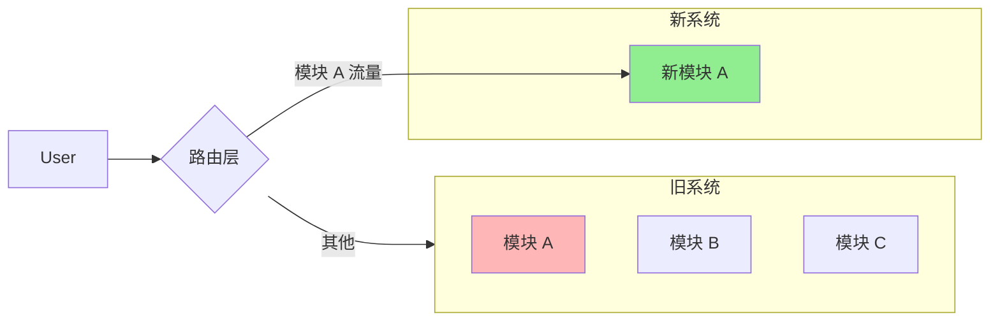
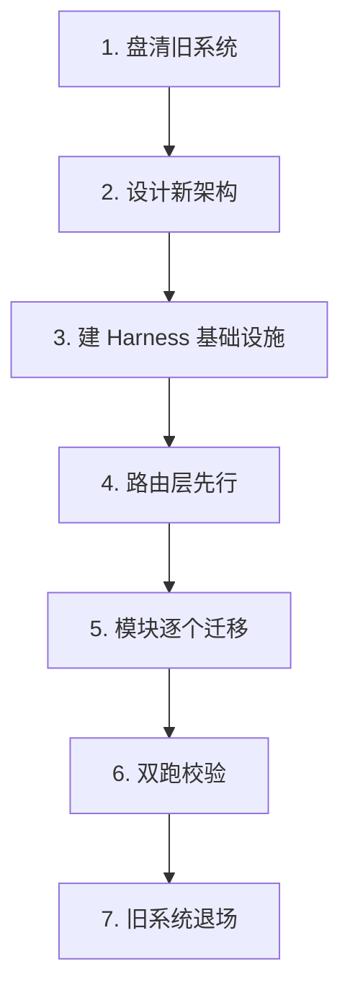
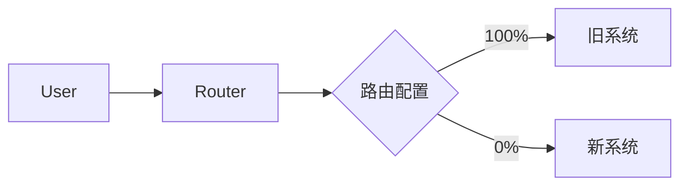
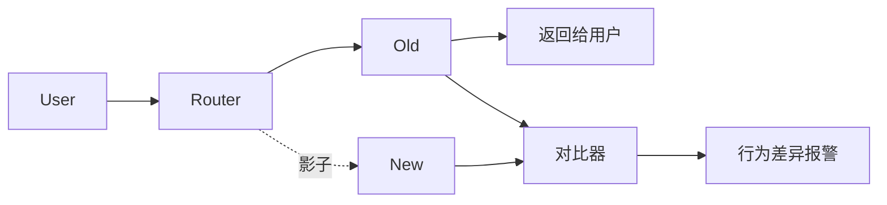

# Playbook: 遗留系统迁移（旧栈 → 新栈）

> 场景：旧技术栈（如 Spring MVC、Angular 1、PHP 5、jQuery）迁移到新栈，且用 AI 加速。

---

## 何时用这个 Playbook

- ✅ 跨技术栈迁移（如 Java → Go、Angular → React、单体 → 微服务）
- ✅ 旧代码遗留，新代码用 AI 写
- ✅ 业务不能停，要并行运行新旧系统

不适用：

- ❌ 同栈内重构 → `refactoring.md`
- ❌ 新项目 → `new-project.md`

---

## 核心挑战

**遗留迁移 + AI Coding 的独特问题**：

1. **旧栈知识老化**：可能 AI 训练数据少
2. **隐性知识多**：老员工脑里、不在文档里
3. **测试覆盖差**：迁移后行为是否一致难验证
4. **并行运行成本**：新旧两套同时跑
5. **风险大**：业务中断不可接受

---

## 总体策略：Strangler Fig 模式 + Harness

**思想**：像绞杀植物一样，新系统**渐进替代**旧系统，不一刀切。

---

## 七步迁移流程

---

### Step 1：盘清旧系统（用 AI 加速）

#### 任务

1. 找老员工口述"老系统的潜规则"
2. 让 AI 扫描代码，提取实际行为
3. 对比两者，找出"文档没写但代码做了"的事

#### AI 的作用

- 公理 3：让 AI 穷举扫描，让人聚焦判断
- 自动生成：依赖图、调用图、数据流图
- 自动总结：每个模块的"实际职责"

#### 关键产出

- `docs/legacy/system-map.md`：全系统功能图
- `docs/legacy/known-behaviors.md`：所有已知行为（含 quirks）
- `docs/legacy/unknown-risks.md`：不确定的部分

---

### Step 2：设计新架构

#### 任务

- 不是简单"语言翻译"
- 重新思考架构（这是难得的机会）
- 但**保持业务行为一致**

#### AI 的作用

- 实践 3：AI 作为"协作者"提多方案 + 权衡

#### 关键产出

- `docs/new-system/architecture.md`：新架构 SPEC
- `docs/new-system/migration-plan.md`：迁移计划

#### 决策原则

| 旧   | 新                   | 理由                    |
| ---- | -------------------- | ----------------------- |
| 单体 | 微服务？模块化单体？ | 看团队规模 + 部署复杂度 |
| MVC  | DDD？分层？          | 看业务复杂度            |
| 同步 | 异步？事件驱动？     | 看性能要求              |

**不要"为新而新"**——每个变化都要有理由。

---

### Step 3：建 Harness 基础设施

#### 必备 6 件

| 件           | 用途                     |
| ------------ | ------------------------ |
| SPEC         | 新系统的设计规格         |
| 新栈 Rule    | 新栈的编码规范（always） |
| 双跑 Scripts | 同时跑新旧系统并对比结果 |
| 路由层       | 控制流量从旧到新切换     |
| dev-map      | 新系统的开发地图         |
| 监控对比     | 实时对比新旧行为         |

---

### Step 4：路由层先行

**关键**：先建路由层（流量分发），后建新模块。

**为什么**：

- 路由层一旦稳定，后续每个新模块只要"接进路由"
- 没有路由层，每个新模块都要单独想"怎么切流量"

---

### Step 5：模块逐个迁移（主 R 打样模式）

#### 选第一个模块

- **选最简单的**：风险低，建立信心
- **不要选核心**：先练手

#### 主 R 流程（参考美团）

1. 主 R 亲自迁移第 1 个模块
2. 沉淀 AI 可执行 SOP（"如何把一个 XX 模块从旧栈迁到新栈"）
3. 其他人按 SOP 让 AI 完成剩余
4. 主 R 只做业务验收 + CR

#### 单模块迁移步骤

1. 在新系统实现等价模块
2. 编写"行为对比测试"（同一输入，新旧输出应一致）
3. 灰度切流量（0% → 1% → 10% → 50% → 100%）
4. 监控对比指标
5. 异常时一键回滚（路由层切回 0%）

---

### Step 6：双跑校验

#### 模式：影子流量（Shadow Traffic）

- 用户请求**同时**发给新旧系统
- 用户拿到的是**旧系统**的响应（保证不出错）
- 但同时**对比**新系统的响应
- 差异报警 → 修新系统

#### 对比维度

- HTTP 状态码
- 响应体结构
- 关键字段值
- 响应时间
- 错误模式

---

### Step 7：旧系统退场

#### 退场条件（全满足才退）

- [ ] 新系统跑了 N 天（建议 ≥ 30 天）无异常
- [ ] 双跑差异率 < 0.1%
- [ ] 路由层切到 100% 新系统
- [ ] 监控指标全绿
- [ ] 备份完整

#### 退场步骤

1. 路由层切 100% 新系统
2. 旧系统进入"只读维护"模式
3. 等 1-2 个月（防回滚需要）
4. 正式归档旧系统

---

## AI 在各阶段的作用

| 阶段   | AI 主要工作  | 人主要工作         |
| ------ | ------------ | ------------------ |
| 1 盘清 | 扫描、总结   | 校验、补充         |
| 2 设计 | 提方案、权衡 | 决策、拍板         |
| 3 基建 | 写脚手架     | 架构决策           |
| 4 路由 | 写实现       | 路由策略           |
| 5 迁移 | 模块翻译     | 业务验收           |
| 6 双跑 | 写对比脚本   | 判断差异是否可接受 |
| 7 退场 | 监控指标     | 拍板退场           |

---

## 关键决策点

### 决策 1：纯翻译还是顺带重构？

**建议**：**有限重构**

- 业务行为必须等价
- 架构可优化（这是难得机会）
- 但不要"为新而新"

### 决策 2：迁移粒度？

| 粒度          | 适用           |
| ------------- | -------------- |
| 整个应用      | 风险大，不推荐 |
| 大模块        | 适合简单系统   |
| 单个 API/接口 | **推荐**，可控 |
| 单个函数      | 太碎，效率低   |

### 决策 3：双跑多久？

- 简单模块：1-2 周
- 核心模块：1-3 个月
- 看业务重要性

### 决策 4：回滚机制？

**必须有**：

- 路由层一键切回旧系统
- 数据兼容（新系统的写入旧系统能读）

---

## 反模式（遗留迁移特有）

| 反模式                         | 后果                       |
| ------------------------------ | -------------------------- |
| 一刀切：旧的全停、新的全上     | 几乎必然失败               |
| 没双跑就上                     | 行为差异引发线上事故       |
| 没路由层就开始                 | 无法快速回滚               |
| 试图用 AI "一键迁移"整个系统   | 上下文塞不下，错误指数累积 |
| 不做行为对比测试               | 不知道迁移是否等价         |
| 选最难的先迁                   | 失败概率高，影响信心       |
| 不沉淀 SOP                     | 每个模块都重新摸索         |
| 旧文档没人维护，直接 AI 读代码 | 漏隐性知识                 |

---

## 风险管理

### 高风险点

1. **数据迁移**：新旧系统数据不一致 → **数据校验脚本**必备
2. **认证/授权**：换栈后用户登录可能失效 → 灰度小范围验证
3. **第三方依赖**：旧系统可能依赖某些已停服 SDK → 提前替换
4. **性能**：新系统 cold start 可能慢 → 监控并优化

### 回滚预案

- 每次切量必须可回滚
- 数据写入两套（一段时间）
- 监控看板 24/7

---

## AI 自检清单（遗留迁移）

- [ ] 我有新旧行为对比测试吗？
- [ ] 我的迁移借了主 R 的 SOP 吗？
- [ ] 我的代码符合新栈的 Rule 吗？
- [ ] 路由层支持回滚吗？
- [ ] 双跑差异在容忍范围内吗？
- [ ] 我更新了新系统的 dev-map 吗？

---

## 关键引言

> "AI 把'看全'门槛打到零，经验价值转移到'判断什么重要'。" —— 美团

> "重构不需要排期，需要拆解能力。" —— 美团（迁移也是一种重构）

> "代码库混乱时直接放 AI 写，AI 不纠偏反而放大差异。" —— 美团

---

## Common Issues / Fallbacks

| 症状                  | 可能原因            | 应急处理                              |
| --------------------- | ------------------- | ------------------------------------- |
| 双跑差异率 > 1%       | 边界情况未对齐      | 拆更小粒度，单个 API 单独双跑         |
| 路由层 bug 影响生产   | 路由本身没测试      | 立即切回 100% 旧系统，修路由层        |
| 新系统性能差          | cold start / 缺缓存 | 预热 + 监控延迟，必要时降切量         |
| 老系统行为没文档      | 隐性知识            | 紧急访谈老员工 + AI 扫代码 + 双跑校验 |
| 数据写入不一致        | 没同步策略          | 暂停切量，建双写或事件同步            |
| 切量 50% 后回滚       | 异常率超阈          | 切回 0%；修后从 1% 重新开始           |
| AI 一键迁移整个系统   | 上下文塞不下        | 拆到单 API/单函数粒度                 |
| 灰度卡在 10% 不敢往上 | 没置信度            | 延长观察期；补行为对比测试            |

## 下一步

- 同栈重构 → `refactoring.md`
- 多团队协作 → `multi-team.md`
- 回主入口 → `../SKILL.md`
