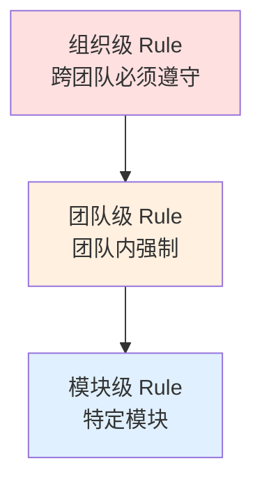
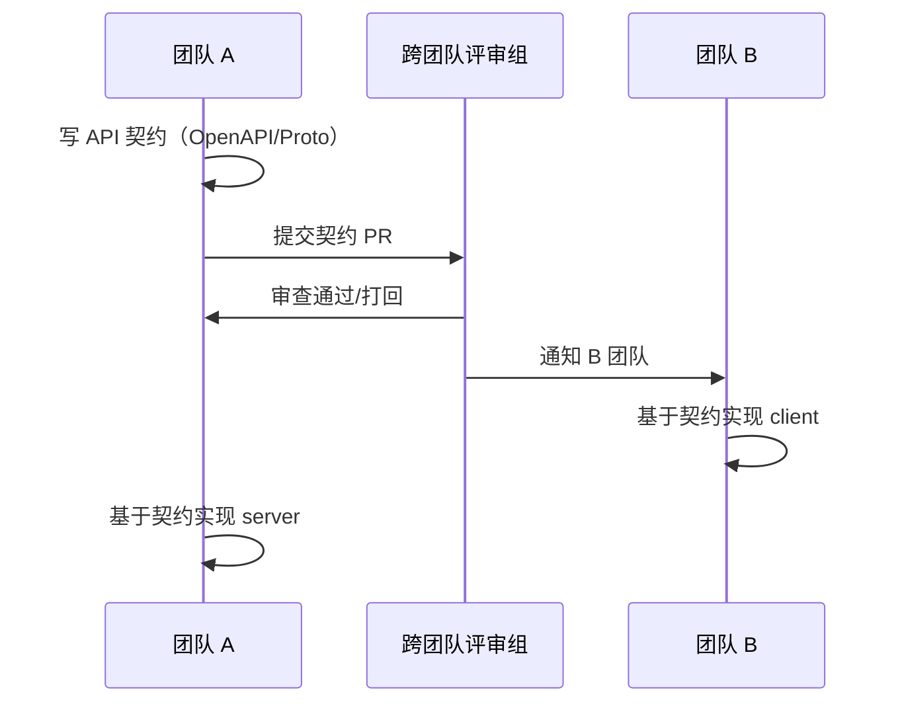
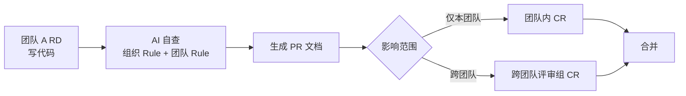

# Playbook: 多团队协作 / 跨组治理

> 场景：多个团队同时用 AI 写代码、共享或互相依赖代码库。怎么对齐？

---

## 何时用这个 Playbook

- ✅ 2+ 团队共享代码库 / 共享底层服务
- ✅ 跨团队 API/接口频繁变更
- ✅ AI Coding 在不同团队使用程度不一
- ✅ 团队总人数 > 10

不适用：

- ❌ 单团队，用 `new-project.md` 或 `ongoing-project.md`
- ❌ 团队互不相干，各做各的（不需要跨团队治理）

---

## 核心挑战

**多团队 + AI Coding 的独特问题**：

1. **标准漂移**：每个团队有自己的 AI Rule，互不兼容
2. **责任模糊**：跨团队代码出问题，谁负责？
3. **重复造轮子**：A 团队和 B 团队都在做相似的 Skill
4. **AI 个性化**：每个团队的 AI 行为不一样，新人在不同团队学到不同"潜规则"

---

## 治理核心：分层标准



### 组织级 Rule（最严，最少）

- **范围**：跨所有团队
- **强制**：必须遵守，违反不能合并
- **典型内容**：
  - 安全红线（不存秘密、不留后门）
  - 数据隐私（PII 处理）
  - 法律合规（开源许可证）
  - 跨团队 API 契约

**建议**：≤ 10 条（多了维护成本爆炸）

### 团队级 Rule（中等严，按团队）

- **范围**：单团队内
- **强制**：团队内强制
- **典型内容**：
  - 团队约定的编码风格
  - 团队架构决策
  - 团队工具链选择

### 模块级 Rule（细，按模块）

- **范围**：特定模块/包
- **强制**：模块内强制
- **典型内容**：
  - 模块特殊处理
  - 历史包袱说明

---

## 治理结构：Harness 治理委员会

### 角色

| 角色                            | 职责                 | 人数     |
| ------------------------------- | -------------------- | -------- |
| **Chief Architect**（"独裁者"） | 拍板组织级 Rule      | 1        |
| **团队 Lead**                   | 团队级标准、向上反馈 | 每团队 1 |
| **跨团队评审组**                | 跨团队 API/契约审查  | 3-5      |
| **AI 工具委员会**               | 工具选型、Skill 管理 | 2-3      |

### 决策机制

> **"1 个独裁者好过 10 个民主者。"**

- 组织级 Rule → **Chief Architect 拍板**（可议但不无限议）
- 团队级 Rule → 团队 Lead 决定
- 模块级 Rule → 模块 owner 决定

---

## 跨团队 API/接口治理

### 契约优先（Contract-First）



### 关键纪律

1. **API/接口必须先有契约**（机器可读：OpenAPI / Proto / GraphQL Schema）
2. **契约变更必须经评审**
3. **契约 = 法律**：违反契约的代码不能合并
4. **AI 自动生成**：客户端代码、Mock、文档都从契约生成

详见 `references/02-architecture.md` § 6 设计原则

---

## 共享 Skill 库

### 问题

- A 团队写了"处理 SVN 冲突"的 Skill
- B 团队不知道，自己又写了一个
- 两者实现略不同 → AI 在两团队行为不一致

### 解决：组织级 Skill 库

```
org-skills/
├── README.md (索引)
├── architecture/
│   ├── four-layer-pattern.md
│   └── api-contract.md
├── tooling/
│   ├── svn-conflict-resolution.md
│   └── ci-cd-pipeline.md
└── ...
```

**规则**：

- 任何团队想加 Skill → 先查组织库
- 已有 → 直接用
- 没有但通用 → 加到组织库（经 AI 工具委员会审查）
- 团队特有 → 留在团队库

---

## Pre-PR 跨团队版



### 关键检查项

- AI 自查时同时跑组织级 + 团队级 Rule
- PR 文档自动标注影响范围（哪些团队会受影响）
- 跨团队改动自动通知 owner

---

## 知识同步机制

### Cross-team dev-map

```
docs/
├── dev-map/
│   ├── INDEX.md              # 全局入口
│   ├── team-a/
│   │   ├── module-1.md
│   │   └── module-2.md
│   ├── team-b/
│   │   └── ...
│   └── shared/               # 跨团队共享
│       └── api-contracts.md
```

### 同步会议（精简）

- **不要**：每周冗长的状态汇报
- **要**：每月 1 次"反模式复盘"
  - 各团队带回最近的"AI 反复犯的错"
  - 讨论是否升级为组织级 Rule

---

## 关键决策点

### 决策 1：什么是组织级？什么是团队级？

**升级到组织级的条件**（任一）：

- 多团队都遇到的问题
- 跨团队的 API/契约
- 安全/合规相关
- 影响整个公司声誉

否则留在团队级。

### 决策 2：评审组规模？

- 跨团队评审组：3-5 人（多了拖效率）
- 含 architect + 关键模块 owner

### 决策 3：Skill 共享策略？

- **强制共享**：通用工具类、安全相关
- **建议共享**：业务相关但其他团队可能用上
- **私有**：团队特有业务逻辑

### 决策 4：模型选型统一吗？

- **建议统一**：减少跨团队差异
- 不同 Agent 角色可用不同档位，但**整套**应一致

---

## 反模式（多团队特有）

| 反模式                | 后果                   |
| --------------------- | ---------------------- |
| 每个团队自己一套 Rule | 跨团队代码风格差异巨大 |
| 没有跨团队评审        | API 契约漂移           |
| Skill 各团队各自维护  | 重复造轮子             |
| 没有 Chief Architect  | 标准永远定不下来       |
| 民主决策一切          | 拖延无限               |
| 用 IM 沟通代替契约    | 不可审计               |
| 不同团队不同模型      | AI 行为差异大          |

---

## 美团 31 万行案例的多团队视角

美团 31 万行重构是**单团队**实战。但其方法可扩展到多团队：

| 单团队（美团原文）   | 多团队扩展                            |
| -------------------- | ------------------------------------- |
| 主 R 打样 → SOP 分发 | Chief Architect 打样 → 团队 Lead 分发 |
| 团队内人人对齐       | 跨团队 Chief Architect 拍板           |
| Pre-PR 团队内        | Pre-PR 跨团队（含影响范围）           |
| dev-map 单仓库       | dev-map 分层（团队级 + 共享级）       |

---

## AI 自检清单（多团队专用）

- [ ] 这个改动影响其他团队吗？
- [ ] 涉及跨团队 API？有契约更新吗？
- [ ] 我用的 Skill 在组织库里有吗？
- [ ] 我加的 Rule 是组织级还是团队级？
- [ ] PR 文档标注了影响范围吗？
- [ ] 反复犯的错误升级为组织级 Rule 了吗？

---

## 关键引言

> "1 个独裁者好过 10 个民主者。" —— 美团

> "真正专业的 Harness，不应该越来越像'我和我的 AI 的默契'，而应该越来越像'任何一个人拿到这个工程，都能顺着这套系统做对事情'。" —— 腾讯/白家杰

---

## Common Issues / Fallbacks

| 症状                 | 可能原因               | 应急处理                                |
| -------------------- | ---------------------- | --------------------------------------- |
| 跨团队评审拖延       | 没 SLA                 | 设硬性 SLA（如 48h），超时自动 escalate |
| 组织级 Rule 越加越多 | 没控制                 | 强制 ≤ 10 条，多了应该是团队级          |
| 各团队仍各自一套     | 没 Chief Architect     | 立即任命，否则永远定不下来              |
| Skill 库冲突         | 两团队各加了相似 Skill | Chief Architect 裁决，合并              |
| API 契约漂移         | 没"契约优先"           | 引入 OpenAPI/Proto 强制审查             |
| 不同团队用不同模型   | 工具未统一             | 至少统一模型分层策略                    |
| 跨团队 PR 被忽视     | 通知未自动化           | 引入自动 mention + 跟踪                 |
| 民主决策无限拖延     | 没独裁者               | 紧急任命                                |

## 下一步

- 单团队场景 → `new-project.md` 或 `ongoing-project.md`
- 遗留系统迁移 → `legacy-migration.md`
- 回主入口 → `../SKILL.md`
