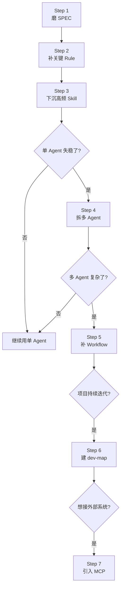

# Playbook: 新项目从零搭 Harness

> 场景：你/团队要开始一个全新的 AI Coding 项目（如新业务、新工具、新组件库等）。

---

## 何时用这个 Playbook

- ✅ 新项目，准备让 AI 主导编码
- ✅ 还没有 Rule/Skill/SPEC，从零开始
- ✅ 团队人数 1-10 人

不适用：

- ❌ 已有代码库，用 `ongoing-project.md`
- ❌ 大规模重构，用 `refactoring.md`
- ❌ 纯个人玩具，用 `small-project.md`

---

## 核心原则

> **"不要贪大，不要一步到位，先从你最反复、最痛的那个问题开始。"**

新项目最大的诱惑：第一天就把所有 Rule/Skill/Agent 全搭齐。
**这是反模式**。应该按"从问题出发，渐进引入"。

---

## 完整步骤（7 步渐进顺序）



---

### Step 1：先磨 SPEC（设计规格文档）

**目标**：把项目的目标、边界、验收标准、兼容要求和 AI 反复聊透。

**SPEC 包含**：

- 项目目标
- 业务边界
- 技术约束
- 验收标准
- 反约束（不能怎么做）

**示例结构**：

```markdown
# SPEC: [项目名]

## 项目目标

[一句话能说清楚的核心目标]

## 业务边界

- 包含: ...
- 不包含: ...

## 技术约束

- 语言/框架: ...
- 平台: ...
- 性能要求: ...

## 验收标准

- [ ] ...
- [ ] ...

## 反约束

- 不能依赖 X
- 不能违反 Y
```

**做这步的方式**：

- 跟 AI 反复对话，让 AI 用提问帮你显式化
- 实践 3：AI 是"需求引导者"
- 反模式：拍脑袋直接动手

**产出**：`docs/specs/00-overall.md`

### Step 2：补最关键的 Rule（不要贪多）

**原则**：**只盯最容易反复出错的底线**。

**判断标准**：

- 这条规则违反了一定出问题
- 这条规则几乎每次任务都涉及
- 这条规则静态可检（脚本能验证）

**典型 always Rule**：

```markdown
# Project Rules (always 加载)

## R1: 禁止硬编码秘密

不能在代码中出现 API key、密码、token 字面值

## R2: 命名规范

- 函数 camelCase
- 类 PascalCase
- 常量 UPPER_SNAKE_CASE

## R3: 错误处理

- 不能裸 try-catch 后吞异常
- 必须 log + 重新抛出或转换
```

**产出**：`docs/rules/always.md` + `.cursorrules` / `.claude-rules.md`

**反模式**：

- ❌ 写 100 条 Rule（AI 会忘）
- ❌ Rule 写得抽象（无法验证）
- ❌ Rule 是建议而非强制

### Step 3：把高频固定动作下沉成 Skill

**目标**：把项目重复性高的操作变成"剧本"。

**典型高频动作**：

- 编译 + 跑测试的标准步骤
- 提交前自查清单
- 处理特定错误的标准流程
- 添加新模块的步骤

**Skill 写法**（参考 skill-creator 规范）：

```markdown
---
name: project-build-and-test
description: 编译 + 测试本项目的标准步骤。当用户要 build/test/run/check 时使用。
---

# 编译并测试

## 步骤

1. 确保 deps 已装: `npm install`
2. 编译: `npm run build`
3. 跑测试: `npm test`
4. 检查 lint: `npm run lint`

## 失败处理

- 编译失败 → ...
- 测试失败 → 查看 `test-results/`
```

**产出**：`skills/` 目录或 Cursor `.cursor/rules/skills/`

### Step 4：单 Agent 失稳时，再拆多 Agent

**怎么判断失稳**：

- AI 经常在多步任务中迷失（"我在做哪一步了？"）
- 不同任务阶段需要的"专业度"不同
- 单次 prompt 已经塞不下所有上下文

**拆分策略**（按需引入）：

| 项目阶段       | 建议 Agent 数                   |
| -------------- | ------------------------------- |
| 早期（功能少） | 1 个                            |
| 中期（多模块） | 2-3 个（如 设计 + 实现 + 测试） |
| 后期（成熟）   | 4-7 个（含 PM + 闸门）          |

**详见** `references/03-workflow.md`

### Step 5：多 Agent 复杂时，补 Workflow 定义

**怎么判断复杂**：

- Agent 之间的交接经常出错
- 不知道当前任务在哪个阶段
- 回退/重试规则模糊

**补什么**：

1. 流程定义文件（YAML/JSON）
2. 角色契约（每个 Agent 必读必写）
3. 流程校验脚本

**详见** `references/03-workflow.md` § 5

### Step 6：项目持续迭代时，建 dev-map

**触发条件**：

- 项目代码超过 5000 行
- 新人/AI 来工作时找不到入口
- 出现"两个人改了相同的东西"的情况

**建什么**：

- `docs/dev-map/INDEX.md`：总入口
- `docs/dev-map/<module>.md`：每模块一份
- `docs/task-board.md`：任务看板

**详见** `references/05-knowledge-base.md`

### Step 7：想把闭环往外推时，引入 MCP

**触发条件**：

- 想让 AI 自动构建、签名、发布
- 需要接 CI/CD、监控、外部 API
- 想做完整的"代码→发布"闭环

**详见** `references/02-architecture.md` § 2.6

---

## 第一周 vs 第一月 vs 第一年

### 第一周（最小化）

- ✅ SPEC（即使只有 1 页）
- ✅ 3-5 条 always Rule
- ❌ 不需要：多 Agent、dev-map、MCP

### 第一月（成型）

- ✅ SPEC v2（细化后）
- ✅ 10 条左右 Rule（按需新增）
- ✅ 3-5 个 Skill（高频动作）
- ✅ 基础 Scripts（编译 + 测试 + 静态规范）
- ❌ 不需要：复杂多 Agent

### 第一年（成熟）

- ✅ 完整 SPEC 体系
- ✅ Rule + Skill 系统
- ✅ 多 Agent（如果项目规模到了）
- ✅ Workflow 定义
- ✅ Scripts 闸机（含基线对比）
- ✅ dev-map + 任务看板
- ✅ Pre-PR 机制
- ✅ 可能引入 MCP

---

## 关键决策点

### 决策 1：用什么 AI IDE？

- Cursor：成熟，规则系统完善
- Claude Code：Skills 系统强
- Trae：定位偏向 Harness Engineering
- 选择标准：团队熟悉度 + 规则系统支持

### 决策 2：多 Agent 还是单 Agent？

- 默认单 Agent
- 失稳信号出现再拆

### 决策 3：always Rule 还是按需 Skill？

- 不可违反 + 频繁触发 + 静态可检 → always
- 否则 → Skill

### 决策 4：SPEC 多详细？

- 项目规模 < 1000 行：一页足够
- 1000-10000 行：每模块一份
- > 10000 行：分层 SPEC（总 + 模块 + 任务）

---

## 反模式（新项目特有）

| 反模式               | 后果             |
| -------------------- | ---------------- |
| 第一天搭 7 个 Agent  | 维护成本爆炸     |
| 一上来写 100 条 Rule | AI 会忘记大部分  |
| 没 SPEC 直接动手     | 需求漂移         |
| 不建 Scripts         | 完成幻觉         |
| 不做 Pre-PR          | 后期 CR 木桶效应 |
| 文档放 Notion        | 与代码漂移       |
| Memory 替代 Rule     | 不可审计         |

---

## AI 自检清单（新项目专用）

- [ ] 我有项目 SPEC 吗？
- [ ] 我有 always Rule 吗？至少 3 条？
- [ ] 我能用 Scripts 验证"完成"吗？
- [ ] 我的代码改动会更新 SPEC 或 dev-map 吗？
- [ ] 我有沉淀机制（出错 → 沉淀 Rule/Skill）吗？

---

## 成熟度自检（可对照 `assets/harness-maturity-levels.md`）

| 阶段   | 你应该达到的 Harness Level           |
| ------ | ------------------------------------ |
| 第一周 | L1（基础 Rule）                      |
| 第一月 | L2（Rule + Skill + Scripts）         |
| 第一年 | L3-L4（多 Agent + dev-map + Pre-PR） |

---

## Common Issues / Fallbacks

| 症状                    | 可能原因                  | 应急处理                                                |
| ----------------------- | ------------------------- | ------------------------------------------------------- |
| AI 写出的代码风格不一致 | Rule 不够明确或缺关键约束 | 加 always Rule（命名/分层/错误处理）；让 AI 跑 lint     |
| SPEC 反复改             | 需求没真聊透              | 回到 Step 1，AI 用结构化提问帮你显式化；不要急着 Step 2 |
| 测试覆盖率下降          | AI 偷删失败测试           | 立即加 B 类 Scripts 检查"测试数不能减少"                |
| Scripts 老报警没人理    | Scripts 不够"硬"          | 改为阻塞 PR 合并，否则警告就是噪音                      |
| AI 不读 SPEC            | SPEC 没在显式上下文       | 在 .cursorrules 加"开始任务前先读 docs/specs/"          |
| 一开始就 5 个 Agent     | 过度设计                  | 退回单 Agent，痛了再拆                                  |
| Cursor/Claude 切来切去  | 工具选型未定              | 第一周内拍板用哪个，团队统一                            |

## 下一步

- 想看具体在做项目改造 → `ongoing-project.md`
- 想看反模式大全 → `../references/08-antipatterns.md`
- 回主入口 → `../SKILL.md`
