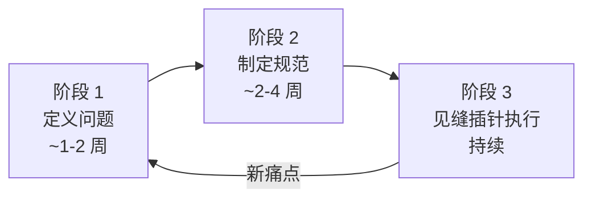
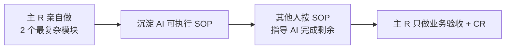

# Playbook: 在做项目改造（零排期式引入 Harness）

> 场景：项目已经在跑，业务在做，没有专项时间。怎么逐步引入 Harness？

---

## 何时用这个 Playbook

- ✅ 项目已上线/在做，业务持续
- ✅ 团队 90%+ 时间在做新需求，无重构排期
- ✅ AI Coding 已部分使用，但混乱
- ✅ 想 **不影响业务** 引入工程化

不适用：

- ❌ 全新项目，用 `new-project.md`
- ❌ 需要大规模架构调整，用 `refactoring.md`

---

## 核心原则：见缝插针

> **"将技术债拆解到日常高优需求中作为'顺带动作'。"** —— 美团

**反模式**：

- ❌ 推倒重来（风险高，业务停摆）
- ❌ 申请专项排期（永远批不下来）

**正模式**：

- ✅ 借需求顺带做
- ✅ 每个高优需求都是引入 Harness 的机会

---

## 三阶段时间线（参考美团 31 万行实战）

---

### 阶段 1：定义问题（借 AI 梳理技术债）

**目标**：在 1-2 周内识别 P0/P1 技术债，**不动代码**。

**方法**：**专家经验定向 + AI 辅助排查**

> "AI 把'看全'门槛打到零，经验价值转移到'判断什么重要'。"

#### 步骤

1. **资深开发圈定高危边界**：哪些模块最容易出问题
2. **AI 穷举扫描**：让 AI 在圈定范围内扫描具体问题
3. **人工分类**：哪些是 P0/P1/P2

#### AI 扫描的典型方向

- 业务模型缺陷（业务对象设计、转换层泄露）
- 数据库性能（缺索引、慢查询、N+1）
- 状态管理混乱
- 重复代码 / 拷贝粘贴
- 不一致的命名/分层
- 接口契约漂移

#### 意外收获

美团实战：定位到 **10 个肉眼难发现的深藏性能隐患**。

**产出**：`docs/tech-debt-inventory.md` （技术债清单 + 优先级）

### 阶段 2：制定 AI 友好的研发规范

**目标**：把工程标准从"文档"升级为 AI 可强制的 Rule + Skill。

#### 步骤

1. **调研业内**：业界对类似项目的最佳实践
2. **沉淀核心规约**：
   - 工程分层规范（如四层架构：Starter/Application/Infrastructure/Common）
   - 业务域模型规约
   - 仓储层规约
   - 接口契约规约
3. **升级为 always Rule**：编码时强约束
4. **沉淀渐进式 Skill**：复杂场景的操作指南
5. **配套 Scripts**：自动检查

#### 关键动作

> 规范从"文档"升级为 **always 级别的 AI Rule** + **预 CR 前置校验**

#### 处理职责边界

针对最易分歧的"编排类 vs 能力类"边界：

- 沉淀为 **渐进式 Skill**（编码时按场景加载）
- 而非 always Rule（避免上下文污染）

**产出**：

- `docs/rules/always.md`
- `.cursorrules` / `.claude/rules/`
- `docs/skills/` 渐进式 Skill 集
- `scripts/lint-architecture.sh`

### 阶段 3：见缝插针式执行

**目标**：每个高优需求都顺带做技术债清理。

#### 工作模式：主 R 打样 → SOP 分发

#### 拆解技术

**每个高优需求拆为两部分**：

- 纯业务需求部分
- 顺带的技术债清理部分

**例子（美团实证）**：

- 借核心功能迭代落地全新业务模型
- 借另一功能升级，设计全新质检业务模型并完成全量迁移

#### 难点：拆解精度

> **"重构不需要排期，需要拆解能力。"**

- ❌ 拆得太大：拖慢业务
- ❌ 拆得太小：技术债堆新债
- ✅ 拆得刚好：技术债 ⊆ 业务需求的影响范围

---

## 引入 Pre-PR 机制（必做）

随着 AI 代码量增加，CR 会成为瓶颈。**必须**引入 Pre-PR。

#### Pre-PR 流程

1. **RD 提交前用 AI 多轮自查**（规范、Bug、异常、一致性、可扩展性、性能）
2. **AI 按模板生成标准 PR 文档**（改动点、影响范围、Review 重点）
3. **人 Reviewer 聚焦业务语义**，不再找规范错

**详见** `references/04-quality-gates.md` § 4

---

## 引入 Scripts 闸机（必做）

**没有 Scripts，所有规范都是一纸空文。**

#### 起步检查（第一周就要有）

- 编译过
- 测试全过
- **测试数量不能异常减少**（防 AI 偷删）

#### 第二月起补充

- 静态规范检查（A 类）
- 工程一致性检查（C 类）
- **基线对比机制**

**详见** `references/04-quality-gates.md`

---

## 渐进引入 dev-map

**触发条件**：

- 新人/AI 找不到代码入口
- 出现"两人改了相同的东西"
- 影响范围判断越来越模糊

**步骤**：

1. 先建 `docs/dev-map/INDEX.md`（一页够）
2. 按模块逐步建子 map（**借需求顺带做**）
3. 规则：**改这个模块时必须更新对应 map**

---

## 关键决策点

### 决策 1：先做哪部分？

- 哪个问题最反复出现 → 先做
- 哪个最痛 → 先做
- 哪个最容易借需求做 → 先做

### 决策 2：always Rule 还是 Skill？

- 不可违反 + 频繁 + 静态可检 → always
- 否则 → Skill
- **建议**：always 不超过 20 条（多了 AI 会忘）

### 决策 3：什么时候停下来做"专项"？

- **几乎不需要**
- 除非：某个技术债拆不进任何需求（罕见）

### 决策 4：跟业务方怎么沟通？

- **不要说"我要做重构"**（会被砍掉）
- 而是说"这个需求顺带把 X 也做了，多花 20% 时间"
- 业务方通常会同意（小代价 + 不耽误进度）

---

## 反模式（在做项目特有）

| 反模式                                      | 后果                    |
| ------------------------------------------- | ----------------------- |
| 申请专项排期                                | 永远批不下来            |
| 不动 AI 时代规范，假装 Cursor 只是 Tab 补全 | AI 代码加速腐化         |
| 让每个人自己摸索 SOP                        | 千人千面                |
| Pre-PR 不引入                               | CR 木桶效应             |
| Scripts 不引入                              | "通过测试就提交" 反模式 |
| dev-map 让 PM 维护                          | 跟代码漂移              |

---

## AI 自检清单（在做项目专用）

- [ ] 这个改动顺带能清理哪个技术债吗？
- [ ] 这个改动对应的 dev-map 章节我更新了吗？
- [ ] 我有 always Rule 约束吗？
- [ ] Scripts 跑过了吗？（含基线对比）
- [ ] PR 描述符合 Pre-PR 模板吗？
- [ ] 这个错误能沉淀为新 Rule/Skill 吗？

---

## 时间线预期

| 阶段   | 时间   | 主要产出                      |
| ------ | ------ | ----------------------------- |
| 阶段 1 | 1-2 周 | 技术债清单                    |
| 阶段 2 | 2-4 周 | always Rule + Skill + Scripts |
| 阶段 3 | 持续   | 每个需求带技术债清理          |

**美团参考**：从 5 万行到 31 万行，**90% 代码 AI 写**，没申请一天专门重构时间。

---

## 关键引言

> "重构不需要排期，需要拆解能力。" —— 美团

> "经验的价值正在从'能看全'转移到'能判断什么重要'。" —— 美团

> "顺序错了，AI Rule 写得再好也是一纸空文。" —— 美团

---

## Common Issues / Fallbacks

| 症状                         | 可能原因               | 应急处理                                                    |
| ---------------------------- | ---------------------- | ----------------------------------------------------------- |
| 业务方不让顺带做技术债       | 拆解太大，看着像"重构" | 拆得更细，让其看起来像"为这个需求"做的必要清理              |
| Scripts 报警太多无法都修     | 没分级                 | 分级：阻塞合并 / 警告但放行 / 仅记录                        |
| dev-map 跟不上代码变化       | 没强制更新             | Scripts 检查 diff：动了 src/X → 必须 diff docs/dev-map/X.md |
| Pre-PR 让 RD 提交变慢        | 自查清单太长           | 精简到 6 维度，AI 一次跑完                                  |
| 阶段 1 找出几百个技术债      | 没分级或专家圈定不准   | 重做圈定，专家定向更严，AI 只在边界内扫描                   |
| 团队抵触 always Rule         | 未做"人人对齐"         | 退一步：先共识工作坊，再固化 Rule                           |
| 老代码不符合新 Rule 不能合并 | 基线对比未启用         | 立即引入基线对比：基线允许的不阻塞，新增才阻塞              |

## 下一步

- 想看大规模重构详情 → `refactoring.md`
- 想看多团队协作 → `multi-team.md`
- 回主入口 → `../SKILL.md`
