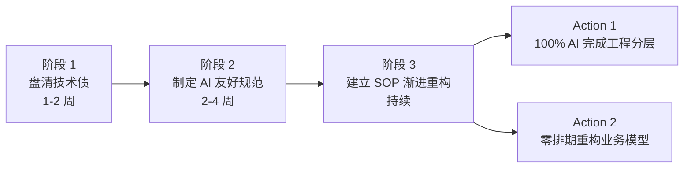
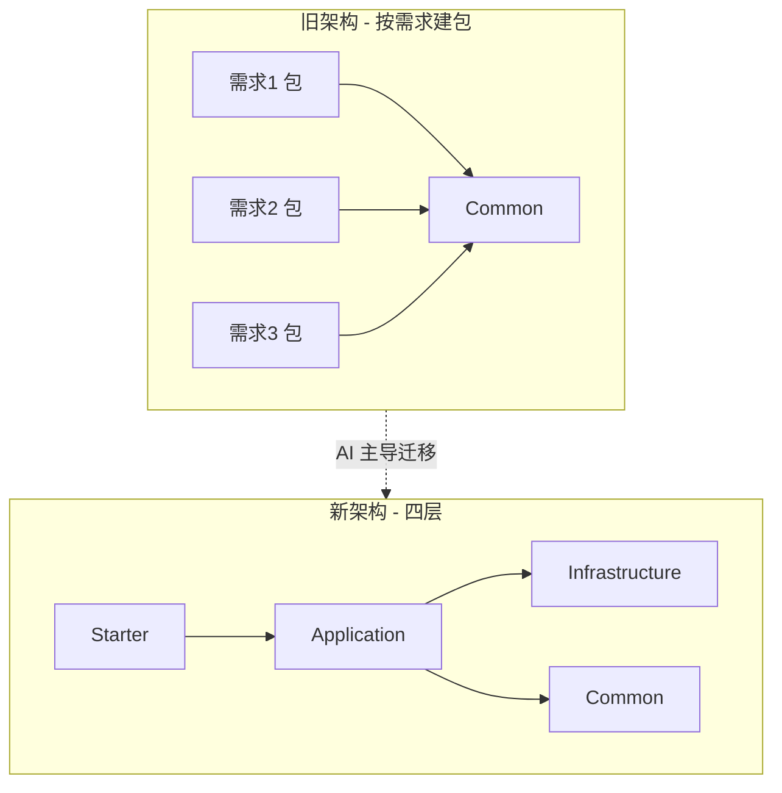

# Playbook: 大规模重构（对标美团 31 万行）

> 场景：项目规模大（>5 万行），架构已腐化，需要系统性重构。

---

## 何时用这个 Playbook

- ✅ 代码量 5 万行以上
- ✅ 架构问题深，新需求成本越来越高
- ✅ AI Coding 已存在，但加速腐化
- ✅ 团队规模 5-30 人
- ✅ 业务不能停

不适用：

- ❌ 小项目（<5000 行）→ `small-project.md`
- ❌ 全新项目 → `new-project.md`
- ❌ 遗留系统迁移（旧栈→新栈）→ `legacy-migration.md`

---

## 核心思想：第三条路

**两条传统路（都有问题）**：

| 路       | 问题                         |
| -------- | ---------------------------- |
| 推倒重来 | 风险巨大、业务停摆、可能失败 |
| 申请专项 | 永远批不下来、与业务零和博弈 |

**第三条路**：**见缝插针 + 主 R 打样 + AI 加速**

---

## 美团 31 万行重构案例（标杆参考）

### 项目背景

- 2025年6月 不足 5 万行 → 31 万行
- 月均承载 16 个需求（80% 业务 + 20% 技术）
- 团队 **90%+ 代码由 AI 生成**

### 三大重构动因

1. 旧数据模型扩展能力差，新增业务"烟囱式"
2. 长期"按需求建包"导致"面条式代码"严重腐化
3. 团队背景复杂 + AI Coding → **无规范则加速腐化**

### 关键指标

- 没申请一天专门重构时间
- 100% AI 完成工程分层迁移
- 见缝插针落地新业务模型

---

## 完整流程（三阶段）



---

### 阶段 1：盘清技术债（借 AI 梳理）

**目标**：1-2 周内识别 P0/P1 技术债。

**核心方法**：**专家经验定向 + AI 辅助排查**

#### 步骤

1. **资深开发圈定高危边界**
   - 哪些模块业务变化频繁？
   - 哪些模块出过线上问题？
   - 哪些模块有"老员工才懂的潜规则"？

2. **AI 在圈定范围内穷举扫描**
   - 业务模型缺陷
   - 数据库性能（索引、慢查询、N+1）
   - 状态管理混乱
   - 转换层泄露
   - 重复代码 / 拷贝粘贴
   - 不一致的命名/分层

3. **人工分类优先级**
   - P0：影响线上稳定性
   - P1：影响开发效率
   - P2：影响代码美观

#### 美团实战亮点

> **意外发现**：短时间内定位 **10 个肉眼难以发现的深藏性能隐患**

**关键认知**：

> "AI 把'看全'门槛打到零，经验价值从'能看全'转移到'能判断什么重要'。"

**产出**：`docs/tech-debt-inventory.md`

---

### 阶段 2：制定 AI 友好的研发规范

**目标**：把架构标准固化为 AI 强制规则。

#### 关键动作

**规范从"文档"升级为**：

1. **always 级别的 AI Rule**（编码时强约束）
2. **预 CR 前置校验**

#### 沉淀的核心规约

参考美团：

- **工程分层规范**：Starter / Application / Infrastructure / Common
- **业务域模型规约**：按业务域组织包结构
- **仓储层规约**：阻断 PO 上浮、收口转换逻辑
- **接口契约规约**：Application 层重建接口契约

#### 职责边界（最易分歧的部分）

针对"编排类 vs 能力类"职责边界：

- **不要做成 always Rule**（会污染上下文）
- 沉淀为 **渐进式加载的 Skill**（按场景触发）

#### 配套 Scripts

```bash
# 静态检查
- 包结构合规（如：dao 不能依赖 controller）
- PO 是否泄露到 Application 层
- 接口签名是否在 Application 层重建

# 基线对比
- 开发前跑一次 → baseline.json
- 开发后跑一次 → 对比
- 新增违规必须修
```

**产出**：

- `docs/rules/always.md`
- `.cursorrules` / `.claude/rules/`
- `docs/skills/` 渐进式 Skill
- `scripts/check-architecture.sh`
- `scripts/check-baseline.sh`

---

### 阶段 3：建立 SOP — "见缝插针"渐进式重构

#### Action 1：100% AI 完成工程分层与解耦

**目标**：从"按需求建包" → 标准四层架构。



##### 三步法

1. **补齐业务对象与数据转换层**，收口转换逻辑
2. **在 Application 层重建接口契约**，阻断 PO 上浮
3. **基于新契约修复上游全链路参数依赖**

##### 执行机制：主 R 打样 → SOP 分发 → 全组并行

```
主 R 亲自迁移 2 个最复杂的包
   ↓
沉淀 AI 可执行 SOP
   ↓
其他人按 SOP 指导 AI 完成剩余包
   ↓
主 R 只做业务语义验收和 CR
```

**美团实证**：十余个核心包**快速完成迁移**。

#### Action 2：零排期重构 — 渐进式业务模型重构

**目标**：将业务模型重构拆解到日常需求中。

##### 实战例子

- 借核心功能迭代落地全新业务模型
- 借另一功能升级，设计全新质检业务模型并完成全量迁移
- 兼容多链路、多视图、多区域交叉验证

##### 难点：拆解精度

> **"重构不需要排期，需要拆解能力。"**

判断标准：

- 既不能拖慢业务（业务方不答应）
- 也不能让需求绕过技术债堆新债
- 需要"极强的技术判断力"

---

## 关键决策点

### 决策 1：先做工程分层还是业务模型？

**先做工程分层**：

- 工程分层是地基
- 业务模型重构需要分层支持
- 分层迁移可以全 AI 自动化

### 决策 2：always Rule 多严？

**核心权衡**：

- 严：质量高但 AI 工作受阻
- 松：AI 顺畅但腐化继续
- **建议**：从严但允许例外（需 PR 说明）

### 决策 3：Scripts 多硬？

**建议分级**：

- 关键约束（如 PO 不能上浮）→ **阻塞合并**
- 重要约束 → **警告但放行**
- 提示性 → **仅记录**

### 决策 4：模型怎么分层？

| Agent        | 模型 | 理由     |
| ------------ | ---- | -------- |
| PM           | 小   | 只路由   |
| 重构方案设计 | 最强 | 判断复杂 |
| 重构执行     | 中   | 按方案做 |
| CR 审查      | 最强 | 高阶判断 |
| 测试生成     | 中   | 基于规则 |

---

## 关键技巧

### 技巧 1：高低阶模型互审

- 用 GPT-5/Claude Opus 审查 GPT-4o-mini/Haiku 的产出
- 判断比生成需要更高阶能力

### 技巧 2：多厂商模型对抗

- OpenAI 模型审 Anthropic 产出（反之亦然）
- 差异化能力互补，盲点不同

### 技巧 3：测试数量强制

- Scripts 检查"测试数不能减少"
- 防止 AI 偷删失败的测试

### 技巧 4：基线对比

- 开发前后跑同样脚本
- 新增违规必须修
- AI 借口"本来就有"被堵死

---

## 反模式（重构特有）

| 反模式                   | 后果                  |
| ------------------------ | --------------------- |
| 推倒重来                 | 风险爆炸              |
| 申请专项排期             | 永远批不下来          |
| 试图人工遍历大代码库     | 看不完                |
| 让每个人独立摸索迁移方式 | 千人千面              |
| 代码库混乱时直接放 AI 写 | AI 不纠偏反而放大差异 |
| 不引入 Scripts 闸机      | 重构后规范更乱        |
| 不做基线对比             | AI 借口"本来就有"     |

---

## AI 自检清单（重构专用）

- [ ] 这个迁移属于哪个 P 级技术债？
- [ ] 我有主 R 沉淀的 SOP 可参考吗？
- [ ] 我能借哪个当前需求一起做？
- [ ] 我的迁移会让 Scripts 通过吗？
- [ ] 测试数量没异常减少吗？
- [ ] PO 没上浮到 Application 层吗？
- [ ] 我更新了对应的 dev-map 章节吗？
- [ ] 我沉淀了新发现的反模式吗？

---

## 成熟度路径

| 阶段        | Harness Level | 关键指标                     |
| ----------- | ------------- | ---------------------------- |
| 重构前      | L0-L1         | 规范靠文档、靠自觉           |
| 阶段 2 完成 | L2            | always Rule + Scripts 闸机   |
| 阶段 3 进行 | L3            | 主 R SOP + Pre-PR + 基线对比 |
| 重构完成    | L4            | 完整 6 零件 + 4 拼图         |

---

## 关键引言

> "重构不需要排期，需要拆解能力。" —— 美团

> "AI Coding 不会自动收敛复杂度。" —— 美团

> "代码库混乱时直接放 AI 写，AI 不纠偏反而放大差异。" —— 美团

> "经验的价值正在从'能看全'转移到'能判断什么重要'。" —— 美团

---

## Common Issues / Fallbacks

| 症状                       | 可能原因             | 应急处理                                          |
| -------------------------- | -------------------- | ------------------------------------------------- |
| 主 R 太忙没时间打样        | 估计不足             | 选第二资深；或先打样 1 个最简单的模块建立模式     |
| 单模块迁移失败             | 粒度太大或依赖未理清 | 拆更小（按方法 / 单文件）；增加 Pre-PR 多轮自查   |
| Scripts 新增违规无法立即修 | 历史遗留太多         | 基线对比：原有违规允许，**新增**违规必须修        |
| AI 借口"这本来就有"        | 没基线对比           | 立即跑基线脚本生成 baseline.json，从此对比        |
| 跨包依赖打不开             | 接口契约未先建立     | 退回三步法的 Step 1：先补 Application 层契约      |
| 测试覆盖率突降             | AI 偷删测试          | Scripts B 类检查必须开启，回滚此 PR               |
| 业务方质疑"为什么这么慢"   | 拆解粒度未透明       | 在 PR 描述里明确"X% 业务 + Y% 技术债"，让进度可见 |
| 多个开发员各自摸索迁移方式 | 主 R 没沉淀 SOP      | 紧急写 SOP，全组对齐再继续                        |

## 下一步

- 想看在做项目改造（中等规模） → `ongoing-project.md`
- 想看遗留系统迁移 → `legacy-migration.md`
- 想看多团队治理 → `multi-team.md`
- 回主入口 → `../SKILL.md`
