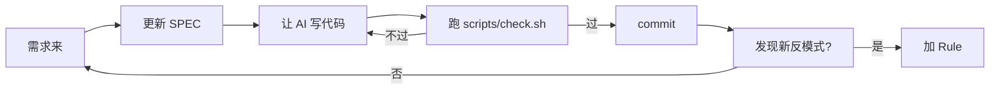

# Playbook: 个人 / 小团队项目（轻量级 Harness）

> 场景：个人副业项目 / 1-3 人小团队 / 玩具/原型项目。

---

## 何时用这个 Playbook

- ✅ 1-3 人团队
- ✅ 代码量 < 5000 行
- ✅ 没有正式的 CI/CD 流程
- ✅ 不需要长期维护（或维护人就是写它的人）
- ✅ 时间紧、迭代快

不适用：

- ❌ 团队 > 3 人 → `new-project.md` 或 `multi-team.md`
- ❌ 代码量 > 5000 行 → `new-project.md`
- ❌ 长期维护、需要新人快速上手 → `new-project.md`

---

## 核心原则：轻量但不放弃

**不应该**：

- ❌ 跳过 Harness（"我一个人无所谓"）—— AI 写代码还是会失稳
- ❌ 上完整 7 Agent + dev-map（杀鸡用牛刀）

**应该**：

- ✅ 最小可用 Harness
- ✅ 只保留**真正高 ROI** 的部分
- ✅ 后期发现需要再加

---

## 最小可用 Harness（MVP）

### 必备 3 件套

| 件               | 工具                   | 投入时间 |
| ---------------- | ---------------------- | -------- |
| **SPEC**         | 1 页 markdown 说清目标 | 30 分钟  |
| **关键 Rule**    | 3-5 条 always Rule     | 30 分钟  |
| **基础 Scripts** | 编译 + 测试一行命令    | 1 小时   |

总投入：约半天搭好，后续节省的时间远超这半天。

### 可选 3 件套（按需）

| 件              | 何时引入             |
| --------------- | -------------------- |
| 简单 dev-map    | 项目超过 10 个文件时 |
| Pre-commit hook | 团队 > 1 人时        |
| 任务清单        | 同时有多个任务时     |

### 不需要的（小项目反模式）

| 反模式                     | 原因           |
| -------------------------- | -------------- |
| ❌ 7 个 Agent              | 杀鸡用牛刀     |
| ❌ 完整 Workflow 定义      | 不值得维护     |
| ❌ 多平面架构（控制/数据） | 项目还没复杂到 |
| ❌ MCP                     | 没外部系统要接 |
| ❌ 严格 Pre-PR             | 1 人没法 PR    |
| ❌ 复杂沙盒                | 信任自己的代码 |

---

## 最小 SPEC 模板（1 页）

```markdown
# SPEC: [项目名]

## 一句话

[项目做什么]

## 目标

- 主要: ...
- 次要: ...

## 范围

- 做: A, B, C
- 不做: D, E

## 验收标准

- [ ] X 功能可用
- [ ] Y 性能达标

## 技术栈

- 语言: ...
- 框架: ...
```

---

## 最小 Rule 模板（3-5 条）

```markdown
# Project Rules

## R1: 命名

- 函数/变量 camelCase
- 类 PascalCase

## R2: 错误处理

- 不要裸 try-catch 吞异常
- 用 console.error / log

## R3: 提交前

- 跑 `npm test`
- 跑 `npm run lint`

## R4: 文件大小

- 单文件 < 300 行（超了拆）

## R5: 依赖

- 加新依赖必须说明理由
```

存在 `.cursorrules` 或 `CLAUDE.md` 或类似文件。

---

## 最小 Scripts 模板

`scripts/check.sh`:

```bash
#!/bin/bash
set -e

echo "==> 编译"
npm run build

echo "==> 测试"
npm test

echo "==> Lint"
npm run lint

echo "==> 检查测试数量（防偷删）"
TEST_COUNT=$(grep -r "it(\|test(" src/ | wc -l)
if [ -f .test-count-baseline ]; then
  BASELINE=$(cat .test-count-baseline)
  if [ "$TEST_COUNT" -lt "$BASELINE" ]; then
    echo "❌ 测试数从 $BASELINE 减到 $TEST_COUNT"
    exit 1
  fi
fi
echo $TEST_COUNT > .test-count-baseline
echo "✅ 全通过"
```

---

## 工作流程（简化版）



---

## 关键决策点

### 决策 1：用什么 AI 工具？

- 个人项目：Cursor / Claude Code / Aider（都行）
- 选你最熟的一个，**不要切来切去**

### 决策 2：什么时候升级？

- 团队人数 > 1 → 升级到 `new-project.md` 流程
- 代码 > 5000 行 → 升级到 `new-project.md`
- 需要协作 → 升级到 `multi-team.md`

### 决策 3：要不要写 dev-map？

- 单文件项目：不需要
- > 10 个文件：写个简单的 INDEX.md
- > 50 个文件：按模块拆 dev-map

---

## 反模式（小项目特有）

| 反模式                    | 后果                |
| ------------------------- | ------------------- |
| 完全跳过 Harness          | AI 在多步任务中失稳 |
| 上完整 Harness            | 维护负担超过收益    |
| 不写 SPEC，"我自己懂"     | AI 不懂，输出乱     |
| 用 Memory 替代 Rule       | 不可见、不可复现    |
| 文档散落在 ChatGPT 对话里 | 跟代码漂移          |

---

## 升级时机

什么时候从"小项目"升到"新项目"流程：

| 信号            | 行动                    |
| --------------- | ----------------------- |
| 第 2 个人加入   | 升级到 `new-project.md` |
| 代码超 5000 行  | 升级到 `new-project.md` |
| 开始有真用户    | 加 Scripts、Pre-PR      |
| 出现 bug 反复犯 | 引入 Error-Driven 闭环  |
| AI 经常迷路     | 引入 SPEC + dev-map     |

---

## AI 自检清单（小项目）

- [ ] SPEC 是不是 1 页就能说清？
- [ ] Rule 是不是 ≤ 5 条？
- [ ] Scripts 是不是一行命令？
- [ ] 是不是真的不需要多 Agent？

---

## 关键引言

> "不要贪大，不要一步到位，先从你最反复、最痛的那个问题开始。" —— 腾讯/白家杰

> "Memory 在个人工具/小型项目里性价比高，省重复话。" —— 腾讯/白家杰

---

## Common Issues / Fallbacks

| 症状                   | 可能原因              | 应急处理                                   |
| ---------------------- | --------------------- | ------------------------------------------ |
| Bug 反复犯             | Error-Driven 闭环没开 | 出错 → 立即沉淀为 Rule / Skill / Scripts   |
| 项目加了第 2 个人      | 升级时刻              | 切换到 `new-project.md` 流程               |
| 代码超 5000 行后开始乱 | 升级时刻              | 切换到 `new-project.md`，建 SPEC + dev-map |
| AI 在多步任务迷路      | 缺 SPEC 或上下文太散  | 写 1 页 SPEC，每次任务前喂给 AI            |
| Scripts 麻烦不想跑     | 太复杂                | 简化到一行命令；如 `npm run check`         |
| Rule 越写越多          | 没控制                | 保持 ≤ 5 条；多了改用 Skill                |

## 下一步

- 项目规模长大 → `new-project.md`
- 加新人 → `multi-team.md`
- 回主入口 → `../SKILL.md`
