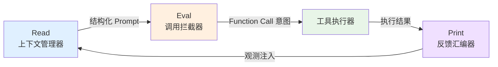
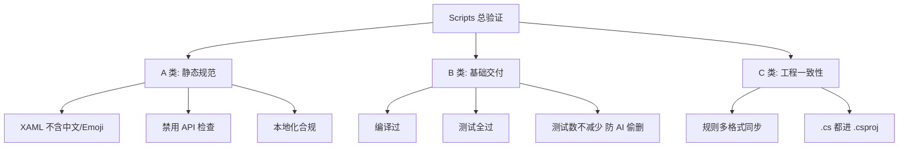
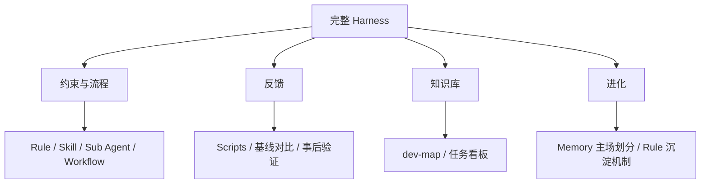
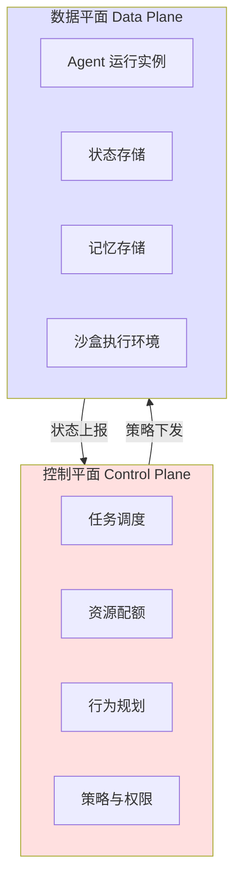
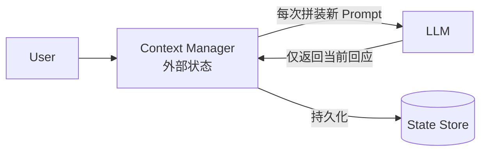
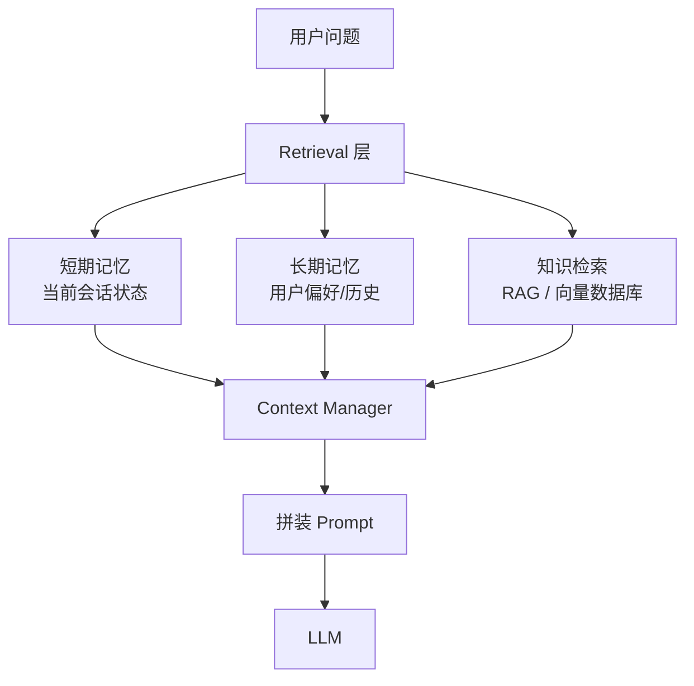
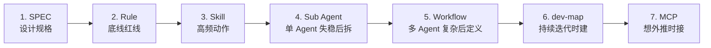

# 02 - 核心架构（6 零件 / 4 拼图 / REPL / 控制&数据平面 / 沙盒）

> 本文回答："Harness 由什么组成？" 提供清晰的分类法和架构层级。

---

## 1. 顶层抽象：Harness = 带边界控制的 REPL 容器

> 来源：TRAE.ai

把任何 Harness 看作一个**带边界控制的 REPL（Read-Eval-Print-Loop）容器**：



| REPL 阶段 | Harness 角色                     | 具体组件                                          |
| --------- | -------------------------------- | ------------------------------------------------- |
| **Read**  | 上下文管理器（Context Manager）  | SPEC 注入、dev-map 查询、Skill 加载、记忆检索     |
| **Eval**  | 调用拦截器（Call Interceptor）   | LLM 调用（带 Rule 软约束）、Function Calling 路由 |
| **Print** | 反馈汇编器（Feedback Assembler） | 工具结果封装为观测、Scripts 验证、Workflow 流转   |
| **Loop**  | 闭环驱动器                       | 错误回退、Rule/Skill 沉淀、PPAF 迭代              |

**关键洞察**：把"AI 在自主思考"这种神秘叙事，落到一个工程师熟悉的执行循环上。

---

## 2. 六大零件清单（核心分类法）

> 来源：腾讯 / 白家杰

| 零件          | 回答什么问题           | 工程角色             | 软/硬约束        | 一句话比喻           |
| ------------- | ---------------------- | -------------------- | ---------------- | -------------------- |
| **Rule**      | 什么事绝对不能乱来     | 基础规矩、红线、底线 | 软（AI 会忘）    | 制度（写在墙上）     |
| **Skill**     | 这件事具体怎么做       | 标准操作手册         | 半软（按需加载） | 操作手册（按需翻）   |
| **Sub Agent** | 复杂任务由谁分工       | 不同阶段的专业角色   | 角色契约         | 专业岗位（各管一段） |
| **Workflow**  | 这些角色按什么顺序接力 | 状态机式流转规则     | 流程             | 接力赛规则           |
| **Scripts**   | 最后谁来判断做没做好   | 统一门禁和事后验证   | **硬（最硬）**   | 闸机（必须刷卡）     |
| **MCP**       | AI 怎么安全接外部系统  | 标准插座             | 接口             | 标准插座（接得上）   |

### 2.1 Rule（规则）

**定义**：基础规矩、红线、底线。如：

- "禁止 XAML 中出现中文/Emoji"
- "禁止直接访问 last_state.json"
- "新增依赖必须经审批"

**软在哪**：

- AI 会忘记（长上下文中沉到底部）
- AI 会"觉得无关"（"这次特殊"）
- AI 会"解释性执行"（"等价验证"、"历史遗留"）

**正确用法**：

- 只当**原则约束**，**不**作为流程执行依据
- 能脚本化的尽量脚本化（→ Scripts）
- Rule 是底线，**不是流程**

### 2.2 Skill（技能）

**定义**：固定动作的标准操作手册。如：

- "编译并跑单测的标准步骤"
- "提交前自查清单"
- "处理 SVN 冲突的标准流程"

**作用**：把高频动作从**临场发挥**变为**按剧本执行**。

**与 Rule 的区别**：

- Rule = "不能做什么"
- Skill = "怎么做"

### 2.3 Sub Agent（子代理）

**定义**：不同阶段的专业角色。典型 7 角色：

```
PM (路由)
  ├─ 需求分析 Agent
  ├─ 方案设计 Agent
  ├─ 闸门总控 Agent
  ├─ 开发实现 Agent
  ├─ 代码审查 Agent
  └─ 测试验证 Agent
```

**关键规则**：

- 下游不能直接改上游文档（**只能阻塞 + PM 打回**）
- PM 只做路由，不做专业判断
- 代码审查 ≠ 测试验证（两道独立的关）
- **模型分层**：PM 用小模型，专业判断用大模型

### 2.4 Workflow（流程）

**定义**：Agent 之间按什么顺序接力的规则。

**三层资产**：

```
Workflow
├─ 流程定义文件 (写给系统看)
│  └─ 阶段、迁移边、回退边
├─ 角色契约 (写给具体角色看)
│  └─ 每个角色必须读什么/写什么/什么情况阻塞
└─ 流程校验脚本 (Scripts 一种)
   └─ 检查一致性和齐全性
```

**理解为接力赛**，明确：

- 当前任务在哪个阶段
- 这个阶段产出是什么
- 谁可以接下一棒
- 哪些问题会触发回退
- 回退到谁那里

### 2.5 Scripts（脚本）

**定义**：统一门禁和事后验证。**Harness 里最硬的东西。**

**三大类检查**：



**核心认知**：

> **"完成"的定义从"我觉得我做完了"变成了"脚本判定你通过了，你才算做完"。**

**基线对比机制**（堵 AI 借口）：

- 开发前跑一次 → 基线
- 开发后跑一次 → 对比
- **新增**失败/告警/违规必须修

### 2.6 MCP（Model Context Protocol）

**定义**：AI 安全接上外部系统的标准接口。

**当前阶段**：不是主干，但越来越关键。

**何时引入**：想把闭环往外推时（构建闭环 → 签名 → 发布 → 结果回写）。

---

## 3. 四块拼图模型（Harness 完整性自检）

> 来源：腾讯 / 白家杰

任何 Harness 必须包含 4 块拼图，**缺一不可**：



| 拼图           | 管什么                      | 缺失后果                              |
| -------------- | --------------------------- | ------------------------------------- |
| **约束与流程** | AI 按什么顺序、什么边界做事 | 裸奔，AI 想干啥干啥                   |
| **反馈**       | 系统能否对结果有说法        | "完成幻觉"（AI 说做完了，实际没做对） |
| **知识库**     | 项目级"从哪进门"的索引      | 重复造轮子、反复踩同一坑              |
| **进化**       | 规范沉淀、人退到哪一层      | 三块冻在某一版，结构脱节              |

**自检题**：

- ❓ 没有 Scripts 闸机 → 反馈缺失
- ❓ 没有 dev-map → 知识库缺失
- ❓ 没机制把"出错→沉淀为 Rule" → 进化缺失

---

## 4. 控制平面 vs 数据平面（架构分层）

> 来源：TRAE.ai（借鉴分布式系统）



| 平面         | 决定什么 | 包含                                             |
| ------------ | -------- | ------------------------------------------------ |
| **控制平面** | "做什么" | 任务调度、资源配额、行为规划、策略与权限         |
| **数据平面** | "如何做" | Agent 运行实例、状态存储、记忆存储、沙盒执行环境 |

**为什么这样分**：

- 让两者**独立演进**
- 控制平面变更不影响数据平面运行
- 多 Agent 系统的可维护性基础

---

## 5. 状态分离原则（核心架构决策）

> **必须将 LLM 严格视为无状态的计算单元（CPU）**，所有跨轮次状态存储在 Harness 外部的上下文状态管理器中。
> —— TRAE.ai

### 为什么

LLM 是"无状态 CPU"的类比：

- CPU 不存数据，数据存在 RAM/磁盘
- LLM 不存状态，状态存在外部存储
- CPU 每次执行只看当前指令 + 当前数据
- LLM 每次推理只看当前 Prompt

### 反模式

**反例**：试图通过 Prompt Engineering 让 LLM 在长对话中"自行维护复杂状态"

- 结果：系统行为混乱、不可预测、难以调试
- 原因：LLM 的"记忆"不可靠（公理 2）

### 正确架构



每次调用 LLM：

1. Context Manager 从外部存储读相关状态
2. 拼装 Prompt
3. LLM 推理（无状态）
4. Context Manager 接收回应并更新外部存储

---

## 6. 沙盒分级（安全工程化）

> 来源：TRAE.ai

| Level | 隔离方式                                          | 适用场景          | 启动开销 |
| ----- | ------------------------------------------------- | ----------------- | -------- |
| L1    | 进程级（chroot / Linux namespaces / seccomp-bpf） | 可信内部工具      | <100ms   |
| L2    | 容器级（Docker / containerd）                     | **推荐默认**      | 数百 ms  |
| L3    | 轻量虚拟机（Firecracker）                         | 多租户/不可信代码 | <1s      |
| L4    | 完整虚拟机（KVM / QEMU）                          | 极少数特殊任务    | 数秒     |

**选型决策树**：

```
AI 要执行任意代码？
├─ 否 → 不需要沙盒
└─ 是
   ├─ 代码可信（内部工具）→ L1
   ├─ 默认情况 → L2 ⭐
   ├─ 多租户/外部代码 → L3
   └─ 高安全要求 → L4
```

---

## 7. 三层记忆架构（系统级 Memory）

> 注意：此处 Memory 指**系统级**外部存储，**不是**对话级 Memory。详见 `05-knowledge-base.md`



| 层           | 用途                | 实现             |
| ------------ | ------------------- | ---------------- |
| **短期**     | 当前会话/任务上下文 | 进程内状态       |
| **长期**     | 历史交互/用户偏好   | 持久化存储（DB） |
| **知识检索** | 项目知识库          | RAG / 向量数据库 |

**注入边界（Injection Boundary）至关重要**：RAG 结果在 Prompt 的位置（前/中/后）会影响效果（**Lost in the Middle** 问题）。

---

## 8. 渐进引入顺序（不要一步到位）



详见 `playbooks/new-project.md` 和 `playbooks/ongoing-project.md`。

---

## 关键引言

> "Rule 不是没用，而是 Rule 只能做'原则约束'，不能做'流程执行'。" —— 腾讯/白家杰

> "你说你做完了没用，得跑过我这关才算。" —— Scripts 的定位

> "真正贵的不是 token，真正贵的是失控。" —— 选结构化调度的理由

> "必须将 LLM 严格视为无状态的计算单元（CPU）。" —— TRAE.ai

---

## 下一步

- 想看具体流程怎么走 → `03-workflow.md`
- 想看质量怎么保证 → `04-quality-gates.md`
- 想看知识库怎么建 → `05-knowledge-base.md`
