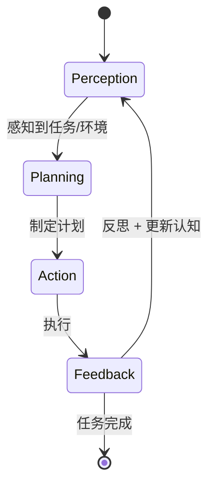
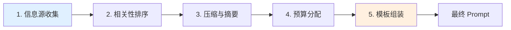
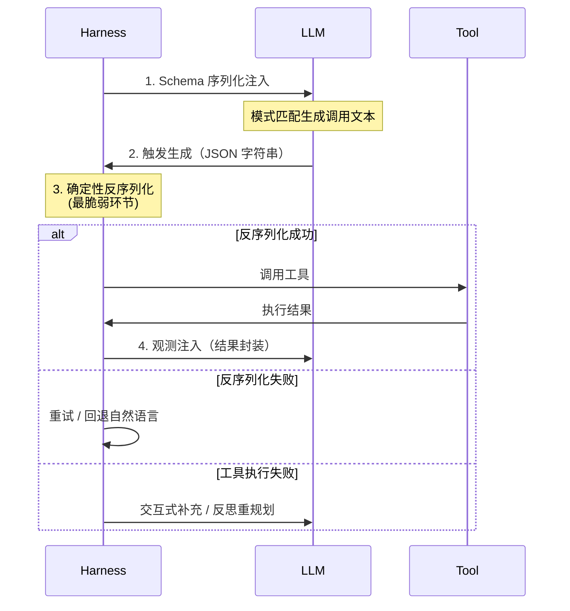
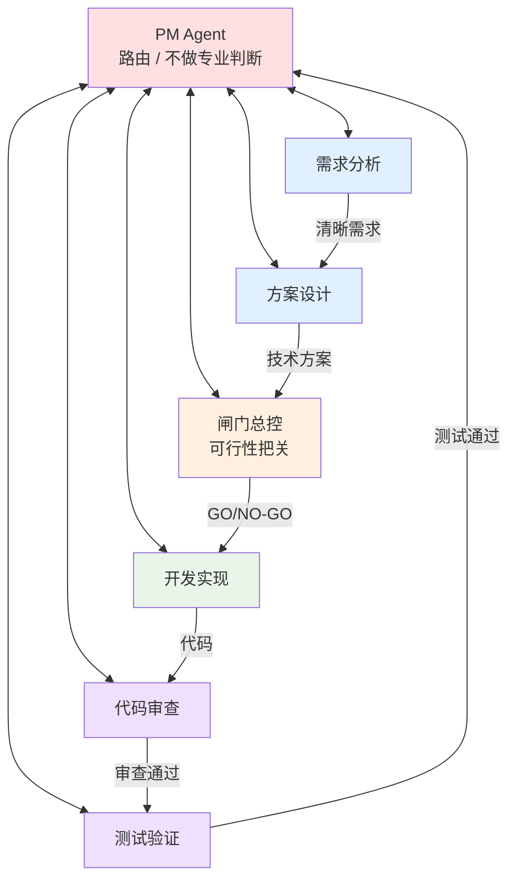
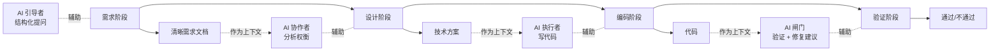

# 03 - 工作流程（PPAF / Token 流水线 / Function Calling / 7 Agent / Workflow 三层）

> 本文回答："Harness 里的 Agent 是怎么工作的？" 从单 Agent 闭环到多 Agent 协作的完整流程设计。

---

## 1. PPAF 闭环（Agent 核心循环）

> 来源：TRAE.ai

**PPAF** = Perception 感知 / Planning 规划 / Action 行动 / Feedback 反思



| 阶段                | 做什么                     | Harness 提供什么                    |
| ------------------- | -------------------------- | ----------------------------------- |
| **Perception** 感知 | 理解用户意图、读取项目状态 | Context Manager、dev-map、SPEC 注入 |
| **Planning** 规划   | 制定行动计划               | Plan-and-Execute 框架、模板         |
| **Action** 行动     | 调用工具、写代码、运行脚本 | Function Calling、沙盒、工具集      |
| **Feedback** 反思   | 检查结果、决定下一步       | Scripts 验证、错误回退机制          |

**反模式**：把核心循环写成简单的 `while(true)` —— 生产环境需要工作流引擎（支持暂停/恢复、幂等重试、长周期任务）。

---

## 2. Token 转化流水线（5 步）

> 来源：TRAE.ai

**核心挑战**：在"无限的外部世界状态"与"有限的 LLM 上下文 Token"之间建立双向映射。

**核心思想**：与其指望模型"自己想清楚该关注什么"，不如通过 Token 转化机制**主动构建上下文**。



| 步               | 做什么                                                   | 工程方法             |
| ---------------- | -------------------------------------------------------- | -------------------- |
| **1 信息源收集** | 聚合用户问题、短期记忆、长期检索结果                     | 多源 fetch           |
| **2 相关性排序** | 基于时间、语义相似度打分                                 | 嵌入 + 重排          |
| **3 压缩与摘要** | 对冗长低密度内容做摘要                                   | 二次 LLM 调用 / 模板 |
| **4 预算分配**   | 按 Token 预算为不同信息类别分配额度                      | 优先级 + 配额        |
| **5 模板组装**   | 用结构化模板（`[user_request]`、`[tool_output]` 等）拼装 | 占位符替换           |

**关键纪律**：每一步都可工程化、可度量、可优化。

---

## 3. Function Calling 生命周期

> 来源：TRAE.ai



**4 个阶段**：

1. **Schema 序列化**：工具定义 → JSON Schema → 注入 Prompt
2. **触发生成**：LLM 模式匹配生成调用文本
3. **确定性反序列化**：**最脆弱环节**，需处理 JSON 格式错误
4. **观测注入**：执行结果封装为观测文本回注

**降级路径**（按严重度）：
| 失败 | 降级 |
|------|------|
| 反序列化失败 | 重试 → 回退到自然语言 |
| 工具执行失败 | 交互式补充参数 → 反思与重规划 |
| 反复失败 | 退回"只读 + 建议"模式 |

---

## 4. 七 Agent 结构化调度（推荐配置）

> 来源：腾讯 / 白家杰（JK Launcher 实战）

> 注意：**不是一开始就 7 个**。单 Agent 失稳后才拆。详见演进顺序。

### 4.1 七角色总图



### 4.2 各 Agent 详细职责

| Agent           | 解决什么问题              | 边界（不做什么）              |
| --------------- | ------------------------- | ----------------------------- |
| **1. PM**       | 路由、交接、回退、进度    | **不做专业判断**，只守流程    |
| **2. 需求分析** | 把模糊诉求变清晰需求      | 不碰技术细节                  |
| **3. 方案设计** | 把需求变技术方案          | **不直接改需求**（要打回 PM） |
| **4. 闸门总控** | 开发前可行性把关          | 只决定 GO/NO-GO，不做具体方案 |
| **5. 开发实现** | 真正落地代码              | 严格按方案                    |
| **6. 代码审查** | 实现质量、需求/方案一致性 | **不做功能测试**              |
| **7. 测试验证** | 功能、稳定性、边界、回归  | **不做代码审查**              |

### 4.3 三条不可破规则

1. **下游不能直接改上游文档**
   - 反例：方案设计觉得需求不严谨 → 直接补需求
   - 正确：提阻塞 → PM 打回上游 → 上游修正

2. **代码审查 ≠ 测试验证**
   - 不能合并成一个 Agent，两道独立的关

3. **PM 只做路由**
   - PM 站中心容易"顺手给意见"
   - 必须克制，专业判断交给专业 Agent

### 4.4 模型分层配置

> 来源：腾讯 / 白家杰

| Agent    | 模型档位           | 理由             |
| -------- | ------------------ | ---------------- |
| PM       | 相对简单、性价比高 | 只做路由，简单   |
| 需求分析 | 中高档位           | 需要理解复杂业务 |
| 方案设计 | **最高档位**       | 专业判断，权衡多 |
| 闸门总控 | 高档位             | 风险判断         |
| 开发实现 | 中档位             | 按方案执行       |
| 代码审查 | **最高档位**       | 高阶判断         |
| 测试验证 | 中高档位           | 边界场景识别     |

类比："不是每个岗位都配同一把最贵的锤子。"

---

## 5. Workflow 三层资产

> 来源：腾讯 / 白家杰

| 层               | 写给谁看     | 内容                                   |
| ---------------- | ------------ | -------------------------------------- |
| **流程定义文件** | 系统         | 阶段、迁移边、回退边                   |
| **角色契约**     | 具体角色     | 每个角色必须读什么/写什么/什么情况阻塞 |
| **流程校验脚本** | Scripts 系统 | 检查流程定义、契约的一致性和齐全性     |

### 5.1 流程定义文件示例

```yaml
# workflow.yaml
states:
  - 需求分析
  - 方案设计
  - 闸门总控
  - 开发实现
  - 代码审查
  - 测试验证
  - 完成

transitions:
  - from: 需求分析
    to: 方案设计
    when: 需求清晰且 PM 确认
  - from: 方案设计
    to: 需求分析  # 回退边
    when: 设计者认为需求有歧义
  ...
```

### 5.2 角色契约示例

```yaml
# roles/dev.yaml
角色: 开发实现 Agent
必读:
  - 技术方案 (上游产出)
  - 相关 dev-map 章节
  - 项目 Rule 集合
必写:
  - 代码改动
  - dev-map 更新 (你改的部分)
阻塞条件:
  - 方案中存在矛盾
  - 缺少必要的 dev-map 信息
  - Scripts 失败
```

### 5.3 上下文纪律

> **每一棒只给当前该看的那一份材料**。上下文越长，重点反而越散。

---

## 6. 规划模式按复杂度递进

> 来源：TRAE.ai

```
默认: Plan-and-Execute
   │
   ├─ 简单任务 → 单 Agent + Plan-and-Execute
   │
   ├─ 复杂任务 → 加入重规划（Re-planning）
   │
   └─ 长期开放任务 → 多 Agent + 多层规划 + Workflow
```

**关键原则**：

- 别一开始就堆 7 个 Agent
- 单 Agent 失稳时才拆
- 多 Agent 太复杂时才补 Workflow

---

## 7. AI 全链条参与（不只是编码段）

> 来源：腾讯 / 第一性原理



| 阶段 | AI 角色                                | 关键产出               |
| ---- | -------------------------------------- | ---------------------- |
| 需求 | **引导者**（结构化提问帮人显式化意图） | 清晰需求文档           |
| 设计 | **协作者**（分析权衡、提替代方案）     | 技术方案               |
| 编码 | **执行者**                             | 代码                   |
| 验证 | **闸门**                               | 通过/不通过 + 修复建议 |

**每阶段产出自然成为下阶段的高质量上下文** → 减少信息损耗（公理 1）。

---

## 8. 反模式（流程层）

### 反模式 1: 一个 Agent 干到底

- 既做需求、又做方案、又做开发、还自己审自己
- **后果**：必然失稳

### 反模式 2: 去中心化自由协商

- 例如：AutoGen GroupChat 类
- **后果**：路径不稳定、责任边界不清、难维护
- **金句**：**"真正贵的不是 token，真正贵的是失控。"**

### 反模式 3: "动态招聘"型多 Agent

- 运行时按需创建 Agent
- **后果**：角色边界漂移、维护成本高

### 反模式 4: 下游改上游文档

- **后果**：责任边界模糊
- **正确**：阻塞 + 打回上游

### 反模式 5: PM Agent 越界

- "顺手给个意见"
- **正确**：PM 只做路由器

### 反模式 6: 流程靠 PM 长文记忆

- **后果**：不可校验、不可审计
- **正确**：流程抽成可校验资产（流程定义文件 + Scripts 校验）

---

## 关键引言

> "真正贵的不是 token，真正贵的是失控。" —— 腾讯/白家杰

> "AI 不是助手，AI 更像是一支执行力极强但必须被制度化管理的团队。" —— 腾讯/白家杰

> "先让 AI 知道该做什么，再让它知道必须怎么做，再让它在复杂任务里学会分工，最后再让整套流程本身变成可维护的工程资产。" —— 腾讯/白家杰

---

## 下一步

- 想看质量怎么保证 → `04-quality-gates.md`
- 想看 6 大实践全貌 → `07-six-practices.md`
- 想看具体场景流程 → `playbooks/`
