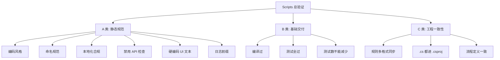
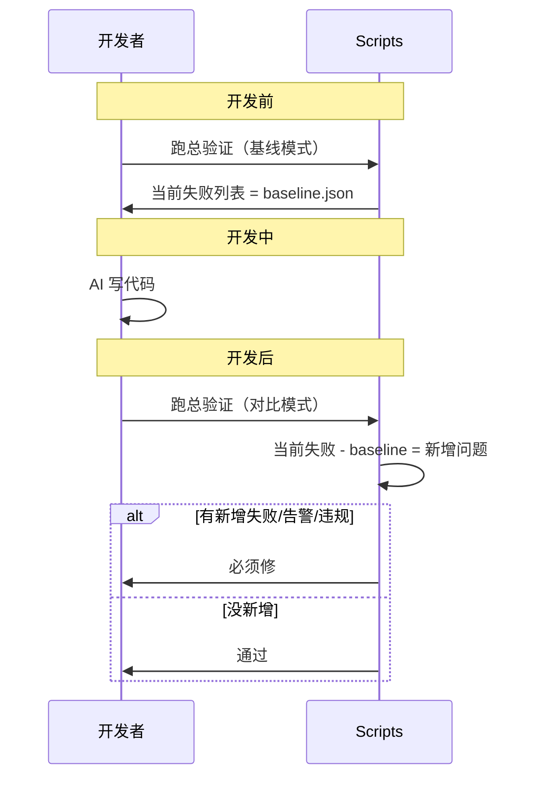
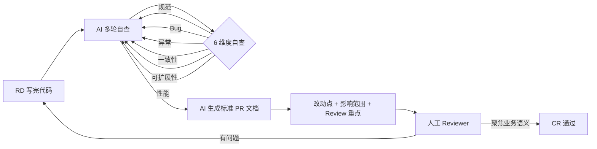
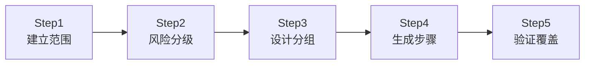
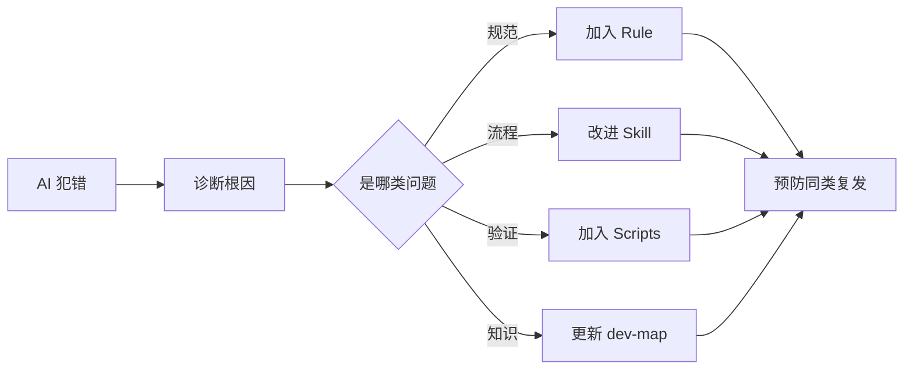

# 04 - 质量门禁（Scripts / 基线对比 / Pre-PR / 测试 SOP）

> 本文回答："如何让 AI 写的代码可靠？" Scripts 是 Harness 里最硬的东西。

---

## 1. 完成的重新定义

> **"完成"的定义从"我觉得我做完了"变成了"脚本判定你通过了，你才算做完"。**
> —— 腾讯 / 白家杰

这是质量门禁存在的**根本理由**：把"完成"从主观判断变为客观判定。

---

## 2. Scripts 总验证脚本（三大类）

### A 类：静态规范问题

具体例子（来自 JK Launcher 实战）：

- XAML 里是否出现中文、Emoji
- 是否使用 C# 8.0+ 语法
- 是否直接用 `MessageBox.Show`
- 是否有硬编码 UI 文本
- 日志是否缺少前缀
- 是否直接访问 `last_state.json`
- SVN 认证参数是否规范
- 文件是否过长
- 本地化是否合规

### B 类：基础交付门槛

- 编译必须成功
- 测试必须全部通过
- **测试数量不能异常减少**（防止 AI 偷偷删测试）⭐

> 这是个非常聪明的检查：AI 在压力下可能会"为了让 CI 过"删掉失败的测试。门禁要**反向检测**这种行为。

### C 类：工程一致性

- 规则文件多格式同步
- `.cs` 文件是否都进了 `.csproj`
- 流程定义文件与角色契约是否匹配

---

## 3. 基线对比机制（堵 AI 借口）

> 应对场景：AI 说"这个错误本来就存在"。

**机制**：

- 开发前跑一次 → 保存为 `baseline.json`
- 开发后跑一次 → 对比 baseline
- **新增**的失败/告警/违规必须修
- 已有问题不强制（但建议跟踪）

**为什么这样设计**：

- AI 借口"本来就有"→ 用基线证明伪
- 不要求一次性修所有历史问题（不现实）
- 但**严格禁止新增问题**

---

## 4. Pre-PR 机制（解决 CR 木桶效应）

> 来源：美团

### 4.1 背景：CR 木桶效应

**问题**：AI 提速 10 倍 → 但 CR 没有提速 → **CR 成为新瓶颈**，把 AI 红利吞掉。

**共识**：人工 CR 的价值要重新定义：

> 从 **"你写得对吗?"** 转变为 **"我们是否在正确约束下解决正确问题?"**

### 4.2 新分工

| 谁负责 | 内容                                         |
| ------ | -------------------------------------------- |
| **AI** | 规范类问题、Bug 初筛、一致性、可扩展性、性能 |
| **人** | 前置技术方案评审、最终业务语义把关           |

### 4.3 Pre-PR 流程

**关键步骤**：

1. **RD 提交前**：用 AI 多轮自查（规范、Bug、异常、一致性、可扩展性、性能）
2. **提交时**：附标准 PR 文档（**AI 按模板生成**）
   - 改动点
   - 影响范围
   - 需重点 Review 的业务逻辑
3. **Reviewer**：拿到"已过滤基础规范错误"的高质量代码，**聚焦核心业务语义**

### 4.4 两个高阶 CR 技巧

#### 技巧 1：高阶模型审查低阶模型

- 用高配模型（GPT-5 / Claude Opus）作为 **Judge Model**
- 审查低阶模型（GPT-4o-mini / Haiku）的产出
- **理由**：判断比生成更需要高阶能力

#### 技巧 2：不同厂商模型对抗互审

- 让 OpenAI 模型审查 Anthropic 模型的产出（反之亦然）
- **理由**：差异化能力互补，盲点不同，覆盖更全
- 实测：覆盖面比单家模型互审高

---

## 5. Human-in-the-loop 测试 SOP

> 来源：美团

### 5.1 失败路线对比

**路线 A（已被证明失败）**：AI 全自动生成测试用例

- 后果：漏隐性高危场景、堆无价值边缘用例
- 原因：AI 缺乏全局业务认知，依赖 PRD，发散

**路线 B（采纳）**：人主导 + AI 辅助 ⭐

### 5.2 5 步 SOP

| 步             | 人做什么                 | AI 做什么                                  |
| -------------- | ------------------------ | ------------------------------------------ |
| **1 建立范围** | 审核排除误报             | 流量监控 + 代码变更双向扫描                |
| **2 风险分级** | 据 AI 信息判定等级       | 读代码：改了多少、分支在哪、旧数据是否兼容 |
| **3 设计分组** | 审核合理性、补特殊场景   | 判定表方法"先拆后合"，生成最小 Case 组合   |
| **4 生成步骤** | 校验匹配实际改动、补边界 | 按"一步操作、多维验证"模板批量生成         |
| **5 验证覆盖** | 最终确认无盲区           | 生成接口×维度覆盖矩阵                      |

### 5.3 核心原则

**人的责任**：定边界、给业务上下文、查盲区
**AI 的责任**：穷举、扫描、生成、矩阵

→ 符合公理 3（AI 穷举 + 人判断）。

---

## 6. 反馈闭环（Error-Driven）

**完整知识生命周期**：

- 自上而下：编码已有知识为 Rule/Skill/Scripts
- 自下而上：从错误中生长新知识
- 两者结合 = Error-Driven 闭环

---

## 7. 反模式（质量层）

### 反模式 1："通过测试就能提交"

**后果**：架构腐化但功能正常 → 长期不可维护
**正确**：Scripts 多层检查（编译 + 测试 + 静态规范 + 测试数对比）

### 反模式 2: "我觉得做完了"

**后果**：完成幻觉
**正确**：Scripts 判定通过 = 完成

### 反模式 3: AI 全自动生成测试

**后果**：漏隐性高危、堆无价值边缘 case
**正确**：人主导分级 + AI 穷举

### 反模式 4: "这错误本来就有"

**后果**：AI 卸责，新增问题混入
**正确**：基线对比堵住

### 反模式 5: CR 还停留在"找错字"

**后果**：CR 木桶效应吞掉 AI 提效红利
**正确**：Pre-PR + 人聚焦业务语义

### 反模式 6: 单模型审单模型

**后果**：盲点相同
**正确**：高阶审低阶 + 跨厂商对抗

---

## 8. 关键引言

> "你说你做完了没用，得跑过我这关才算。" —— Scripts 的定位

> "完成的定义从'我觉得我做完了'变成了'脚本判定你通过了，你才算做完'。" —— 腾讯/白家杰

> "人工 CR 的价值，应该从'你写得对吗?'转变为'我们是否在正确的约束下解决正确的问题?'" —— 美团

---

## 下一步

- 想看团队治理 → `06-team-governance.md`
- 想看演进策略 → `playbooks/ongoing-project.md`
- 想看反模式大全 → `08-antipatterns.md`
