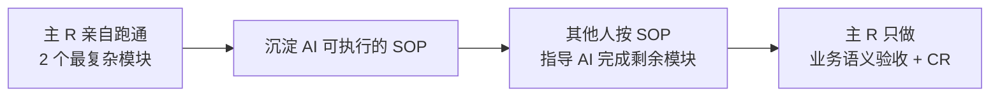
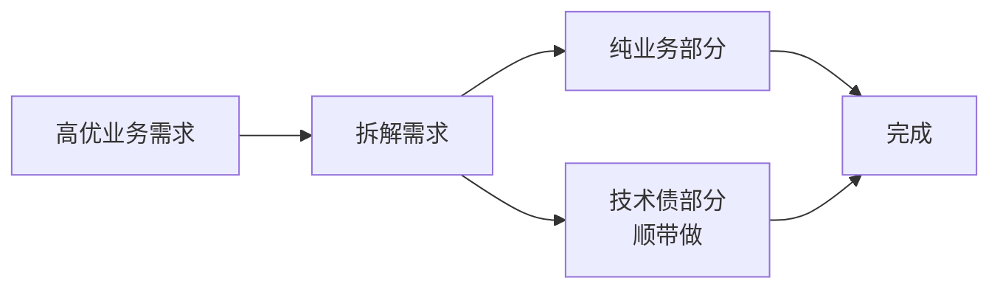
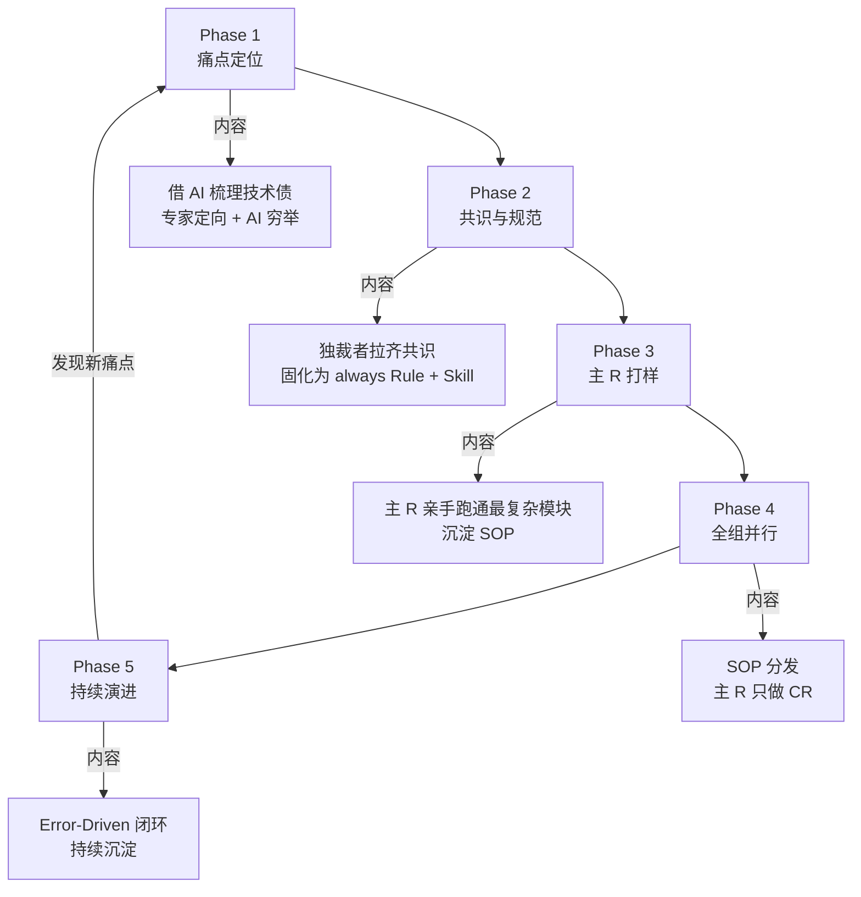

# 06 - 团队治理（人人对齐 / 独裁者 / 主 R 打样 / 见缝插针 / CR 重新定义）

> 本文回答："团队层面如何让 AI Coding 落地？" 真正的瓶颈在人，不在工具。

---

## 1. 顺序律：人人对齐 → 人机对齐

> 来源：美团

### 1.1 核心论断

> **"顺序错了，AI Rule 写得再好也是一纸空文。"**

正确顺序：

1. **标准对齐（人人对齐）**：先在人之间达成共识
2. **人机对齐**：把共识固化为 AI Rule / Skill

颠倒顺序的后果：

- 没共识 → Rule 写得再好也会被解释成不同版本
- 不同工程师理解不同 → AI 产出不一致 → 系统加速腐化

### 1.2 阶段任务

#### 阶段 1：人人对齐

- 拉齐产品、运营、算法、QA 等所有评测标准
- 需要 1 位强有力的"独裁者"角色（见下节）
- 产出：共识文档

#### 阶段 2：人机对齐

- 共识 → AI Rule（always 加载）
- 共识 → AI Skill（按需加载）
- 通过模型选型和指标优化，使**人机一致率达到阈值**（如 90%）
- 才能让机器评价可信

---

## 2. 独裁者原则

> 来源：美团

### 2.1 核心金句

> **"1 个独裁者好过 10 个民主者。"**

### 2.2 为什么

**标准制定阶段**，民主决策的问题：

- 每个人都有合理意见
- 讨论永远收敛不到一处
- 标准漂移、不稳定
- 工程师按"自己理解"用 AI → 各自不同的代码

**解决方案**：

- 在标准制定阶段，需要**一位有判断力的"独裁者"**
- 快速决策、明确边界
- 决策可以被讨论改进，但**不能无限拖延**

### 2.3 谁是独裁者

- 通常是技术 Leader 或 Tech Director
- 有跨域判断力
- 有团队信任
- 有承担"做错就改"的勇气

### 2.4 反模式

| 反模式               | 后果               |
| -------------------- | ------------------ |
| "我们投票决定"       | 标准漂移           |
| "每个人都有道理"     | 永远定不下来       |
| "等架构师有空再讨论" | 拖延中代码已经写完 |
| 没人拍板             | 团队无所适从       |

---

## 3. 主 R 打样 → SOP 分发 → 全组并行

> 来源：美团（31 万行重构实战）

### 3.1 流程

### 3.2 步骤详解

#### Step 1：主 R 亲自跑通最复杂的 2 个模块

- 不是嘴上说"应该这么做"
- 而是**亲自动手**完成
- 选最难的：包含所有边界情况、最复杂依赖

#### Step 2：沉淀 AI 可执行的 SOP

- 把过程写成 **Skill**（按步骤的操作手册）
- 包括：触发条件、输入、步骤、产出、验证

#### Step 3：全组并行执行

- 其他工程师按 SOP 指导 AI 完成剩余模块
- 不需要每人从头摸索
- 一致性显著提高

#### Step 4：主 R 验收

- 不亲自写代码
- 只做**业务语义验收 + CR**

### 3.3 为什么这样设计

**问题**：让每个工程师独立摸索 → 重复劳动 + 千人千面
**解决**：一人趟一遍 + SOP 化 + 复用

**美团实证**：十余个核心包按这个流程**快速完成迁移**。

---

## 4. 见缝插针式重构（第三条路）

> 来源：美团

### 4.1 行业常见两条路（都有问题）

| 路径             | 问题                           |
| ---------------- | ------------------------------ |
| **推倒重来**     | 风险巨大、业务停摆、可能失败   |
| **申请专项排期** | 与业务零和博弈、永远申请不下来 |

### 4.2 第三条路：见缝插针

**核心思想**：将技术债拆解到日常高优需求中作为"顺带动作"。

### 4.3 具体实施

- **不申请专门重构时间**
- 借核心功能迭代落地新架构
- 借另一功能升级，设计新业务模型
- 借机会迁移多链路、多视图、多区域

### 4.4 难点：拆解精度

> **"重构不需要排期，需要拆解能力。"**

**判断难点**：

- 既不能拖慢业务（业务方不答应）
- 也不能让需求绕过技术债堆新债（陷阱）
- 需要"极强的技术判断力"

### 4.5 对应的人

- 主 R 必须有这种拆解能力
- 拆解能力 = 看清"技术债与业务需求的最大公约数"

---

## 5. CR 价值的重新定义

> 来源：美团

### 5.1 旧定义 vs 新定义

| 旧 CR             | 新 CR                                   |
| ----------------- | --------------------------------------- |
| **"你写得对吗?"** | **"我们是否在正确约束下解决正确问题?"** |
| 找语法/规范错     | 判断业务语义、设计合理性                |
| 行行看代码        | 看 PR 描述 + 抽查关键行                 |

### 5.2 为什么变

**AI 时代背景**：

- AI 提速 10 倍 → CR 速度没变 → **CR 成新瓶颈（木桶效应）**
- AI 已经搞定 80% 规范类问题
- 人继续做 AI 的工作 = 浪费

### 5.3 Pre-PR 配套

CR 的重定位需要 Pre-PR 机制配套：

- AI 多轮自查（规范、Bug、异常、一致性、可扩展性、性能）
- AI 生成标准 PR 文档（改动点、影响范围、Review 重点）
- 人 Reviewer 收到的是**已过滤基础错误的高质量代码**

详见 `04-quality-gates.md` § 4。

---

## 6. AI Rule 的层级

> 来源：美团

### 6.1 加载策略

| 类型             | 加载时机 | 用途                 |
| ---------------- | -------- | -------------------- |
| **always Rule**  | 永远加载 | 不可违反的红线、底线 |
| **渐进式 Skill** | 按需加载 | 具体场景的操作指南   |

### 6.2 always Rule 的判断标准

只有满足以下条件，才升级为 always：

- **不可违反**：违反必出问题
- **频繁触发**：几乎每次任务都涉及
- **静态可检**：脚本能直接验证

例如：

- ✅ "禁止 XAML 出现中文" → always
- ❌ "处理 SVN 冲突的步骤" → 应该是 Skill，不是 always Rule

### 6.3 渐进式 Skill 的设计

- 只在特定上下文加载（如"用户提到 SVN"才加载 SVN Skill）
- 用 description 字段精确控制触发
- 每个 Skill 聚焦一个职责

详见 `references/02-architecture.md` § 2.2。

---

## 7. 组织演进路线

> 综合美团 + 腾讯

---

## 8. 反模式（团队治理层）

### 反模式 1: 跳过人人对齐

- **后果**：Rule 写得再好也是一纸空文

### 反模式 2: 民主决策标准

- **后果**：标准漂移

### 反模式 3: 让每人独立摸索

- **后果**：重复劳动 + 千人千面

### 反模式 4: 申请专项排期

- **后果**：永远申请不下来

### 反模式 5: 推倒重来

- **后果**：风险巨大、可能失败

### 反模式 6: CR 还在找错字

- **后果**：木桶效应吞掉 AI 提效红利

### 反模式 7: 配 Rule 就万事大吉

- **后果**：忽视人的共识，规则被解释性执行

### 反模式 8: 规范停留在文档

- **后果**：规范不落到 AI 工具链 = 一纸空文

---

## 9. 美团 31 万行重构的实证

### 项目背景

- 从 2025年6月不足 5 万行 → 31 万行
- 月均承载 16 个需求（80% 业务 + 20% 技术）
- **团队 90%+ 代码由 AI 生成**

### 三大重构动因

1. 旧数据模型扩展能力差，新增业务全靠"烟囱式"开发
2. 长期"按需求建包"导致"面条式代码"严重腐化
3. 团队人员背景复杂，**没硬性规范则系统加速腐化**

### 三阶段时间线

| 阶段             | 时间   | 主要动作                                                     |
| ---------------- | ------ | ------------------------------------------------------------ |
| 阶段一：定义问题 | 2026.2 | 借 AI 梳理技术债（专家定向 + AI 穷举）                       |
| 阶段二：制定规范 | 2026.3 | 沉淀工程分层、业务域、仓储层规约，升级为 always Rule + Skill |
| 阶段三：建立 SOP | 2026.4 | 见缝插针渐进式重构                                           |

### 实战亮点

#### 阶段一意外收获

- 定位 **10 个肉眼难发现的深藏性能隐患**
- 启发：**"AI 把'看全'门槛打到零，经验价值转移到'判断什么重要'"**

#### Action 1：100% AI 完成工程分层

- 从"按需求建包" → 标准四层架构（Starter / Application / Infrastructure / Common）
- 主 R 打样 2 个最复杂包 → 全组并行
- 十余个核心包快速完成迁移

#### Action 2：零排期重构

- 借核心功能迭代落地新业务模型
- 借另一功能升级，设计新质检业务模型
- 兼容多链路、多视图、多区域

---

## 10. 关键引言

> "1 个独裁者好过 10 个民主者。" —— 美团

> "顺序错了，AI Rule 写得再好也是一纸空文。" —— 美团

> "AI Coding 不会自动收敛复杂度。" —— 美团

> "重构不需要排期，需要拆解能力。" —— 美团

> "经验的价值正在从'能看全'转移到'能判断什么重要'。" —— 美团

> "当 90% 代码由 AI 生成，团队成员工作重心应从'写代码'转向'设计并维护一个能让 AI 可靠产出代码的工程环境'。" —— 美团

---

## 下一步

- 想看 6 条核心实践 → `07-six-practices.md`
- 想看反模式大全 → `08-antipatterns.md`
- 想看具体场景 → `playbooks/`
