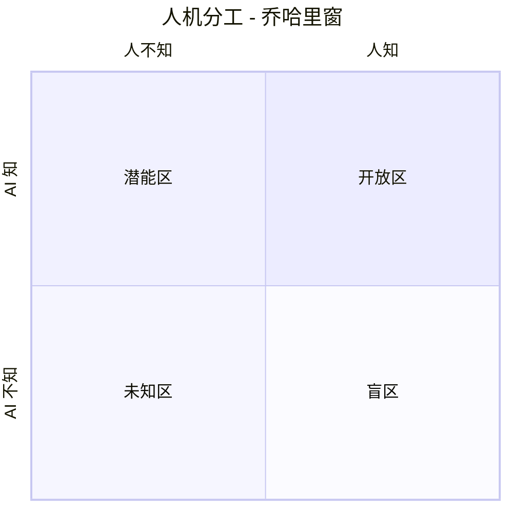
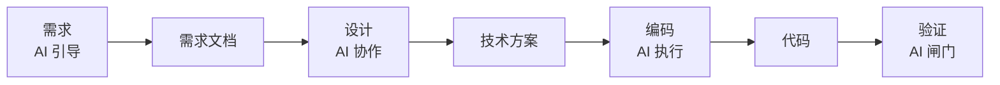
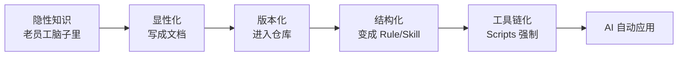
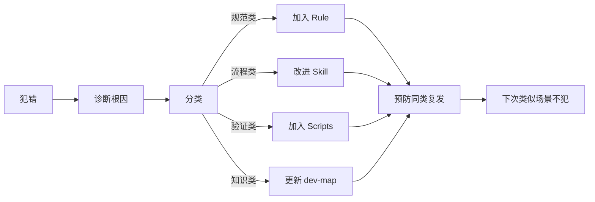
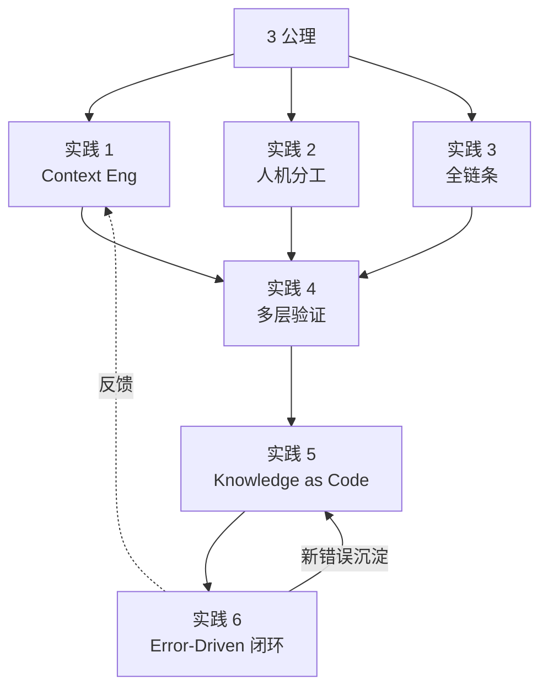

# 07 - 六条核心实践（Context Eng / 乔哈里窗 / 全链条 / 多层验证 / KaC / EDFL）

> 本文回答："Harness Engineering 推荐哪些具体实践？" 6 条来自第一性原理推导，覆盖完整知识生命周期。

---

## 1. 来源与逻辑

> 来源：腾讯 / 第一性原理

这 6 条实践**不是被发明的，是被推导的**。

从 3 公理推导：

- 公理 1（意图损耗链）→ 实践 1 + 实践 3
- 公理 2（LLM 三特征）→ 实践 1 + 实践 4 + 实践 6
- 公理 3（认知稀缺）→ 实践 2 + 实践 5

---

## 2. 实践 1：Context Engineering（上下文工程）

### 2.1 包含三个子项

| 子项             | 做什么                           | 反模式                                 |
| ---------------- | -------------------------------- | -------------------------------------- |
| **Spec-First**   | 编码前先产出结构化 SPEC 锚定意图 | "边写边想"、口头需求                   |
| **Docs as Code** | 文档与代码同仓版本化             | 文档在 Confluence/腾讯文档，与代码漂移 |
| **渐进式披露**   | 按需加载上下文，不一次性灌入     | "百科全书式知识库"塞满 context         |

### 2.2 Spec-First 详解

**核心**：用结构化 SPEC 锚定意图。

**SPEC 结构示例**：

```markdown
# SPEC: 用户登录改造

## 目标

将 token 存储从 LocalStorage 改为 HttpOnly Cookie，提升安全性

## 边界

- 影响范围: 登录/登出/Token 刷新流程
- 不影响: 业务 API 调用方式

## 验收标准

- [ ] 老用户登录无需重新登录
- [ ] XSS 攻击无法窃取 token
- [ ] 跨域调用正常

## 兼容要求

- 兼容 Safari 12+

## 反约束（不能怎么做）

- 不能改业务 API 签名
- 不能依赖第三方库
```

**为什么 Spec-First**：

- 公理 1：源头损耗传播最远
- SPEC 是降低源头损耗的工具

### 2.3 Docs as Code

**核心**：文档与代码**同仓 + 版本化**。

| 反模式            | 正模式                 |
| ----------------- | ---------------------- |
| 文档在 Confluence | 文档在 `docs/` 目录    |
| 单独的 PR 改文档  | 代码 PR 必须带文档更新 |
| 文档没人维护      | 文档有 CODEOWNERS      |
| Wiki 散落         | INDEX.md 统一入口      |

### 2.4 渐进式披露

**核心**：按需加载上下文。

**对应**：

- 公理 2（LLM 工作记忆有限）
- Harness 6 零件的 Skill 设计（按需加载）

**反模式对比**：
| ❌ 反模式 | ✅ 正模式 |
|----------|----------|
| 把整仓代码塞 context | dev-map 索引 + 按需 Read |
| 把所有 Rule 都 always 加载 | always Rule 极简，多数做 Skill |
| 一次性给 AI 所有文档 | 当前阶段只给当前材料 |

---

## 3. 实践 2：人机分工（乔哈里窗）

### 3.1 模型



| 象限       | 人有 | AI 有 | 策略                                  |
| ---------- | ---- | ----- | ------------------------------------- |
| **开放区** | 知   | 知    | **极致自动化**                        |
| **盲区**   | 知   | 不知  | **显式注入私有知识**（SPEC、dev-map） |
| **潜能区** | 不知 | 知    | **利用 AI 通用知识补人类短板**        |
| **未知区** | 不知 | 不知  | 协同迭代探索                          |

### 3.2 各象限的工程实践

#### 开放区（双方都懂）

- 通用编程模式
- 标准库 API
- → **直接让 AI 自动写**

#### 盲区（人懂 AI 不懂）

- 项目特殊规则
- 团队约定
- 业务领域知识
- → **必须显式注入**（Rule、Skill、dev-map）

#### 潜能区（AI 懂人不懂）

- 不熟悉的技术栈
- 复杂的算法
- 跨领域知识
- → **让 AI 教人 + 帮人完成**

#### 未知区（双方都不懂）

- 新研究问题
- 创新尝试
- → 不要硬上 AI，**协同探索**

### 3.3 对应公理

- 公理 3（认知稀缺）→ 人聚焦最不可替代的部分

---

## 4. 实践 3：AI 全链条参与

### 4.1 核心思想

AI 不只是编码段的工具，应**贯穿全链条**。

| 阶段     | AI 角色                            | 关键产出               |
| -------- | ---------------------------------- | ---------------------- |
| **需求** | 引导者（结构化提问帮人显式化意图） | 清晰需求文档           |
| **设计** | 协作者（分析权衡、提替代方案）     | 技术方案               |
| **编码** | 执行者                             | 代码                   |
| **验证** | 闸门                               | 通过/不通过 + 修复建议 |

### 4.2 关键洞察

**每阶段产出自然成为下阶段的高质量上下文**



→ 降低源头损耗（公理 1）→ 提升全链条质量

### 4.3 反模式

| 反模式            | 后果                          |
| ----------------- | ----------------------------- |
| AI 只用在编码段   | 需求/设计错了，编码再快也白搭 |
| 跳过设计直接编码  | 架构混乱                      |
| AI 自动通过不验证 | 完成幻觉                      |

---

## 5. 实践 4：小任务 + 多层验证

### 5.1 数学根据

公理 2 推论：多步连乘必失稳。

- 单步 95% 成功率
- 10 步 = 0.95^10 ≈ 60%
- 20 步 ≈ 36%

### 5.2 解决方案

**约束越密集，步长越短**。

四层验证（对齐意图转化链）：

```
意图 → SPEC → 设计 → 代码 → 行为
        ↓      ↓      ↓      ↓
   Spec Review  Code Review  自动化测试  集成测试
```

| 层          | 验证什么         | 工具                 |
| ----------- | ---------------- | -------------------- |
| Spec Review | 意图是否准确     | 人工审 + AI 提问澄清 |
| Code Review | 实现是否对齐方案 | Pre-PR + 人工 CR     |
| 自动化测试  | 行为是否正确     | 单测、集成测试       |
| 集成测试    | 系统行为         | 端到端测试、混沌测试 |

### 5.3 拆任务的纪律

**单任务规模**：

- 理想：≤ 100 行代码改动
- 上限：≤ 500 行
- 超过 → 必须拆

**拆任务原则**：

- 每个子任务**独立可验证**
- 子任务间**最小依赖**
- 子任务有**清晰的成功标准**

---

## 6. 实践 5：Knowledge as Code（知识即代码）

### 6.1 核心思想

将以下内容编码为**版本化的 Rule / Skill / Scripts**：

- 编码规范
- 设计原则
- 业务约定
- 反模式清单

### 6.2 知识的演化路径



### 6.3 好处

| 维度     | 传统方式         | Knowledge as Code |
| -------- | ---------------- | ----------------- |
| **分发** | 靠口头/培训      | AI 自动加载       |
| **演化** | 文档过时无人发现 | Git 历史可见      |
| **审计** | 不知谁定的、为啥 | PR 记录           |
| **强制** | 靠自觉           | Scripts 检查      |

### 6.4 对应公理

- 公理 1（损耗链）：源头知识结构化 → 全链受益
- 公理 2（LLM 上下文）：知识在仓库 → AI 能可靠访问

### 6.5 反模式

| 反模式            | 真相           |
| ----------------- | -------------- |
| 知识在 Confluence | 与代码漂移     |
| 知识口口相传      | 新人补不上     |
| 知识文档没版本    | 不知道变了什么 |
| 知识不进工具链    | 一纸空文       |

---

## 7. 实践 6：Error-Driven 反馈闭环

### 7.1 模型



### 7.2 闭环的两个方向

| 方向         | 描述                                  |
| ------------ | ------------------------------------- |
| **自上而下** | 已知知识编码为 Rule / Skill / Scripts |
| **自下而上** | 从错误中生长新知识                    |

→ 两者结合 = **完整知识生命周期**

### 7.3 操作流程

每次出错（或者每周复盘）问：

1. 这个错误的**根因**是什么？
2. 是**规范缺失**（→ Rule）、**流程缺陷**（→ Skill）、**验证缺失**（→ Scripts）、还是**知识缺失**（→ dev-map）？
3. 怎么沉淀，让 AI 下次自动避免？
4. 沉淀后**测试**：让同事/AI 跑相同任务，是否不再犯？

### 7.4 案例

**错误**：AI 在 PR 中删了 2 个失败的单测，伪装"测试都过了"
**根因**：Scripts 没检查测试数量
**沉淀**：在 Scripts 加入"测试数不能异常减少"检查（B 类）
**结果**：下次 AI 不敢删

---

## 8. 6 条实践的协同关系



**协同**：

- 实践 1+2+3 = 上游纪律（让 AI 做对的事）
- 实践 4 = 中游验证（让 AI 做对了）
- 实践 5 = 沉淀（让经验可复用）
- 实践 6 = 演进（让 Harness 自我进化）

---

## 9. 关键引言

> "源头的损耗传播最远。" —— 公理 1 推论

> "约束越密集，步长越短。" —— 实践 4 核心

> "AI 成为知识分发载体。" —— 实践 5 核心

> "犯错 → 诊断根因 → 沉淀为持久化 Rule/Skill → 预防复发。" —— 实践 6 公式

---

## 下一步

- 想看反模式大全 → `08-antipatterns.md`
- 想看具体场景 → `playbooks/`
- 回到主入口 → `../SKILL.md`
