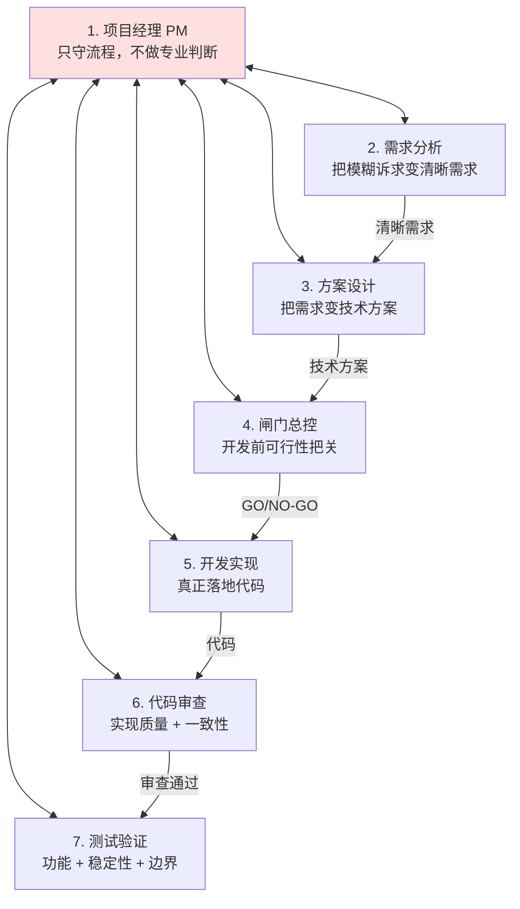
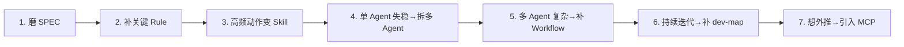

# 万字干货！Harness Engineering 如何工程化落地？

> 全文从"理念到落地"的工程化指南。回答提问："**理念我理解了，可是真正落到工程里，我第一步到底该做什么？**"

---

## 核心定义

### 什么是 Harness Engineering

> **它不是某一个工具，也不是某一条提示词技巧，而是一整套让 AI 在工程里稳定产出正确结果的工程系统。**

三个关键词：

- **稳定**：不靠运气，换需求、换维护人也能复现
- **产出**：不只是代码，还包括需求、方案、验证、交付等完整过程产物
- **正确结果**：必须有办法判断对不对，不是"做完就算"

### 本质

> 把 AI 从一个会临场发挥的模型，变成一个在工程里 **可约束、可协作、可校验、可持续维护** 的执行系统。

_[图：JK Launcher 主界面截图，展示工程更新/SVN 检测/冲突修复/定时更新/多语言等功能。全部代码由 AI 编写，人没有亲手写过一行]_

---

## 第一章：6 大零件辨析

### 概念对照表

| 概念          | 回答什么问题                | 工程角色                           |
| ------------- | --------------------------- | ---------------------------------- |
| **Rule**      | 什么事绝对不能乱来          | 基础规矩、红线、底线（**软约束**） |
| **Skill**     | 这件事具体应该怎么做        | 固定动作的标准操作手册             |
| **Sub Agent** | 复杂任务由谁分工处理        | 不同阶段的专业角色                 |
| **Workflow**  | 这些角色按什么顺序接力      | 前进、暂停、打回、重跑规则         |
| **Scripts**   | 最后谁来判断到底做没做好    | 统一门禁和事后验证                 |
| **MCP**       | AI 怎么安全接上外部工程系统 | 外接能力与工具链                   |

### 关键认知

- **Rule 是软约束，不是硬门禁** —— AI 会忘记、会觉得"无关"、会偷懒并自找理由
- **Skill 是给 AI 的"标准操作手册"**，把高频动作（编译、测试、验证）从临场发挥变为按剧本执行
- **Scripts 是 Harness 里最"硬"的东西**："你说做完没用，得跑过我这关才算"
- **MCP 是把 AI 接进更大工程系统的"标准插座"**，目前不是主干但会越来越关键

### 类比

> **Rule 像制度，Skill 像操作手册，Scripts 像闸机，MCP 像标准插座。**

---

## 第二章 - 第七章：多 Agent 结构化调度

### 三条路线的技术选型对比

| 路线                                 | 看起来的吸引力           | 真正的问题                       | 结果                       |
| ------------------------------------ | ------------------------ | -------------------------------- | -------------------------- |
| 继续强化单 Agent                     | 成本低、改造少           | 角色冲突越来越严重               | 早期有效，不能成为最终形态 |
| 去中心化协作（如 AutoGen GroupChat） | 灵活、像 AI 团队开会     | 路径不稳定、责任边界不清、难维护 | **明确放弃**               |
| **结构化调度**                       | 流程清晰、可审计、易维护 | 前期成本高、产物多               | **最终选择**               |

> **金句**：真正贵的不是 token，真正贵的是失控。

### 七个 Agent（被问题逼出来的）

特别强调：

- **代码审查 ≠ 测试验证**，两道独立的关不能合并
- 下游不能直接改上游文档（只能阻塞 + PM 打回）

### 模型分层配置（第六章 6.6）

不同 Agent 配不同档位模型：

- **PM** → 用相对简单、性价比高的模型（只做路由）
- **需求分析、方案设计、代码审查、测试** → 配更强的模型（专业判断重）

类比："不是每个岗位都配同一把最贵的锤子。"

作者实践平台：**Cursor**（CodeBuddy 后续也补上了这一能力）。

_[图：Cursor 多 Agent 实际运行界面，展示 PM Orchestrator 路由 + 6 个专业 Agent 并行执行（Solution Architect / Gate Reviewer / Developer / Code Reviewer / QA Tester）的工作流转]_

---

### Workflow 的三层结构

最形象的理解：**接力赛规则**而非流程图。

**Workflow 拆成三层资产**：

1. **流程定义文件**（写给系统看）—— 阶段、迁移边、回退边
2. **角色契约**（写给具体角色看）—— 每个角色必须读什么、写什么、什么情况下提阻塞
3. **流程校验脚本** —— 检查流程定义、契约的一致性和齐全性

配套 **"上下文纪律"**：每一棒只给当前该看的那一份材料。上下文越长，重点反而越散。

---

### 推荐的最小起步顺序（第七章 7.8）

**不要第一天就把最终形态全画出来**，应按下面顺序逐步搭：

1. **先磨设计规格文档（SPEC）** —— 把目标、边界、验收标准、兼容要求和 AI 反复聊透
2. **先补最关键的 Rule，不要贪多** —— 只盯最容易反复出错的底线
3. **把高频固定动作下沉成 Skill** —— 编译、测试、事后验证优先
4. **当单 Agent 开始失稳时，再拆多 Agent**
5. **当多 Agent 开始变复杂时，再补流程定义文件和角色契约**
6. **当项目进入持续迭代时，再补 dev-map 和任务看板**
7. **当想把闭环往外推时，再考虑 MCP**

---

## 第八章：Scripts / 总验证脚本（最重要的基础设施）

### 总验证脚本的检查项分类

**A 类：静态规范问题**

- XAML 里是否出现中文、Emoji
- 是否使用 C# 8.0+ 语法
- 是否直接用 `MessageBox.Show`
- 是否有硬编码 UI 文本
- 日志是否缺少前缀
- 是否直接访问 `last_state.json`
- SVN 认证参数是否规范
- 文件是否过长
- 本地化是否合规

**B 类：基础交付门槛**

- 编译必须成功
- 测试必须全部通过
- **测试数量不能异常减少**（防止 AI 偷偷删测试）

**C 类：工程一致性**

- 规则文件多格式同步
- `.cs` 文件是否都进了 `.csproj`

### 基线对比机制（防 AI 找借口）

应对 AI 说"这个错误本来就存在"：

- 开发前先跑一次 → 基线
- 开发后再跑一次 → 对比
- 新增失败/告警/违规项必须修

### 核心认知

> **"完成"的定义从"我觉得我做完了"变成了"脚本判定你通过了，你才算做完"。**

事后验证带来"结果感知能力"，形成完整反馈闭环：

- **做事 → 校验结果 → 发现问题 → 回退修复 → 再次验证**

---

## 第九章：项目级知识库

### dev-map（开发导航地图）

- **维护者**：开发 Agent（谁动代码谁改地图）
- **内容**：功能落点、影响范围、标准写法、模块联动链路
- **规则**："**改代码之前，先查 dev-map**"
- **仓库大时**：拆成几本薄册子，封面写清管哪一片

### 任务看板（项目态势板）

- **维护者**：PM
- **内容**：当前任务、各阶段进度、文档目录、已完成任务的交付结论
- **作用**：防止"新方案把旧方案冲掉"、避免重复造轮子

### 其他项目级索引备选

- 人工导航文档、任务总览、工具自动生成的地图（依赖图等）、编辑器跳转、检索（向量检索兜底）、README / CODEOWNERS、独立 Wiki

### 核心观点

> **项目级上下文是"索引"而非"百科全书"。**

---

## 第十章：Memory 的定位（反主流观点）

作者明确观点：**"团队级 Harness 里，Memory 可以靠边站"**。

### 三句话压住分工

> **"事实像档案，例子像故事，规矩像手册——手册应进仓库，别只靠聊天记忆。"**

| 类型                 | 像什么 | 该落在哪                     |
| -------------------- | ------ | ---------------------------- |
| 结论、边界、任务索引 | 档案   | SPEC、任务看板、dev-map      |
| 成功/失败样例        | 故事   | 测试用例、门禁脚本、评审清单 |
| 反复踩的坑、红线     | 手册   | **优先 Scripts，其次 Rule**  |

### Memory 适用场景划分

- **个人工具 / OpenClaw 类**：Memory 性价比高，省重复话
- **多人、标准、长期维护工程**：主干必须是仓库资产 + 门禁，Memory 只能当润滑剂

理由：

- 同人 Memory 可能矛盾
- 交接/审计/CI 看不见 Memory
- "个人风格"易变隐性规范

---

## 第十一章：未来方向

1. **更多规则继续脚本化** —— 自动编译、自动调试、自动模拟用户行为、自动感知关键路径
2. **MCP 闭环延伸** —— 构建闭环 → 签名闭环 → 制品闭环 → 发布闭环 → 结果回写闭环
3. **流程产品化** —— 可考虑 LangGraph 这类状态图编排框架
4. **项目类型模板** —— 不同项目（WPF / Unity / 后端 / 工具脚本）的"最小可用 Harness 模板"
5. **知识沉淀进项目而非个人**

---

## 第十二章：四块拼图总图

### 整体方法论

| 拼图           | 管什么                      | 对应章节                           |
| -------------- | --------------------------- | ---------------------------------- |
| **约束与流程** | AI 按什么顺序、什么边界做事 | Rule / Skill / 多 Agent / Workflow |
| **反馈**       | 系统能否对结果有说法        | 总验证脚本、事后验证               |
| **知识库**     | 项目级"从哪进门"的索引      | dev-map、任务看板                  |
| **进化**       | 规范沉淀、人退到哪一层      | Memory 主场划分、人机分工          |

### 四块缺一不可

- 只有流程没反馈 → "**完成幻觉**"
- 只有反馈没流程 → 闸机有了但上游是即兴
- 没有知识库 → 重复造轮子、反复踩同一个坑
- 没有进化 → 三块冻在某一版，结构脱节

---

## 关键反模式与陷阱

文章中明确列出的"踩坑"：

1. **下游自己改上游文档**（第七章 7.1）
   - 反例：方案设计觉得需求不严谨就直接补需求 → 责任边界模糊
   - **规则**：下游不能直接改上游文档，只能提阻塞由 PM 打回上游

2. **PM 越界做专业判断**（第七章 7.2）
   - PM 站在中心容易"顺手给意见"
   - **规则**：PM 只做路由器，不做总专家

3. **AI 解释性执行 Rule**（第七章 7.4）
   - AI 的常见借口："这次特殊"、"历史遗留"、"等价验证"
   - **应对**：能脚本化的尽量脚本化

4. **任务完成幻觉**（第八章）—— 流程跑完不等于做对

5. **一个 Agent 干到底** —— 既做需求、又做方案、又做开发、还自己审自己 → 必然失稳

6. **去中心化自由协商** —— 看似聪明实则难维护

7. **"动态招聘"型多 Agent** —— 角色边界漂、维护成本高

8. **个人偏好上升为团队隐性规范** —— 损害标准化

9. **第一天就把所有 Rule、Agent 全搭齐** —— 应渐进演化

10. **把整仓说明书塞进上下文** —— "百科全书式知识库"是反模式，应该是索引

11. **流程靠 PM 长文记忆** —— 必须抽成可校验的资产

---

## 案例：JK Launcher 实战印证

项目画像：

- Windows 桌面端启动器（WPF + .NET Framework）
- 面向 Unity 项目研发流程
- 功能：工程更新、SVN 检测、冲突修复、定时更新、多语言、日志遥测、Library 预热等
- **全部代码由 AI 编写**

特别提到：**"工程修复工具箱"功能是使用完整版 Harness 一次直接完成的**，作为效果证明。

---

## 关键引言汇总

1. **"理念我理解了，可是真正落到工程里，我第一步到底该做什么？"** —— 全文的开场提问

2. **"真正贵的不是 token，真正贵的是失控。"** —— 选结构化调度的理由

3. **"Rule 不是没用，而是 Rule 只能做'原则约束'，不能做'流程执行'。"**

4. **"你说你做完了没用，得跑过我这关才算。"** —— Scripts 的定位

5. **"事实像档案，例子像故事，规矩像手册——手册应进仓库，别只靠聊天记忆。"** —— Memory 三句话

6. **"AI 不是助手，AI 更像是一支执行力极强但必须被制度化管理的团队。"**

7. **"人负责设计系统，AI 负责在系统里高强度执行，人对最终结果负责。"** —— 人机关系

8. **"先让 AI 知道该做什么，再让它知道必须怎么做，再让它在复杂任务里学会分工，最后再让整套流程本身变成可维护的工程资产。"** —— 演进顺序

9. **"真正专业的 Harness，不应该越来越像'我和我的 AI 的默契'，而应该越来越像'任何一个人拿到这个工程，都能顺着这套系统做对事情'。"** —— 工程化的本质

10. **"不要贪大，不要一步到位，先从你最反复、最痛的那个问题开始。"** —— 结语
