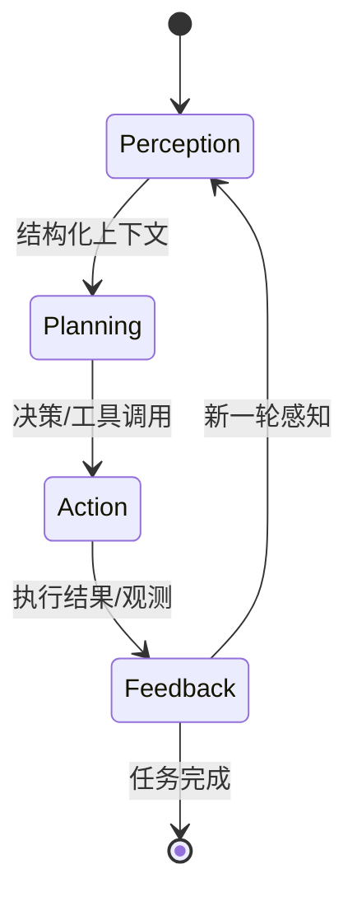
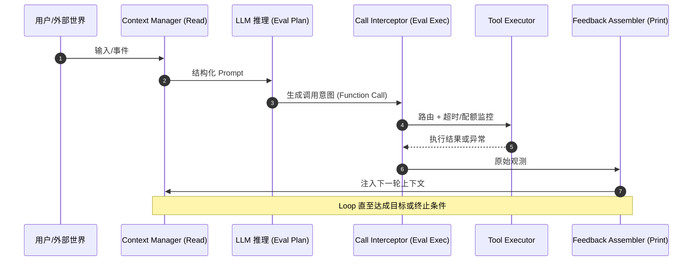
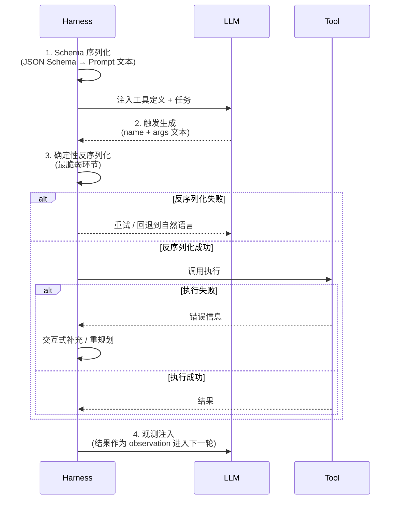
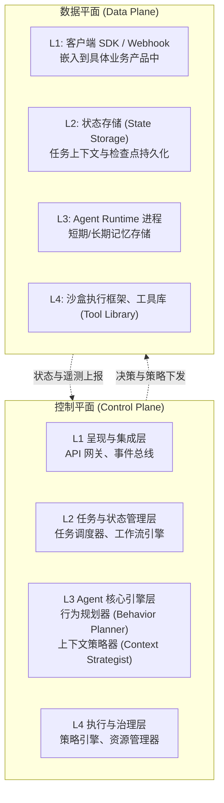
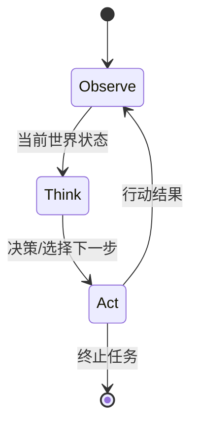
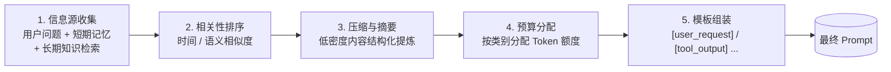

# 万字干货：理解 Harness Engineering，看这一篇就够了

> 本文作者：咸鱼，TRAE 开发者用户

## 前言

针对现在层出不穷的 AI 新概念，拒绝「错失恐惧症」，也就是我们常说的 Fomo！

请先对自己默念：拒绝 Fomo！拒绝 Fomo！拒绝 Fomo！重要的事情说三遍呀！

Harness 并不是 AI 圈子凭空发明的新概念。作者在此前的 AI 实践中，一直在尝试总结一套完整的方法论，但发现无论是 Prompt Engineering 还是 Context Engineering，都无法很好地囊括全部实践。于是，作为前端工程师，索性自己造了个新词：**"AI 工程化"或"AI 基建设计"。Harness Engineering 这个词的出现，不过是用一个更形象、更生动的词语，对这类现有实践做了一次系统性的汇总和命名。**

本文的部分内容来源于作者多次模型评测和工程实践中的思考，行文风格可能与常见的技术文章有所不同。如有不当之处，还请大家不吝指正。在正式阅读这篇文章之前，我也给大家准备了一份术语说明，如果你在阅读过程中有任何不清楚的地方，欢迎随时查看。

### 术语说明

| 术语                      | 专业释义                                                                                                 | 类比说明                                                                                                     |
| ------------------------- | -------------------------------------------------------------------------------------------------------- | ------------------------------------------------------------------------------------------------------------ |
| Harness Engineering       | 围绕 AI 智能体而设计、构造的工程框架，旨在通过约束和反馈机制，让 AI 系统稳定、可靠、可规模化地完成任务。 | 一支队伍出场需要走的纪律和流程，包括人员配置、装备核验、出场顺序、应急流程和安全保障等工程框架。             |
| AI Agent                  | 一个能基于环境、目标，自主规划、行动、并通过感知反馈持续迭代以完成复杂任务的 AI 系统。                   | 一个能独立干活、自主选择路径的"自主员工"，能拆解任务、调度资源、解决问题，而不是只能听一句做一句的执行助手。 |
| Context Engineering       | 通过结构化、规则化、模板化等手段，为 AI Agent 构建有效输入环境与知识结构。                               | 把零散资料按章节、目录、索引组织成手册，让阅读者快速定位关键信息。                                           |
| Architectural Constraints | 通过自身工具能解决的特定任务范围与边界，保证系统在可控范围内运行。                                       | 城市道路系统的限行、限速、单行线和车道规则，使车辆在受控环境下高效安全地通行。                               |
| Self-Verification         | AI Agent 在完成任务后，能够通过自我校验机制对输出结果进行评估和修正，提升可信度。                        | 学生在交卷前主动检查、改错的过程，使最终结果更接近正确答案。                                                 |
| Ralph Loop                | 一种让 AI Agent 不断进化、迭代、其能力逐步增强的循环机制。                                               | 一位资深"金牌讲师"会不断打磨课件、复盘讲法，让自己的课程越来越好。                                           |
| Entropy / 熵              | 在软件系统中，随时间累积的混乱和无序程度。Harness 的目标即降低系统熵。                                   | 一个不断使用却从不整理的房间，随着时间堆积越来越凌乱，最终难以使用。                                         |

废话不多说，正文开始～

---

## 01 Harness Engineering 是什么？

_插图：一幅蒸汽朋克风格的插画，三匹分别标记着 "Gemini / GPT / 豆包" 的小马拉着一个写着 "TRAE" 的方块在键盘上奔驰，背景是数据中心机柜与代码流，标题 "Harness Engineering" 横亘画面顶部——形象呈现"用工程缰绳驾驭多模型野马"的核心隐喻。_

2026 年，继提示词工程（Prompt Engineering）与上下文工程（Context Engineering）之后，软件工程领域迎来了一个新的关键词：**Harness Engineering**。这个概念由 HashiCorp 联合创始人 Mitchell Hashimoto 提出，并因 OpenAI 的一篇报告而广为人知。

其核心隐喻：**"马与缰绳"**：生动地描绘了它的使命：为强大但方向不定的"野马"（例如 AI Agent 或任何复杂的软件系统）套上名为"Harness"的"缰绳"，通过**约束、引导并纠正其行为，确保它能沿着预设的轨道稳定、可靠地前行。**

我们通过一个形象的比喻，相信你会更加清楚：

> **AI Agent = SOTA 的模型（野马） + Harness（驾驭系统） = 千里马**

AI Agent 如同一匹潜力无限的"野马"，而 Harness Engineering 则是那套能将其驯化为"千里马"的完整驾驭体系。**它不是去改变马的基因（模型本身），而是为它设计一套专业的马具和训练方法。**

Harness 就是：除了 LLM 本身之外，让 Agent 真正能干活的一切**基础设施**。Harness Engineering 不是"更好的提示词（Prompt）"，也不是"更强的模型"，而是优化模型运行的环境与机制。它的本质是**优化模型运行所需的环境、机制与基础设施的总和**，它是一套将 AI 的"智能"转化为可靠、可控、可规模化"生产力"的工程哲学与实践框架。

再次明确这一点：Harness Engineering 不是一个需要焦虑追捧的全新发明，而是对一系列现有工程实践的系统性总结与命名。正如本文开篇所说，它更像是一套"AI 工程化的驾驭体系"，旨在解决一个核心问题：当 AI 成为我们团队的一员时，我们该如何**管理**这位"超级实习生"？

**概念已经明晰，那么下一个自然而然的问题是：我们为什么需要它？**

---

## 02 为什么需要 Harness Engineering？

随着 AI 从单一的"应答机器"向能够自主规划和执行复杂任务的智能体（AI Agent）演进，工程师的角色正在发生根本性的转变。Harness Engineering 的出现，正是为了应对这一转变带来的全新挑战。其必要性主要体现在以下几个方面：

### 构建更可靠的 Agent 系统

为了让 Agent 从**"有趣的玩具"**变为**"可靠的工具"**，它必须满足四个核心目标，我们可以将其概括为 **R.E.S.T** 模型：

| 目标                                        | 定义                                                                                                         | 关键要求                                                                                                                                                                                                             |
| ------------------------------------------- | ------------------------------------------------------------------------------------------------------------ | -------------------------------------------------------------------------------------------------------------------------------------------------------------------------------------------------------------------- |
| **R — 可靠性（Reliability）**               | 系统在面对各种预期和非预期的输入、环境变化和内部故障时，能够持续、稳定地提供服务，并完成其既定任务的能力。   | • **失败可恢复**：任务中断后能自动从检查点恢复<br>• **操作幂等性**：关键的写操作可安全重试，不会弄脏状态<br>• **行为一致性**：在相同输入下，行为应是可预测的                                                         |
| **E — 效率（Efficiency）**                  | 在满足功能和可靠性的前提下，系统使用计算、存储、网络等资源的有效性，直接关系到服务的成本和可扩展性。         | • **资源可控**：对 Token 消耗、API 调用、计算时间有精确的预算控制<br>• **低延迟响应**：在交互式场景中，快速给出有意义的反馈<br>• **高吞吐量**：在批处理场景中，单位时间内能处理更多任务                              |
| **S — 安全性（Security）**                  | 保护系统及其数据免受未经授权的访问、使用、泄露或破坏的能力。对于能自主行动的 Agent，安全性是不可逾越的红线。 | • **最小权限**：仅授予完成当前子任务所必需的权限<br>• **沙盒执行**：所有不授信的代码或指令必须在严格隔离的沙盒中执行<br>• **输入/输出过滤**：防止指令注入、敏感信息泄露和有害内容生成                                |
| **T — 可观测性（Traceability / 可追溯性）** | 系统提供足够的数据（日志、指标、追踪），使开发和运维人员能够理解其内部状态、决策过程和行为轨迹的能力。       | • **全链路追踪**：从请求到结果，每一个环节的调用链都清晰可追溯<br>• **决策可解释**：Agent 的每一个关键决策（如选择哪个工具）都应有明确的归因记录<br>• **状态可审计**：系统在任意历史时间点的完整状态都应可查询和审计 |

### Agent-First 时代对工程师的必然要求

**工程复杂性持续攀升**：随着 AI 能力的不断增强，人们对应用场景的复杂度和预期也水涨船高。编程场景早已不再是贪吃蛇、俄罗斯方块等 Vibe Coding 小 Demo，而是从简单的程序跃迁为复杂的工程实践。

**从"执行者"到"设计者"的角色跃迁**：当 AI 承担起代码编写等具体任务时，人类工程师的核心价值便从"动手执行"转向"系统设计"。我们不再是逐行编码的工人，而是设计蓝图、定义规则、验收最终成果的架构师：正如系列文章前文提到的 Spec Coding 理念。当然，仅靠给 AI 制定 Prompt 规则这种"软约束"是远远不够的。

也是 Harness Engineering 爆火的起因：

<https://openai.com/zh-Hans-CN/index/harness-engineering/>

#### 传统工程师 vs Harness 时代工程师

|              | 传统工程师         | Harness 时代工程师                   |
| ------------ | ------------------ | ------------------------------------ |
| **价值**     | 写代码的速度和质量 | 设计系统的能力                       |
| **核心技能** | 编码               | 约束设计、反馈回路设计、控制系统设计 |
| **产出**     | 代码               | Agent 可靠运行的环境                 |
| **关注点**   | 代码本身           | 支撑结构（工具、抽象、反馈回路）     |

一个令人瞩目的行业实验印证了这一趋势：一个仅三人的小型团队，在几乎不手写任何代码的情况下，通过引导 AI Agent，于短短五个月内构建了一个**百万行代码级别**的复杂产品，期间累计合并了约 1,500 个 Pull Request。这一实践有力地证明了一个趋势：当 AI 成为主要的"生产力"时，传统的工程管理模式已不再适用。我们不再是逐行砷墙的工人，而是绘制蓝图、定义规则、最终验收成果的**架构师**。

仅通过提示词（Prompt）下达指令这种"软约束"远远不够，我们需要一套"硬约束"的工程体系"来保障最终产物的质量、可靠性与可维护性：这正是 Harness Engineering 的用武之地。

**简而言之，Harness Engineering 的核心理念是：当模型遇到问题时，通过一套工程化的 Harness 机制，从根本上避免同类问题再次发生。**

它是这个时代的产物：随着模型的持续迭代，更多基础能力将被内化至模型本身，部分 Harness 也将随之退出历史舞台；与此同时，新的应用场景不断涌现，也必将催生新的 Harness 实践。

**明确了"为什么"之后，让我们进一步拆解 Harness Engineering 到底包含哪些具体内容。**

---

## 03 Harness Engineering 包含什么

在当前基于 Transformer 和自回归的 LLM 架构下，模型的原始输出本质上是随机且无序的。

而 Harness Engineering 的作用，正是通过有序的约束来驾驭无序的算力，从而完成更加复杂的工程实践。

要理解它"包含什么"，我们首先需要理解 Agent 是如何运作的。一个完备的 Agent 系统，其核心运行机制可抽象为一个持续循环的四阶段过程：感知（Perception）、规划（Planning）、行动（Action）、以及反思（Feedback / Reflection）。

### PPAF 闭环



| 环节         | 英文全称              | 核心内容                                                                                                                                                                     |
| ------------ | --------------------- | ---------------------------------------------------------------------------------------------------------------------------------------------------------------------------- |
| **P — 感知** | Perception            | Agent 通过"传感器"或接口，从外部环境和内部状态采集信息。包括用户输入、外部 API 返回结果、内部记忆等。Harness 在感知层做结构化预处理，将原始信息组装成 LLM 可读的"语境视图"。 |
| **P — 规划** | Planning              | 在感知基础上，由 LLM 担当"大脑"理解当前状态，结合最终目标和约束，将复杂任务拆分为可执行的子步骤。规划质量高度依赖 Prompt、工具描述、资源边界等上下文的完整度。               |
| **A — 行动** | Action                | 规划完成后，Agent 将"指令"外化为具体行为，可能是 API 执行代码、调用工具，或返回信息给用户。Harness 在执行前可做精细化检查并兜底失败处理。                                    |
| **F — 反思** | Feedback / Reflection | 行动结束后，反馈被系统采集，Agent 比较行动结果与预期目标的差异并回流。反思（如知正错误、修正计划）会成为下一轮感知和规划的输入，形成持续学习与优化的闭环。                   |

Harness Engineering 将 Agent 的工程化体系解构为四个核心维度，每个维度都与 PPAF 闭环的一个或多个环节紧密耦合。这四个维度共同构成了一个完整的 Agent "马具"（Harness），用于驾驭、约束和提升 Agent 这匹"智能之马"。

### 四大工程维度

| 工程维度                         | 核心隐喻                 | 工程目标                                                                     | 主要支撑的 PPAF 环节              |
| -------------------------------- | ------------------------ | ---------------------------------------------------------------------------- | --------------------------------- |
| **造缰（Making the Reins）**     | 定义接口、协议与约束     | 为 Agent 的感知和行动提供清晰、稳定、安全的边界与输入/输出通道。             | 感知（Perception）                |
| **驭马（Riding the Horse）**     | 实现策略、调度与执行控制 | 设计并实现 Agent 的核心决策与执行逻辑，确保 Agent 能够自主、高效地完成任务。 | 规划（Planning） & 行动（Action） |
| **相马（Evaluating the Horse）** | 建立评估、观测与选择机制 | 建立一套度量和评估体系，用于观察 Agent 的能力、性能和行为。                  | 反思（Reflection）                |
| **育马（Breeding the Horse）**   | 构建训练、迭代与记忆体系 | 设计数据回路、模型训练和知识更新的闭环机制，使 Agent 能够从经验中学习。      | 反思（Reflection）& 记忆          |

为了更系统地理解不同类型 Agent 的能力边界和工程挑战，我们可以构建一个二维的战略分析矩阵。该模型从"认知循环"和"上下文效率"两个维度对 Agent 应用进行划分。

**横轴：AI 认知循环（Cognitive Loop）**

- **被动响应（React）**：Agent 的行为主要由外部单次触发驱动，执行预定义的、确定性的任务，缺乏自主规划和反思能力。
- **主动规划与反思（Proactive Plan & Reflect）**：Agent 能够基于长期目标，自主进行多步规划、执行、并根据结果进行反思和动态调整。

**纵轴：环境系统上下文处理效率（Context Efficiency）**

- **低效（人工/单点投喂）**：Agent 运行所需的大部分上下文依赖人工手动提供，或只能通过有限的、低效的接口获取。
- **高效（沙盒化/全自动注入）**：Agent 运行在一个高度集成和自动化的环境中，所需上下文能够通过系统级接口（如文件系统、API 网关、状态引擎）被高效、全面地自动捕获和注入。

### 二维战略矩阵：Agent 应用分类

```mermaid
quadrantChart
    title Agent 应用的二维战略矩阵
    x-axis 被动响应 (React) --> 主动规划与反思 (Proactive)
    y-axis 低效上下文 (人工投喂) --> 高效上下文 (沙盒化/自动注入)
    quadrant-1 第一象限：自主智能体 Autonomous Agents
    quadrant-2 第四象限：高阶应用助手 Advanced Assistants
    quadrant-3 第三象限：基础问答与单点工具 Basic Q&A / One-shot Tools
    quadrant-4 第二象限：专家辅助系统 Expert Assistant Systems
```

四个象限的具体含义：

| 象限                                                          | 类型        | 典型形态                                             | 关键诉求                                                       | 主要 Harness 挑战                                                           |
| ------------------------------------------------------------- | ----------- | ---------------------------------------------------- | -------------------------------------------------------------- | --------------------------------------------------------------------------- |
| **第一象限**：自主智能体 (Autonomous Agents)                  | 主动 + 高效 | 全栈应用开发 Agent、AI 科研员、自动化运营 Agent。    | 真正能自驱动完成长周期、跨领域复杂目标，并具备自适应能力。     | 需在沙盒安全、长程规划、记忆体系、容错与自愈等方面构建完善的 Harness 系统。 |
| **第二象限**：专家辅助系统 (Expert Assistant Systems)         | 被动 + 高效 | IDE Copilot、可视化分析、文档辅助。                  | 在专业场景下，Agent 能根据丰富语境精准地一次性给出高价值结果。 | 重点在高质量、低延迟的上下文构建与工具集成。                                |
| **第三象限**：基础问答与单点工具 (Basic Q&A / One-shot Tools) | 被动 + 低效 | 普通 ChatBot、单一 Prompt 工具。                     | 满足通用的快速问答和简单工具调用，无需复杂状态。               | 关注 Prompt 质量、基础安全与稳定性，是大多数应用初版的形态。                |
| **第四象限**：高阶应用助手 (Advanced Assistants)              | 主动 + 低效 | 多步骤规划 Bot、依赖人工持续投喂上下文的"半 Agent"。 | 在有限自动化的情况下尝试多步规划，但效率受限于上下文获取效率。 | 主要挑战在于上下文工程的提升，需向沙盒化与自动化方向演进。                  |

这个矩阵清晰地揭示了 Harness Engineering 的价值所在：**Harness 的成熟度，直接决定了 Agent 应用能否从低效的、被动的第三、四象限，跃迁至高效的、主动的第一、二象限。**

理解了 Harness Engineering 的组成部分后，下一步自然要问：它是如何被设计出来的？

---

## 04 Harness Engineering 是如何设计的

理论框架为我们指明了方向，现在让我们深入工程实践，探讨如何一步步构建起一个稳健的 Harness 系统。

### 4.1 顶层抽象：Harness 作为带边界控制的 REPL 容器

在架构层面，Harness 的本质可以被抽象为一个**带有边界控制、工具路由与确定性反馈的 REPL（Read-Eval-Print Loop）容器。** 它包裹在 LLM 这个非确定性的"大脑"之外，负责管理从"感知"到"行动"再到"反思"的完整生命周期，从而将 LLM 的推理能力接入到确定性的工程世界。

#### Harness 作为 REPL 容器的核心逻辑



- **Read（读取）**：Harness 通过 **上下文管理器（Context Manager）**，将外部世界（用户输入、API 状态）和内部记忆"翻译"成 LLM 可理解的、高度结构化的 Prompt。这实现了对"感知"环节的工程化管理。
- **Eval（评估/执行）**：当 LLM 生成一个规划（如 Function Calling）时，Harness 通过 **调用拦截器（Call Interceptor）** 捕获该意图，并将其路由到正确的工具执行器。执行过程被严密监控，包括超时、资源配额和错误捕获。
- **Print（打印/反馈）**：工具执行的结果（成功数据或异常信息）被 **反馈汇编器（Feedback Assembler）** 捕获，并组装成结构化的"观测结果"，重新注入到上下文中，供 LLM 进行下一轮的"反思"与"规划"。
- **Loop（循环）**：这个"读取-评估-打印"的过程不断循环，直到 Agent 达到目标状态或触发终止条件，构成了 PPAF 的核心驱动力。

### 4.2 底层转换机制：在无限状态与有限 Token 间架起桥梁

Agent 的智能涌现，建立在对海量状态信息的理解之上。然而，**LLM 的核心，也就是 Transformer 架构：操作的是一个有限的、线性的 Token 序列。**

因此，Harness 的核心挑战之一，就是在"无限"的外部世界状态与"有限"的 LLM 上下文 Token 之间，建立一套高效、可靠的双向映射和转化机制。

#### 4.2.1 上下文管理：从"无限状态"到"有限 Token"

Agent 的上下文（Context）是其感知的全部来源，它包含了任务目标、历史交互、工具定义、当前状态等海量信息。如何将这些信息有效"压缩"到 LLM 的 Token 窗口内，是规划质量的生命线。

##### 上下文映射策略对比

| 映射策略                            | 核心机制                                                                                     | 适用场景                                           | 工程挑战                                     |
| ----------------------------------- | -------------------------------------------------------------------------------------------- | -------------------------------------------------- | -------------------------------------------- |
| **滑动窗口（Sliding Window）**      | 保留最近的 N 轮对话或步骤，简单高效。                                                        | 需要短期记忆的、连续性的对话。                     | 容易丢失早期的关键信息（"长程遗忘"）。       |
| **检索增强生成（RAG）**             | 将外部知识库（文档、数据库）向量化，根据当前意图检索最相关的片段注入上下文。                 | 需要引用大量外部静态知识的任务。                   | 检索的准确性、实时性，以及如何处理知识冲突。 |
| **按需加载（On-demand Loading）**   | 仅在需要时（如 Agent 提到某个特定实体）才从外部知识源加载该实体的详细信息。                  | 状态空间巨大但访问稀疏的场景。                     | 需要精确的实体识别和依赖关系分析。           |
| **分层记忆（Hierarchical Memory）** | 将记忆分为短期（当前对话）、中期（任务级摘要）、长期（向量化知识库）三层，根据需要组合注入。 | 需要兼顾短期上下文、中期目标和长期知识的复杂任务。 | 记忆的提取、融合策略，以及跨层一致性。       |

##### 工程决策：规约规则与注入边界

上下文管理本质上是一系列**规约规则（Reduction Rules）** 的集合。

Harness 必须定义清晰的规则，来决定在 Token 预算紧张时，哪些信息应该被牺牲、哪些被保留。同时，**注入边界（Injection Boundary）** 也至关重要，它定义了外部信息（如 RAG 结果）应在 Prompt 的哪个位置（前、中、后）注入，以达到最佳效果，避免出现"大海捞针（Lost in the Middle）"问题。

#### 4.2.2 Function Calling：从"文本预测"到"物理执行"

Function Calling（FC）是连接 LLM 规划与物理世界行动的桥梁。这个过程看似简单，实则包含了一个严密且脆弱的生命周期闭环：



1. **Schema 序列化**：Harness 将可用的工具（函数）列表及其参数定义（JSON Schema）序列化为特定格式的文本，注入到 Prompt 中。这是 LLM 理解其"能力边界"的唯一途径。
2. **触发生成**：LLM 在其庞大的参数空间中进行"模式匹配"，当它认为某个工具能满足当前规划步骤时，会生成一段遵循特定语法的文本，其中包含工具名称和参数值。
3. **确定性反序列化**：Harness 捕获这段文本，并尝试将其反序列化为一个结构化的调用请求。这**是最脆弱的环节**，因为 LLM 的生成可能不完全符合语法（如 JSON 格式错误、参数类型错误）。
4. **观测注入**：Harness 执行该调用，并将执行结果（成功或失败）封装成一段"观测"文本，再次注入 Prompt，完成闭环。

##### 失败面与降级路径

由于 LLM 生成的非确定性，Function Calling 的每一步都可能失败。稳健的 Harness 必须为这些失败设计降级路径：

- **反序列化失败 → 重试**：向 LLM 提供错误信息（如 `Invalid JSON format`），并要求其重新生成。
- **回退到文本**：放弃 FC，转而要求 LLM 生成自然语言指令，由更传统的解析器处理。
- **执行失败 → 交互式补充**：若因参数缺失导致失败，可向用户请求补充信息。
- **反思与重规划**：将详细的错误信息注入上下文，引导 Agent 在下一轮反思失败原因并选择其他路径。

##### 核心架构决策：状态分离原则

必须将 LLM 严格视为一个**无状态的计算单元（CPU）**，而将所有需要跨轮次保持一致性的状态（如用户会话、任务进度）存储在 **Harness 控制的外部上下文状态管理器或其他持久化引擎（内存/硬盘）** 中。

> **反模式**：试图通过 Prompt Engineering 让 LLM 在长对话中自行维护复杂状态，这会导致系统行为混乱、不可预测且难以调试。

### 4.3 核心约束与设计原则

在构建 Harness 时，我们必须直面三大核心约束，并以六大设计原则作为应对之道。

#### 三大核心约束

| 约束类别                                                 | 描述与工程影响                                                                                                                                                                       |
| -------------------------------------------------------- | ------------------------------------------------------------------------------------------------------------------------------------------------------------------------------------ |
| **模型能力的不完备性（Model Imperfection）**             | • **现象**：幻觉、上下文丢失、推理不稳定。<br>• **工程影响**：系统不能盲目信任模型的输出，必须建立事实校验、状态维护和行为纠偏机制。                                                 |
| **上下文窗口的物理限制（Context Window Limitation）**    | • **原因**：Transformer 的 O(n²) 复杂度、注意力稀释。<br>• **工程影响**：系统必须实现高效的上下文管理策略，主动"构建"而非被动"填充"上下文，将有限的 Token 预算分配给最高价值的信息。 |
| **开放环境的不可预测性（Environment Unpredictability）** | • **现象**：外部工具失效、外部资源变更、用户意图干扰。<br>• **工程影响**：系统必须具备强大的异常处理、重试、回滚和动态重规划能力，以适应环境的不确定性。                             |

#### 六大设计原则

1. **为失败而设计（Design for Failure）**：将异常和失败视为系统运行的常态，而非个例。所有组件和服务都应具备容错、重试和优雅降级的能力。
2. **契约优先（Contract-First）**：所有系统内外的交互都必须由明确的、机器可读的契约（Schema、API、Event）来定义，这是实现模块化、可测试性和系统演进的基石。
3. **默认安全（Secure by Default）**：安全不是事后添加的功能，而是系统设计的出发点。遵循最小权限、零信任和纵深防御原则。
4. **决策与执行分离（Separation of Concerns: Decision vs. Execution）**：将"决定做什么"（规划）与"如何做"（执行）在逻辑和物理上解耦，提升系统的灵活性和可扩展性。
5. **万物皆可度量（Everything is Measurable）**：系统的每一个行为、每一次决策、每一次资源消耗都应该是可度量的。没有度量，就没有分析和优化。
6. **数据驱动进化（Data-driven Evolution）**：将 Agent 的每一次运行都视为一次学习机会。建立从数据采集、标注、回流到模型/知识更新的闭环，是实现系统长期智能增长的唯一路径。

### 4.4 关键工程位点

为了实现上述 REPL 闭环并落地设计原则，Harness 需要在架构中部署一系列关键组件（或称"工程位点"）。

| 工程位点                                      | 核心职责                                                                                      | PPAF 环节 | 设计要点                                                                              |
| --------------------------------------------- | --------------------------------------------------------------------------------------------- | --------- | ------------------------------------------------------------------------------------- |
| **工具网关（Tool Gateway）**                  | 统一管理工具的注册、发现、Schema 提供和权限控制。                                             | 规划/行动 | • 动态注册与发现<br>• 基于角色的访问控制（RBAC）<br>• Schema 自动同步与版本管理       |
| **调用拦截器（Call Interceptor）**            | 在工具执行前后注入逻辑：参数校验、限流、超时、日志、错误捕获。                                | 行动/反思 | • AOP（面向切面编程）设计<br>• 可插拔的策略链（限流、重试、回退）<br>• 统一的错误分类 |
| **反馈汇编器（Feedback Assembler）**          | 将工具执行的原始结果（如 Python 异常、网络可读的格式化）转化为 LLM 友好的、结构化的观测描述。 | 反思      | • 统一的反馈 Schema<br>• 错误归因模板与降级摘要<br>• 错误模式自动归纳与策略联动       |
| **上下文状态管理器（Context State Manager）** | 管理多轮对话和 Token 预算，决策哪些信息保留、压缩或丢弃。                                     | 感知/记忆 | • 滑动窗口、RAG、策略链<br>• 基于注意力分布的优先级排序<br>• 长短期记忆的清晰边界     |
| **异常处理器（Exception Handler）**           | 对系统中各个环节（LLM、工具、网络）的异常进行统一管控。                                       | 反思/行动 | • 完整的异常分类树<br>• 标准化的错误码与人类可读语义<br>• 与可观测系统的深度联动      |

Harness Engineering 本身只是大模型工程的工程手段的总称，不管是 AI SDK、Agent 实现、还是应用方的 skill 以及各种插件，本身就是尝试约束模型不在同一个问题反复摔跤，随着模型能力的逐渐提升和相关工程化的演进，各种 Harness 也在被不断内化或不断更替。讲明白了 Harness 是如何设计的，我们来聊聊具体是如何实现的。

---

## 05 Harness Engineering 是如何实现的

上文更多站在"概念 + 框架"的层面理解 Harness Engineering。对于负责落地平台和基础设施的工程同学，还可以把 Harness 进一步视作一个完整的运行系统，从**架构分层、关键机制、运行治理和度量演进**四个角度来审视。

### 5.1 系统架构总览：控制平面与数据平面

一个成熟的 Harness 通常会拆分为 **控制平面（Control Plane）** 与 **数据平面（Data Plane）**：

- **控制平面**负责"决定做什么"：任务调度、资源配额、行为规划、策略与权限。
- **数据平面**负责"如何去做"：实际的 Agent 运行实例、状态存储、记忆存储和沙盒执行环境。



在此之上，可以进一步抽象出四个功能层级：

| 层级                    | 控制平面视角                                                         | 数据平面视角                                           |
| ----------------------- | -------------------------------------------------------------------- | ------------------------------------------------------ |
| **L1 呈现与集成层**     | API 网关、事件总线，统一入口对外暴露 Agent 能力。                    | 客户端 SDK、Webhook 等集成方式，嵌入到具体业务产品中。 |
| **L2 任务与状态管理层** | 任务调度器、工作流引擎，负责触发与编排长周期任务。                   | 状态存储（State Storage），持久化任务上下文和检查点。  |
| **L3 Agent 核心引擎层** | 行为规划器（Behavior Planner）、上下文策略器（Context Strategist）。 | Agent Runtime 进程，以及短期/长期记忆存储。            |
| **L4 执行与治理层**     | 策略引擎、资源管理器，负责安全与成本控制。                           | 沙盒执行框架、工具库（Tool Library）。                 |

在具体落地时，你可以把 Harness 看成是对现有 AI 环境的一层"智能胶水"：上接模型 API Gateway，下接沙盒和各类服务，以工程的方式串联各个基建。

### 5.2 核心运行机制：循环、记忆与 Token 转化

#### 5.2.1 Agent 核心循环

原始材料中将 Agent 的行为抽象为一个持续的"观察 → 思考 → 行动"循环：



- **观察（Observe）**：感知当前世界状态，包括用户输入、工具结果、历史对话、任务进度等。
- **思考（Think）**：基于观察信息，由规划器更新目标、拆解任务、选择下一步行动。
- **行动（Act）**：执行内部操作（更新记忆、结束任务）或外部操作（调用工具、发出回复），行动结果反过来进入下一轮观察。

> **工程提醒：核心循环不是一个简单的 `while (true)`。**
> 在生产环境中，它通常需要与工作流引擎或状态机框架集成，支持暂停/恢复、幂等重试、并发事件处理以及长周期任务管理，因此也就衍生出了很多工程化手段解决上下文焦虑的问题。

#### 5.2.2 记忆分层与 Token 转化

为了在有限的上下文窗口内承载尽可能多的有效信息，多数 Agent 通过各种外挂 memory 的方式进行实现。

##### 三层记忆体系

| 记忆层级                      | 典型载体                   | 特点与治理要点                                                                              |
| ----------------------------- | -------------------------- | ------------------------------------------------------------------------------------------- |
| **L1 感官记忆（上下文窗口）** | Prompt / In-Context 信息   | 容量小但成本高、访问最快；需要通过规约规则精打细算 Token 预算，只保留当前决策最关键的信息。 |
| **L2 短期/工作记忆**          | Redis、KV 存储、会话数据库 | 保存当前任务的中间状态和交互历史，使用 TTL / 会话粒度治理容量。                             |
| **L3 长期记忆**               | 向量库、知识图谱、对象存储 | 容量大、成本低，用于沉淀长期知识和复用经验，通常通过 RAG 等方式按需检索。                   |

在三层记忆之上，Harness 还需要一条 **Token 转化流水线（Token Transformation Pipeline）**，在每轮调用前，把多源信息规约成一个可控的 Prompt：



1. **信息源收集**：聚合用户问题、短期记忆、长期知识检索结果等。
2. **相关性排序**：基于时间、语义相似度等指标，对候选信息打分。
3. **压缩与摘要**：对冗长低密度内容做摘要或结构化提炼。
4. **预算分配**：按照预设 Token 预算，为不同信息类别分配额度。
5. **模板组装**：使用结构化模板（例如显式标注 `[user_request]`、`[tool_output]` 等）拼装最终 Prompt。

> **关键思想：把注意力管理变成一个外部工程问题。**
> 与其指望模型**"自己想清楚该关注什么"**，不如通过 Token 转化机制主动构建上下文，把**有限的窗口留给真正重要的信息**。

### 5.3 规划模式与执行策略

在"行为规划器"这一层，通常实践中根据复杂程度包含以下几种：

| 规划模式                              | 核心机制                                                | 主要优缺点（摘录）                                         | 典型场景                               |
| ------------------------------------- | ------------------------------------------------------- | ---------------------------------------------------------- | -------------------------------------- |
| **ReAct**                             | 在单个 Prompt 中交替生成"思考 + 行动"。                 | 实现简单，但容易迷路或陷入循环，缺乏长期规划能力。         | 一次性任务、简单工具调用。             |
| **Plan-and-Execute**                  | 先生成结构化计划，再由确定性引擎顺序执行。              | 结构清晰、可审计，但对环境变化不敏感，需要配合重规划机制。 | 结构化工作流，如定时报表、数据流水线。 |
| **分层规划（Hierarchical Planning）** | 引入"元规划器"拆解顶层目标，底层 Agent 各自完成子任务。 | 适合极复杂任务，但实现与运维成本高，对边界设计要求高。     | 全栈应用开发、自动化科研等大型项目。   |

> **实践建议：默认用 Plan-and-Execute，按需叠加重规划与多 Agent。**
> 对大多数企业级场景，用结构化计划配合"异常触发重规划"已经足够稳健；只有在特别开放、长期的任务中，才需要引入多层规划与多 Agent 协作。

### 5.4 运行与治理：沙盒、安全与成本

#### 5.4.1 沙盒执行框架

为了让 Agent 可以"动手做事"而不破坏系统，因此需要给 Agent 一个安全的环境让他独立运行。

| 等级        | 名称         | 实现方式                                                   | 适用场景                                         |
| ----------- | ------------ | ---------------------------------------------------------- | ------------------------------------------------ |
| **Level 1** | 进程级隔离   | `chroot` / Linux namespaces / `seccomp-bpf` 限制系统调用。 | 启动快但仍共享内核，适用于可信内部工具。         |
| **Level 2** | 容器级隔离   | Docker / containerd 等。                                   | 生态成熟，是大多数工具执行的默认选择。           |
| **Level 3** | 轻量级虚拟机 | Firecracker 等提供独立虚拟内核。                           | 适合多租户或执行不可信代码。                     |
| **Level 4** | 完整虚拟机   | KVM / QEMU。                                               | 安全性最高但成本最大，只在极少数特殊任务中使用。 |

> **推荐策略**：默认采用容器级隔离（Level 2），配合严格的系统安全内核与只读根文件系统；对不可信代码或高敏感数据，引入轻量级虚拟机（Level 3）作为加强版沙盒。

#### 5.4.2 资源管理与弹性策略

在资源与成本控制方面，原始材料强调了几类关键机制：

- **预算与配额**：为 Token、外部 API 调用次数、CPU 时间分别设置配额，并支持按"平台 / 租户 / Agent / 单任务"多层级配置。
- **超时控制**：所有网络请求和工具执行都必须设置合理超时时间，**避免因下游卡死拖垮整个 Agent**。
- **重试策略**：对可恢复的临时错误使用带退避的重试，对明显的永久性错误快速失败并上报。
- **熔断机制**：当某个依赖连续失败时暂时熔断，防止出现级联故障。
- **优雅降级**：关键能力不可用时，自动降级为"弱但安全"的模式，例如从"可执行代码"退回到"只读 + 建议"。

#### 5.4.3 安全与合规：策略门控

除了沙盒本身，Harness 还需要一个位于"规划器 → 执行层"之间的 **策略门控（Policy Gateway）**，负责在每一次行动前做最后的安全与合规检查，包括：

- **权限检查**：基于 RBAC/ABAC 判定某个 Agent 是否有权访问目标资源或执行敏感操作。
- **敏感数据过滤**：对参数和返回结果做 PII / 密钥检测与脱敏。
- **指令注入防御**：识别潜在恶意的 Prompt / 命令拼接，禁止危险模式进入执行层。
- **审计日志**：记录每一次"谁在何时尝试做什么、结果如何"，便于事后追溯和合规审计。

### 5.5 度量与演进：让 Harness 在数据中成长

最后，有效合理的评测用来衡量 Agent 系统是否"跑在正确的轨道上"：

**任务效能（Task Effectiveness）**

- 任务成功率（Task Success Rate）
- 指令遵循度（Instruction Following Rate）
- 工具使用有效性（Tool Use Effectiveness）

**服务质量（Quality of Service）**

- 端到端延迟（End-to-End Latency）
- 首次响应延迟（Time to First Action）
- 错误率（Error Rate）

**资源效率（Resource Efficiency）**

- 平均 Token 消耗（Avg. Token Consumption）
- 平均工具调用次数（Avg. Tool Calls）

**安全与合规（Security & Compliance）**

- 策略拒绝率（Policy Denial Rate）
- 安全事件数（Number of Security Incidents）

这些指标不是为了"凑一张大表"，而是用来反向驱动 Harness 的演进：当你发现任务成功率上不去时，很可能需要回到规划器和上下文策略；当错误率和成本居高不下时，多半需要反查沙盒、资源配额和熔断策略是否设计合理。

---

## 写在最后

Harness Engineering 从来不是又一个需要顶礼膜拜的"银弹"，而是一套生于实践、归于实践的工程哲学。

**当 AI 的代码生成能力一次次突破想象，当整个行业都在狂热地谈论"颠覆"与"取代"，这套方法论冷静地提醒我们：工程师的核心职责从未消失，而是完成了一次关键的升华：从代码的创作者，变成了创造过程的守护者。**

构建一套可靠的 Harness 系统，本质上是在软件世界的"混沌"与"秩序"之间寻找那个微妙的平衡点。我们从不奢望 AI 永远正确，正如我们从不指望人类永不犯错。真正的工程智慧，**在于构建一个能够从错误中持续学习、在不确定性中稳健前行的系统。**

这套"缰绳"的终极目的，从来不是束缚，而是为了更安全、更彻底地释放，或许不远的将来，模型会逐渐挣脱一层层基础束缚。
